# 营账管理

#### 营业报表

展示云认证计费项目的运营信息。

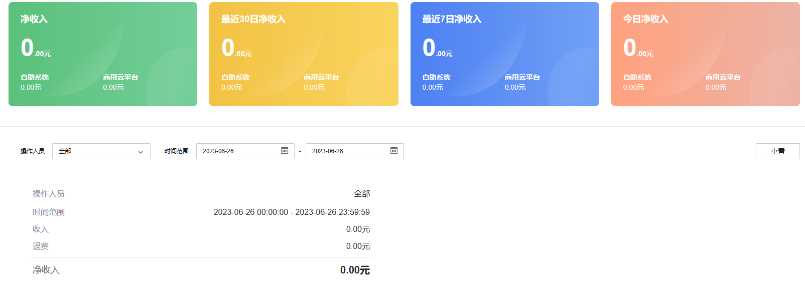

#### 账号续费

可手动对账号进行续费操作。

  1. 输入账号名称，点击查找。

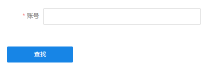

  2. 选择购买套餐，点击购买。

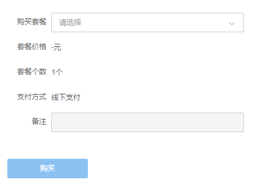

#### 套餐卡管理

自定义编辑套餐卡内容。用户输入识别码可免费兑换设置的套餐。

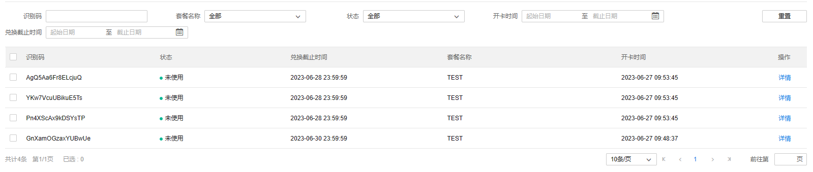

  1. 点击<开卡>，选择套餐卡关联的套餐、开卡数量以及兑换截止时间。

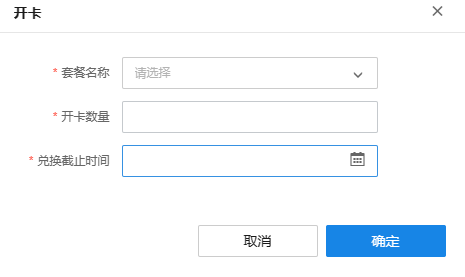

  2. 点击<确定>，提示开卡成功。

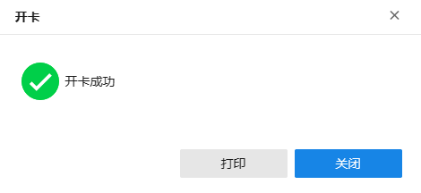

  3. 点击<打印>，可将套餐卡内容添加到打印。

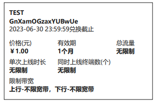

> 说明：
> 
> 请开启用户自助系统。开启后，用户才能兑换套餐卡。

#### 退款审批

查看并审批用户的退款请求。

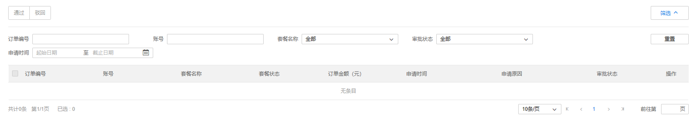

#### 账单记录

可根据账号、套餐、操作类型和支付方式等查找相应的账单记录。

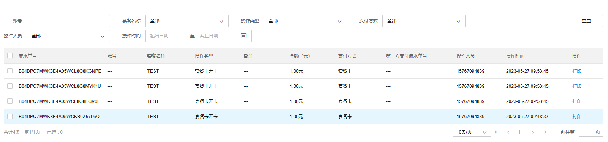

|   
---|---  
导出 excel| 可导出当前筛选条件下的账单信息  
筛选| 可根据账号、套餐类型等筛选相应账单记录，点击重置将恢复默认记录信息  
打印| 可打印当前账单信息  
  
选中订单记录，支持对订单参数进行修改，目前仅支持对限制带宽和同时在线终端数上限等参数进行修改，其他订单参数不能修改。

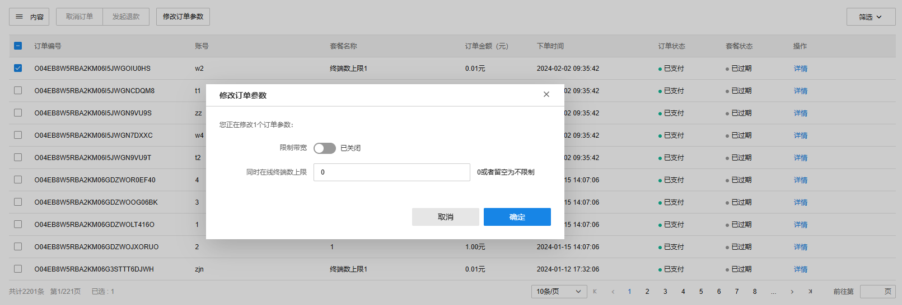

修改订单参数后，会在 高级-日志 页面形成操作记录，如下图所示：

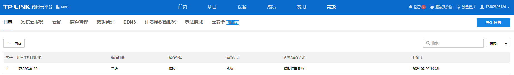

#### 对账

对现有账单记录进行对账操作。

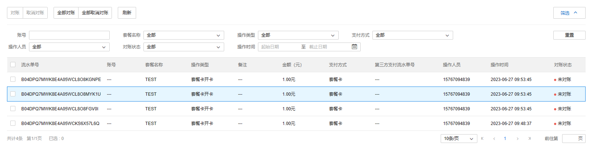

|   
---|---  
对账| 选中相应流水单号，点击对账，对该单进行对账。  
取消对账| 选中相应流水单号，点击取消对账，对该单取消对账。  
全部对账| 对所有账单对账。  
全部取消对账| 对所有账单取消对账。  
筛选| 按照账号、套餐、操作类型、支付方式等进行筛选相应账单信息。  
导出 excel| 勾选所需账单条目，导出 excel。
