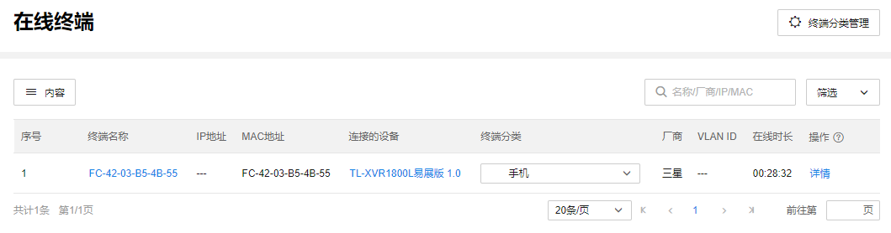
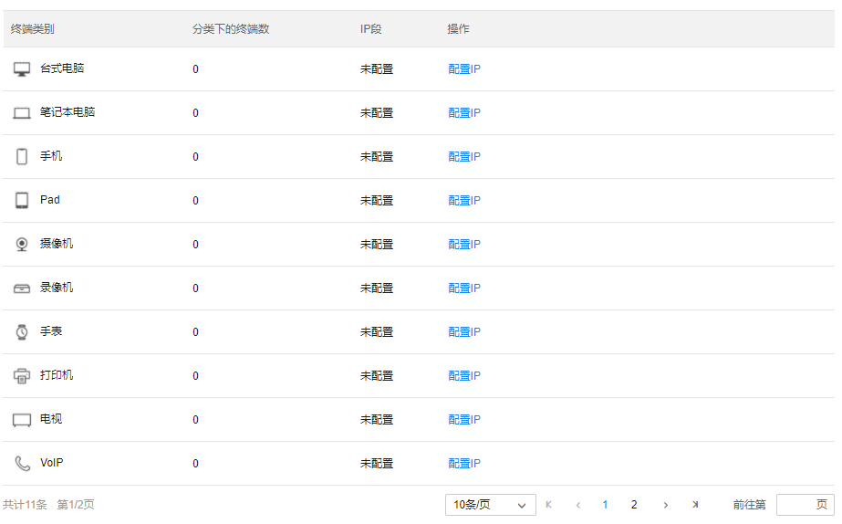
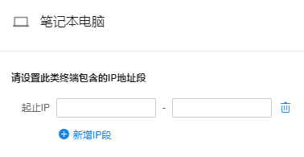

# 在线终端统计

展示项目内所有在线终端的统计信息。

**进入页面的方法：项目 >> 网络管理 >> 在线终端统计**

点击<内容>可选择需要在页面展示的内容：

|   
---|---  
终端名称| 默认或自定义的终端名称。  
IP 地址| 终端的 IP 地址。  
MAC 地址| 终端的 MAC 地址。  
连接的设备| 该终端关联的网络设备。  
终端分类| 自定义和展示项目内关联终端的类别，所有类别见下图。  
  

点击<配置 IP>可对不同分类的终端指定 IP 段。

点击<添加自定义分类>可自定义添加终端类别。

|   
---|---  
厂商| 终端的厂商品牌。  
VLAN ID| 终端所在 VLAN 的 ID。  
在线时长| 终端在线的时长。  
认证方式| 终端上网使用的认证方式。  
认证状态| 在线终端的认证状态。  
SSID| 无线终端关联的 SSID。  
信号强度| 终端关联无线的信号强度。  
射频| 终端关联射频单元的射频模式。  
频段| 终端关联射频单元工作的频段。  
终端型号| 终端的设备型号。  
商云管理| 监控终端是否为商云管理的状态。  
状态| 监控终端的状态。  
所在端口| 监控终端连接的交换机的端口。  
端口状态| 终端连接交换机的对应端口是否可用。  
操作| 点击<操作>可展开在线终端条目，查看终端详情信息。
