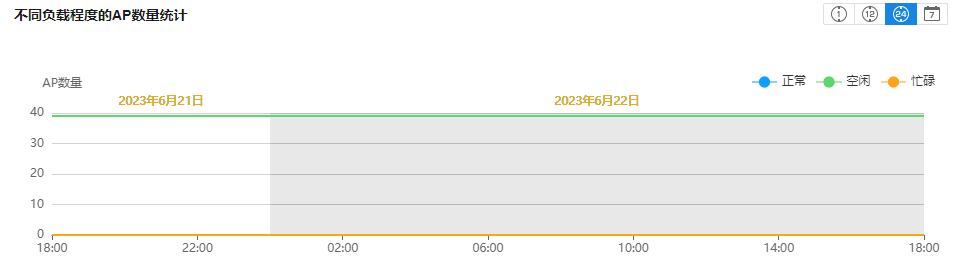
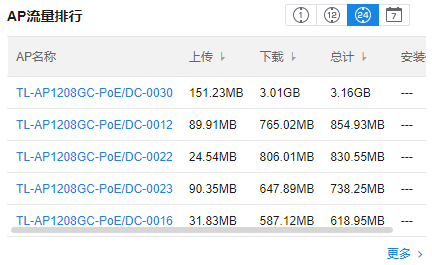
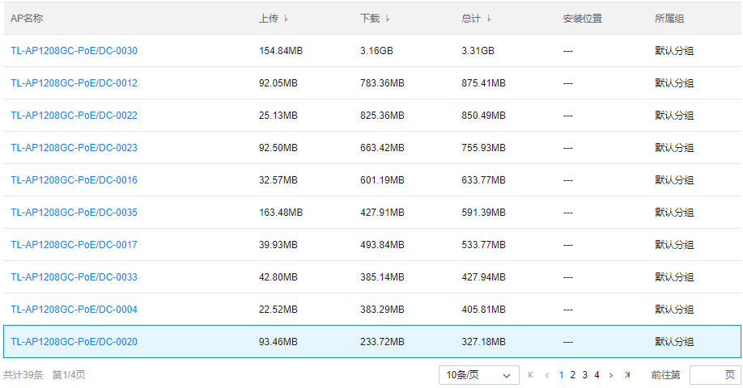
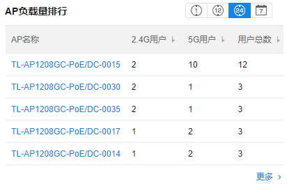
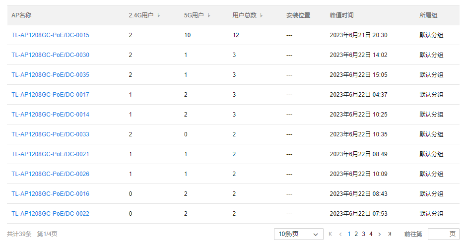
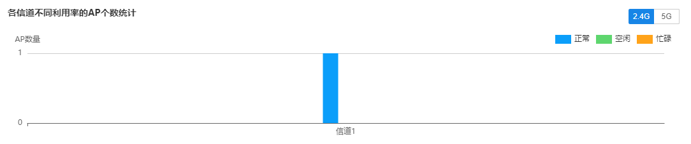
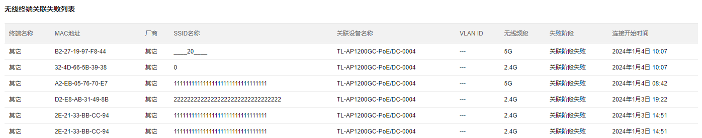

# AP 数据

展示项目内所有 AP 的统计信息。

**进入页面的方法：项目 >> 网络管理 >> 网络数据统计 >> AP 数据**

#### AP 负载

统计 AP 的负载、流量等信息

  1. 不同负载程度的 AP 数量统计：统计近 1 小时、近 12 小时、近 24 小时或近 7 天 AP 的负载程度

|   
---|---  
AP 数量| 不同负载程度下的 AP 数量。  
正常| AP 当前射频承载的终端数量占带机量的百分比。百分比在[20,70]之间认为是正常。  
空闲| 百分比在[0,20]认为是空闲。  
忙碌| 百分比在[70,100]之间认为是忙碌。  
  
  2. AP 流量排行：统计所有 AP 的流量信息并排序

**状态栏介绍：**

|   
---|---  
上传| 关联 AP 的终端上行流量总计。  
下载| 关联 AP 的终端下行流量总计。  
总计| 关联 AP 的终端上、下行流量总计。  
安装位置| 选择备注的 AP 安装位置  
所属组| AP 所属的分组  
  
**点击** <**更多** >**可展开** AP**的详细流量信息：**

  3. AP 负载量排行：统计所有 AP 的负载量信息并排序。

**状态栏介绍：**

|   
---|---  
2.4G 用户| 关联 AP 2.4G 的终端数量总计。  
5G 用户| 关联 AP 5G 的终端数量总计。  
用户总数| 关联 AP 的终端总计。  
安装位置| AP 所在的安装位置。  
峰值时间| AP 关联终端数最多的时刻。  
所属组| AP 所属的分组。  
  
**点击** <**更多** >**可展开** AP**的详细流量信息：**

#### 射频统计

统计 AP 的负载、流量等信息

  1. 各信道不同利用率的 AP 个数统计:统计各信道不同利用率的 AP 个数，右上角可选择 2.4G 或 5G 频段。

**状态栏介绍：**

|   
---|---  
AP 数量| 各信道不同利用率的 AP 数量。  
正常| AP 在当前信道利用率在[20,70]之间认为是正常。  
空闲| AP 在当前信道利用率在[0,20]认为是空闲。  
忙碌| AP 在当前信道利用率在[70,100]之间认为是忙碌。  
  2. AP 信道负载排行：统计所有 AP 的信道使用率并排序，在右上角可选择频段及时间

  3. AP 无线重传率排行：统计所有 AP 的重传率并排序，在右上角可选择频段及时间

  4. AP 无线干扰强度排行:统计所有 AP 的干扰强度并排序，在右上角可选择频段及时间

  5. AP 弱信号占比排行：统计所有 AP 的弱信号占比并排序，在右上角可选择频段及时间

#### 无线连接

  1. 无线连接统计：统计 AP 近 1 小时、近 12 小时、近 24 小时或近 7 天内无线连接各个阶段成功及失败的数量

  2. AP 连接失败率排行：统计 AP 设备近 1 小时、近 12 小时、近 24 小时或近 7 天内连接失败率及失败次数并排序

  3. 无线终端关联失败列表：统计在关联阶段失败的无线终端信息

