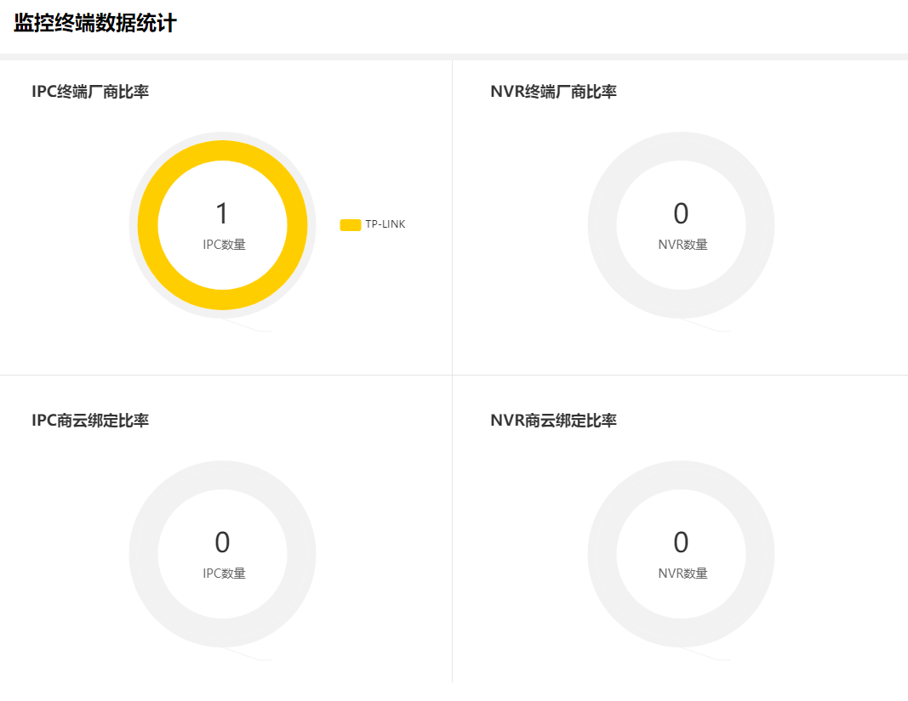
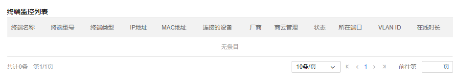

# 监控终端数据

统计终端中监控设备的数量及相关信息：

|   
---|---  
终端名称| 自定义的终端名称。  
终端型号| 终端的设备型号。  
终端类型| 监控终端的设备类型。  
IP 地址| 监控终端的 IP 地址。  
MAC 地址| 监控终端的 MAC 地址。  
连接的设备| 监控终端关联的网络设备。  
厂商| 监控终端的厂商。  
商云管理| 监控终端是否为商云管理的状态。  
状态| 监控终端的状态。  
所在端口| 监控终端连接的交换机的端口。  
VLAN ID| 监控终端所在 VLAN 的 ID。  
在线时长| 监控终端在线的时长。
