# 终端数据

展示项目内所有终端的统计信息，将鼠标放置在统计图中可查看详细信息。

**进入页面的方法：项目 >> 网络管理 >> 网络数据统计 >> 终端数据**

  1. 在线用户：统计项目内设备近 1 小时、近 12 小时、近 24 小时或近 7 天的在线终端数量

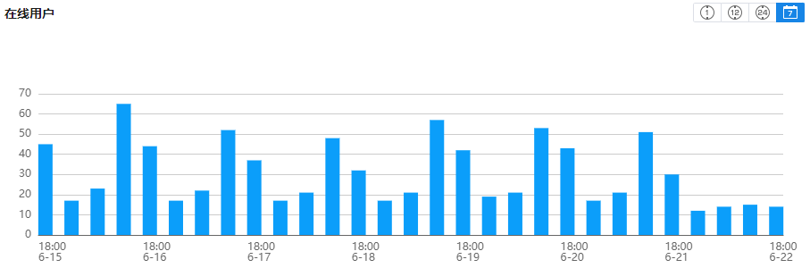

  2. 首次接入终端数：统计项目内设备一段时间内首次关联接入的终端数量

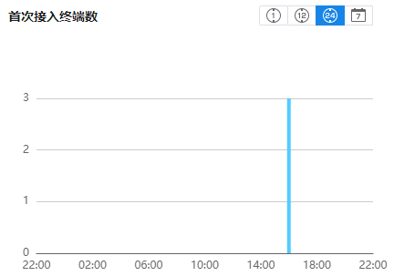

  3. 接入终端数：统计项目内设备一段时间内关联接入的终端数量

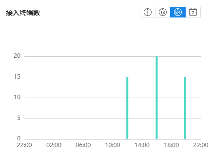

  4. 无线终端 SSID 分布比率：统计项目内无线终端关联的 SSID 分布比率

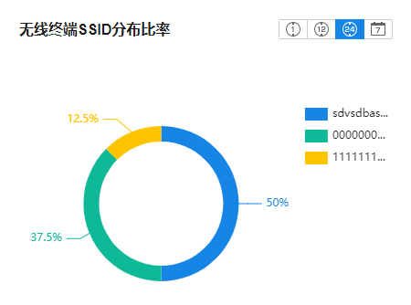

  5. 认证类型比率：统计项目内终端关联无线时，认证类型的分布比率

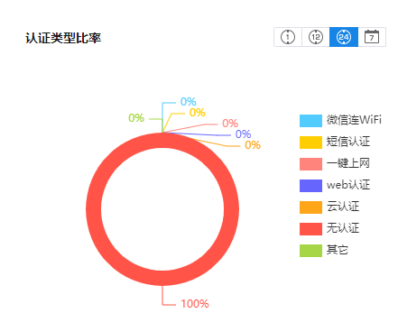

  6. 终端厂商比率：统计项目内无线终端的厂商信息

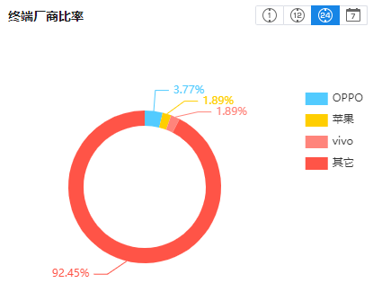

  7. 终端信号强度比率：统计项目内无线终端信号强度分布比率

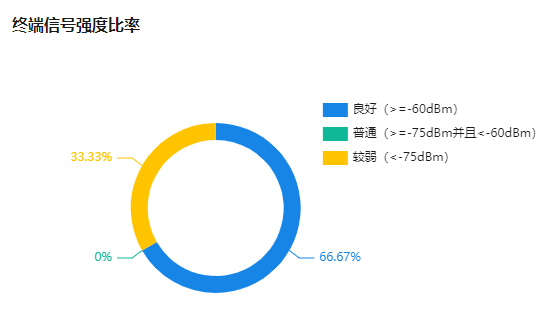

  8. 终端流量排行：统计项目内无线终端使用流量

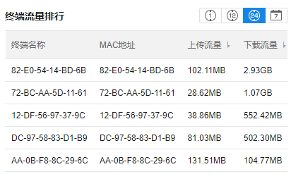

**点击** <**更多** >**可展开终端流量排行的详细信息：**

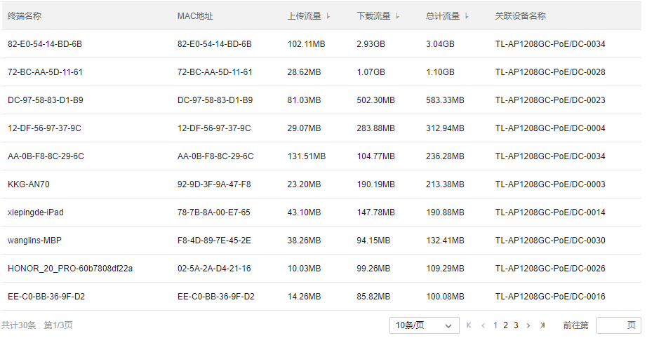

  9. 终端连接时长排行：统计账号内终端的在线时长

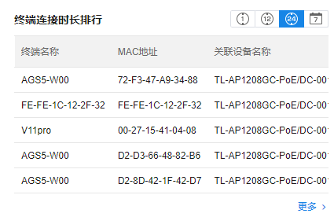

**点击** <**更多** >**可展开终端连接时长排行的详细信息：**

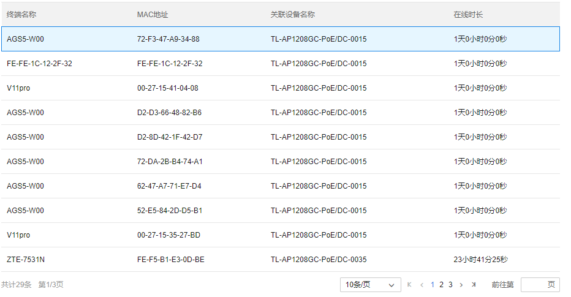
