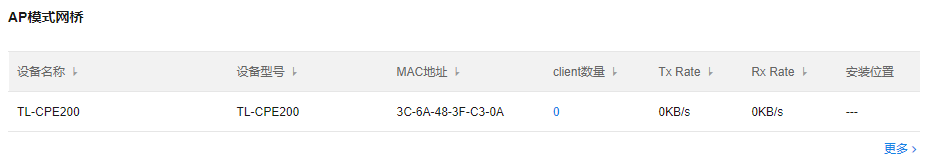
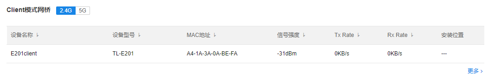
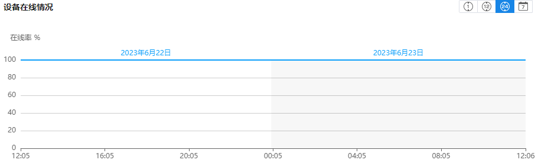

# 网桥数据

展示账号内所有网桥统计信息。

**进入页面的方法：项目 >> 网络管理 >> 网络数据统计 >> 网桥数据**

  1. AP 模式网桥：统计账号内所有 AP 模式网桥的信息

**状态栏介绍：**

|   
---|---  
Client 数量| 关联 AP 模式网桥的 client 网桥数量。  
Tx Rate| 发射速率  
Rx Rate| 接收速率  
安装位置| 自定义备注网桥的安装位置  
  
**点击** <**更多** >**可展开查看所有** AP**模式网桥的信息**

  2. Client 模式网桥：统计账号内所有 Client 模式网桥的信息

|   
---|---  
信号强度| Client 网桥关联 AP 的信号强度。  
Tx Rate| 发射速率  
Rx Rate| 接收速率  
安装位置| 自定义备注网桥的安装位置  
  
**点击** <**更多** >**可展开查看所有** Client**模式网桥的信息**

  3. 设备在线情况：统计网桥设备的在线情况

  4. 2.4G 信道中网桥数量：统计工作在 2.4G 射频各个信道内网桥的数量

  5. 5G 信道中网桥数量：统计工作在 5G 射频各个信道内网桥的数量

  6. AP/Client 模式统计：统计工作在 AP 模式和 Client 模式的网桥数量分布

