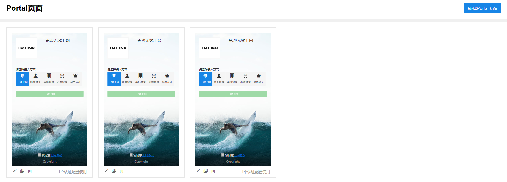
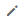
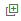
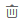
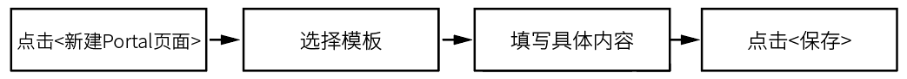
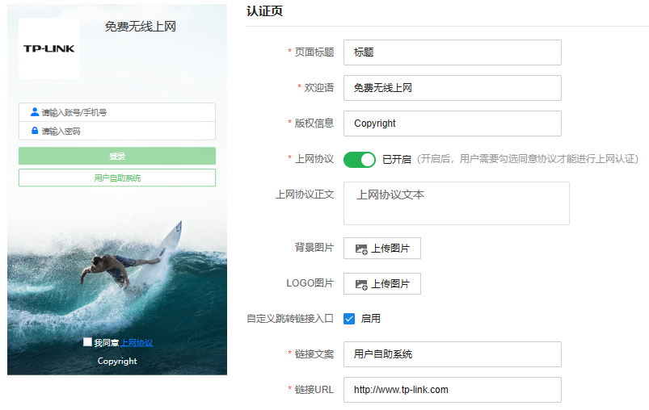
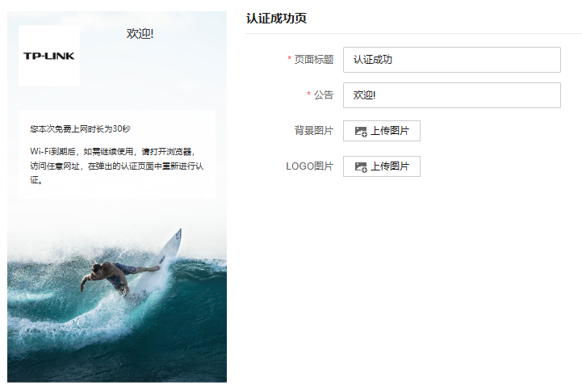

# Portal 页面

设置和编辑 Portal 页面展示的内容。

|   
---|---  
| 点击可编辑 Portal 页面内容。  
| 点击可复制 Portal 页面。  
| 点击将删除对应 Portal 页面。  
  
配置方法：

（1）设置认证页：

|   
---|---  
页面标题| 跳转页面的页面标题。  
欢迎语| 显示跳转页面的欢迎信息。  
版权信息| 显示跳转页面的版权声明信息。  
上网协议| 开启后，用户需要勾选同意协议才能进行上网认证。  
上网协议文本| 点击“上网协议”链接后显示的具体内容。  
背景图片| 用于页面的背景展示图，图片大小限制在 200KB 以内。  
Logo 图片| 设置页面的 Logo 图片，图片大小限制在 100KB 以内。  
自定义跳转链接入口| 在认证界面设置额外的跳转链接入口，可自定义文案和链接 URL。  
  
（2）设置认证成功页

|   
---|---  
页面标题| 设置认证完成页的页面标题。  
公告| 设置页面的提示信息。  
背景图片| 用于页面的背景展示图，图片大小限制在 200KB 以内。  
Logo 图片| 设置页面的 Logo 图片，图片大小限制在 100KB 以内。
