# SSID

TP-LINK 商用云平台支持对当前网络的 SSID 进行统一配置管理，使网络管理更为简洁高效。

**进入页面的方法：项目** **> >** **网络管理** **> >** **网络配置** **> > SSID**

> 说明：
> 
> 如 Portal 条目同步自设备本地配置，则切换或者删除已绑定此 Portal 条目的 SSID，导致此 Portal 条目无 SSID 绑定时，Portal 条目会被删除。
> 
> 当 SSID 下仅有基于 VLAN 模式或接口模式的设备时，此 SSID 条目无法进行相关编辑操作。

SSID 页面可选择以框图展示或以列表展示。

点击，SSID 以框图展示，可查看其无线名称、开启或关闭无线状态，查看无线密码和当前关联设备。

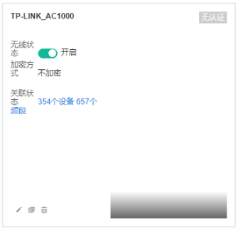

|   
---|---  
| 编辑 SSID，可更改 SSID 加密方式、认证方式、选择设备和频段。具体内容设置方法请参考本小节“添加 SSID”部分。  
| 复制当前 SSID。复制后的 SSID 仅无线名称不同，其余设置相同。  
| 删除该 SSID。  
  
点击，SSID 以列表展示，可查看其认证方式、加密方式、关联设备和频段数量等信息。

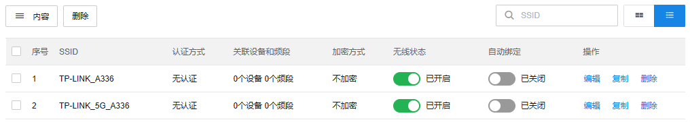

|   
---|---  
内容| 可根据 SSID、认证方式、关联设备和频段等筛选列表显示内容。  
编辑| 编辑 SSID，可更改 SSID 加密方式、认证方式、选择设备和频段。具体内容设置方法请参考本小节“添加 SSID”部分。  
复制| 复制当前 SSID。复制后的 SSID 仅无线名称不同，其余设置相同。  
删除| 删除该 SSID。  
  
#### 添加 SSID

点击<添加 SSID>进行 SSID 的添加。

##### SSID 设置

填写无线网络名称，选择加密方式等内容。设置完成后，点击<下一步>。

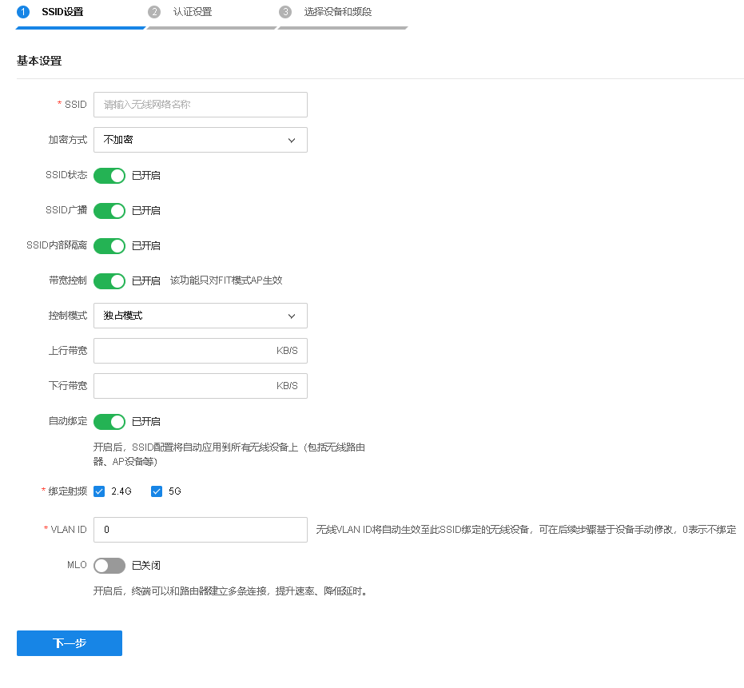

|   
---|---  
SSID| 设置无线网络名称。  
加密方式| 设置该无线网络的加密方式。如果希望任意主机都可以接入无线网络，选择“不加密”；如果需要对无线网络进行加密，请选择 WPA/WPA2、WPA_PSK/WPA2_PSK 或 WPA2-PSK/WPA3-SAE 三种加密方式中的一种进行无线安全设置。为保障网络安全，推荐加密无线网络。  
SSID 状态| 开启或关闭该 SSID。  
SSID 广播| 开启或关闭 SSID 广播。开启广播后，AP 将向无线覆盖范围内的主机广播无线网络名称，这样主机就能搜索到其无线信号。关闭后，主机只能手动输入无线网络名称以进行连接。  
SSID 内部隔离| 开启 SSID 内部隔离后，接入同一 SSID 的终端之间无法互相访问。  
带宽控制| 开启后可设置客户端带宽控制模式。共享模式：所有客户端均分共享带宽控制值；独占模式：所有客户端独占带宽控制值。  
自动绑定| 设置无线服务是否自动绑定 AP，包含之前已经接入的 AP 和之后新接入的 AP。  
MLO| MLO 即 Multi-link Operation，多链路操作。开启后，终端可以和路由器建立多条连接，提升速率、降低延时。无线服务绑定的设备至少有 2 个支持 802.11be 无线模式的频段且无线名称需使用非 WPA 加密方式时，本功能才能生效。  
  
1） 选择 WPA/WPA2 加密方式

WPA/WPA2 是采用 Radius 服务器进行身份认证并得到密钥的 WPA 或 WPA2 安全模式。

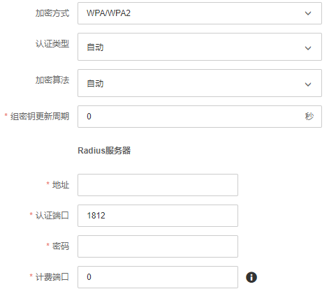

|   
---|---  
认证类型| 选择系统安全模式：自动、WPA 或 WPA2。默认为自动，设备会根据主机请求自动选择 WPA 或 WPA 安全模式。  
加密算法| 选择对无线数据进行加密的安全算法：自动、TKIP、AES。 自动：设备将根据网卡端的加密方式自动选择 TKIP 或 AES 加密方式。 TKIP（Temporal Key Integrity Protocol，暂时密钥集成协议）：负责处理无线安全问题的加密部分。 AES（Advanced Encryption Standard，高级加密标准）：是美国国家标准与技术研究所用于加密电子数据的规范。该算法汇聚了设计简单、密钥安装快、需要内存空间少、在所有平台上运行良好、支持并行处理并且可以抵抗所有已知攻击等优点。  
组密钥更新周期| 设置广播和组播密钥的定时更新周期，以秒为单位，最小值为 30，若该值为 0，则表示不进行更新。  
  
设置 Radius 服务器：

|   
---|---  
地址| 设置 Radius 服务器的 IP 地址。  
认证端口| 设置 Radius 认证服务器采用的端口号，Radius 服务器用来对无线网络内的主机进行身份认证。  
密码| 设置用来加密与 Radius 服务器通讯数据的密码。  
计费端口| 设置 Radius 认证服务的计费端口号。  
  
2） 选择 WPA_PSK/WPA2_PSK 加密方式

WPA_PSK/WPA2_PSK 安全类型是基于共享密钥的 WPA 模式，安全性很高，设置也比较简单，适合普通家庭用户和小型企业使用。

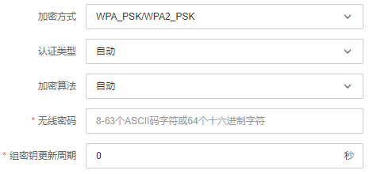

|   
---|---  
认证类型| 选择系统安全模式：自动、WPA_PSK 或 WPA2_PSK。默认为自动，设备会根据主机请求自动选择 WPA_PSK 或 WPA2_PSK 安全模式。  
加密算法| 选择对无线数据进行加密的安全算法：自动、TKIP、AES。 自动：设备将根据网卡端的加密方式自动选择 TKIP 或 AES 加密方式。 TKIP（Temporal Key Integrity Protocol，暂时密钥集成协议）：负责处理无线安全问题的加密部分。 AES（Advanced Encryption Standard，高级加密标准）：是美国国家标准与技术研究所用于加密电子数据的规范。该算法汇聚了设计简单、密钥安装快、需要内存空间少、在所有平台上运行良好、支持并行处理并且可以抵抗所有已知攻击等优点。  
无线密码| 初始设置密钥，要求为 8-63 个 ASCII 字符或 64 个十六进制字符。  
组密钥更新周期| 设置广播和组播密钥的定时更新周期，以秒为单位，最小值为 30，若该值为 0，则表示不进行更新。  
  
3） 选择 WPA2-PSK/WPA3-SAE 加密方式

WPA2-PSK/WPA3-SAE 加密方式是基于共享密钥的 WPA2 或 WPA3 模式。

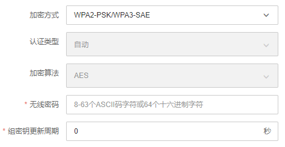

|   
---|---  
无线密码| 初始设置密钥，要求为 8-63 个 ASCII 字符或 64 个十六进制字符。  
组密钥更新周期| 设置广播和组播密钥的定时更新周期，以秒为单位，最小值为 30，若该值为 0，则表示不进行更新。  
  
##### 认证设置

选择认证设置方式：无认证、设备本地认证、云认证。

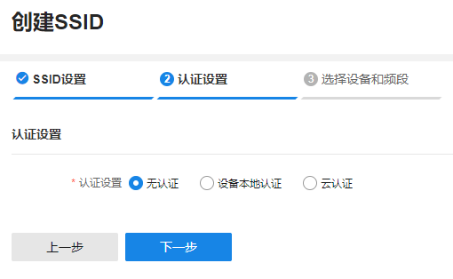

无认证：如无需认证，选择“无认证”后直接点击<下一步>即可。

设备本地认证：如需采用已有的认证方式，选中认证方式后点击<下一步>。如需新建认证配置，请参考后续章节。

云认证：可选择禁止移动端 Portal 弹出，设置完成后点击<下一步>。后续需配置云认证，支持配置公众号认证和小程序认证。

##### 选择设备和频段

在左侧选择设备分组，勾选设备条目，选择相应频段，点击<保存>使 SSID 和认证设置在选中设备频段上生效。

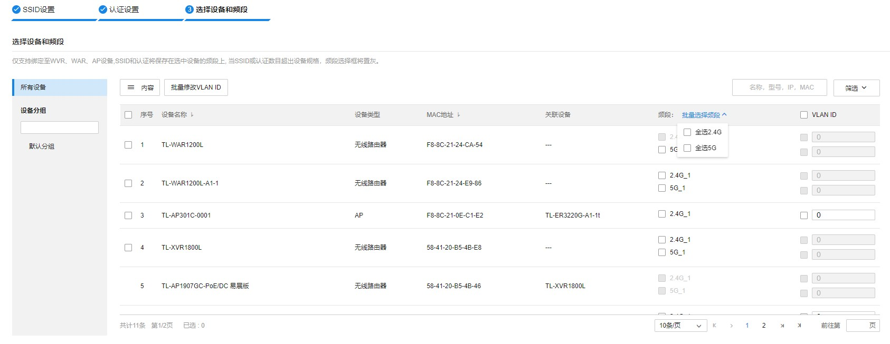

|   
---|---  
内容| 可根据设备名称、设备类型、MAC 地址、关联设备等筛选列表显示内容。  
批量选择频段| 勾选需要绑定的频段，可单独选择 2.4G、5G 或全选所有频段。  
批量修改 VLAN ID| 勾选 AP 条目，可批量修改 AP 的 VLAN ID。  
筛选| 可根据设备类型筛选列表显示信息。  
  
勾选 AP 条目，点击批量修改 VLAN ID。修改完成后，点击<确定>，存储配置。

> 说明：
> 
> 仅支持绑定至 XVR/WVR/WAR/AP 设备。
> 
> 当 SSID 或认证数目超出设备规格，频段选择框将置灰。

##### 配置云认证

  * 云认证策略

点击<添加认证策略>可添加云认证策略，配策略名称及相关条件后，点击<确定>完成添加。

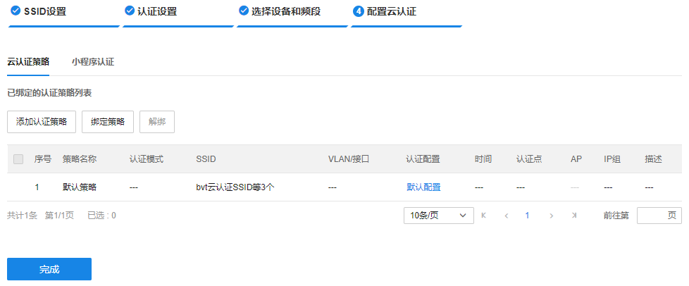

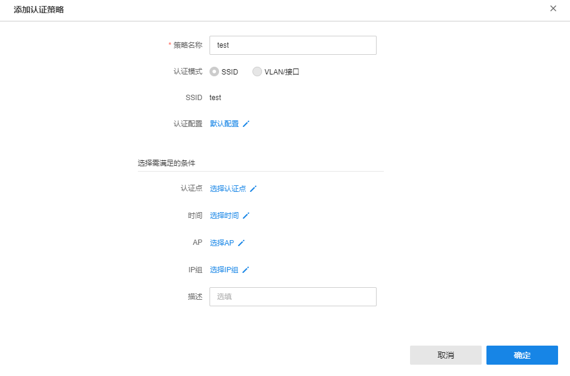

|   
---|---  
策略名称| 设置云认证策略名称。  
认证配置| 选择认证配置。  
认证点| 选择策略生效的路由器或 AC 设备。  
时间| 选择策略生效的时间范围。  
AP| 选择策略生效的 AP 设备。  
IP 组| 选择策略生效的 IP 组范围。  
描述| 可填写该策略的相关信息，用于区分策略。  
  
  * 小程序认证

支持小程序认证，用户可使用微信扫描小程序二维码认证上网，或通过微信公众号跳转小程序，关注微信公众号后方可进行认证上网。

如需添加小程序认证，可参考如下步骤：

  1. 选择小程序认证，点击<添加小程序认证>，填写认证配置。

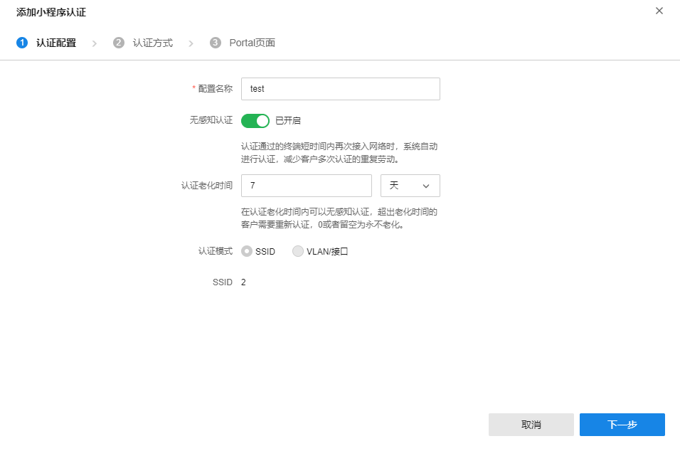

|   
---|---  
配置名称| 设置小程序认证名称。  
无感知认证| 可选择开启无感知认证；开启无感知认证后，认证通过的终端短时间内再次接入网络时，系统自动进行认证，减少客户多次认证的重复劳动。  
认证老化时间| 在认证老化时间内可以无感知认证，超出老化时间的客户需要重新认证，0 或者留空为永不老化。  
  
  2. 认证方式

支持公众号认证、快速上网、一键认证、账号认证及短信认证五种方式。其中，一键认证、账号认证和短信认证三种方式可复选。

1）公众号认证：

可配置公众号认证，实现公众号引流。开启公众号认证后，关注公众号即后可快速上网。

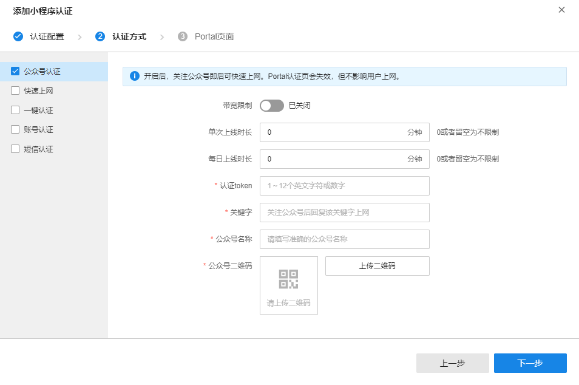

|   
---|---  
带宽限制| 可开启带宽限制，设置上行/下行带宽。  
单次上线时长| 可设置单次上线时长限制，0 或者留空为不限制。  
每日上线时长| 可设置每日上线时长限制，0 或者留空为不限制。  
认证 token| 1~12 个英文字符或数字，用于校验。  
关键字| 关注公众号后回复该关键字上网。  
公众号名称| 请填写准确的公众号名称。  
公众号二维码| 点击<上传二维码>，从本地上传微信公众号的二维码。  
  
> 说明：
> 
> 此种方式将使 Portal 认证页失效，但不影响用户上网。

2）快速上网：

开启快速上网后，通过微信扫码或公众号跳转链接可快速上网，无需选择认证方式。

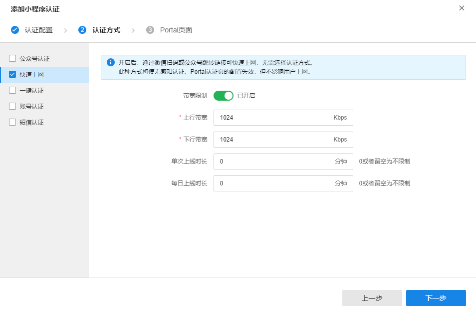

|   
---|---  
带宽限制| 可开启带宽限制，设置上行/下行带宽。  
单次上线时长| 可设置单次上线时长限制，0 或者留空为不限制。  
每日上线时长| 可设置每日上线时长限制，0 或者留空为不限制。  
  
> 说明：
> 
> 此种方式将使无感知认证、Portal 认证页的配置失效，但不影响用户上网。

3）一键认证：

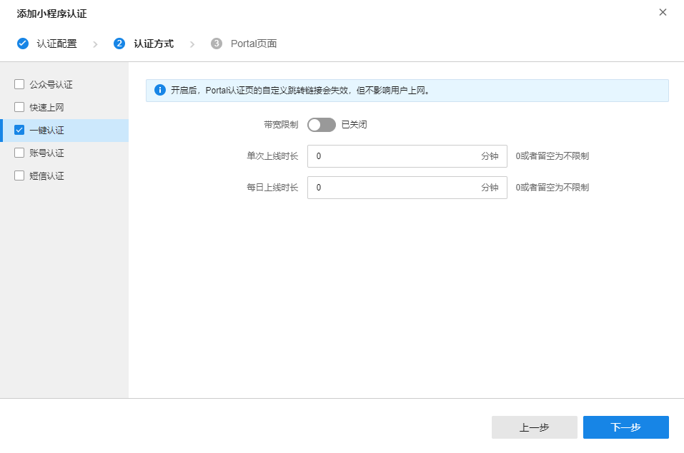

|   
---|---  
带宽限制| 可开启带宽限制，设置上行/下行带宽。  
单次上线时长| 可设置单次上线时长限制，0 或者留空为不限制。  
每日上线时长| 可设置每日上线时长限制，0 或者留空为不限制。  
  
> 说明：
> 
> 开启后，Portal 认证页的自定义跳转链接会失效，但不影响用户上网。

4）账号认证

支持账号认证。如需进行账号导入、创建和维护，请前往页面：网络管理 >> 云认证计费 >> AAA >> 账号管理

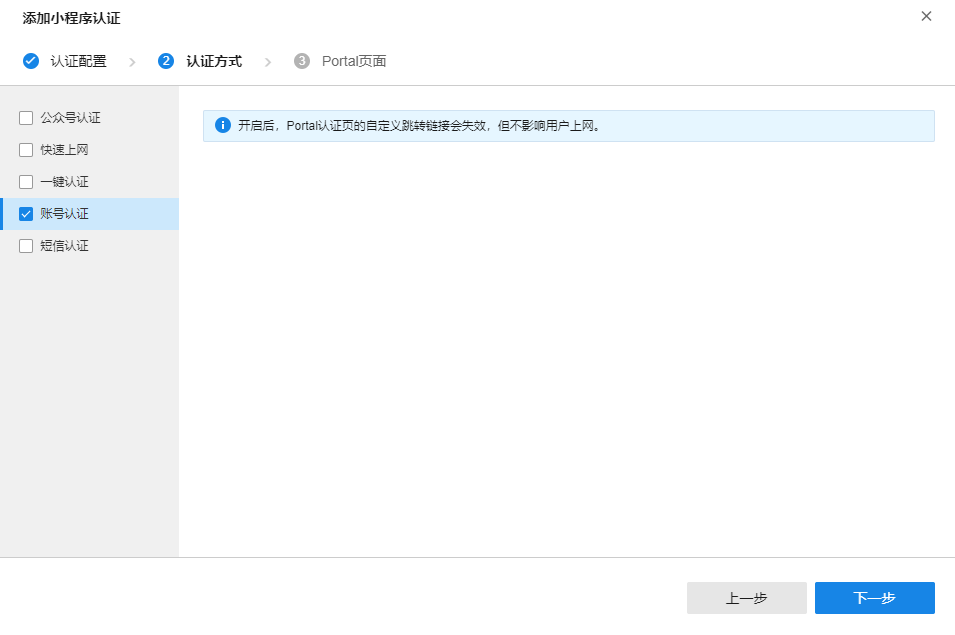

> 说明：
> 
> 开启后，Portal 认证页的自定义跳转链接会失效，但不影响用户上网。

5）短信认证

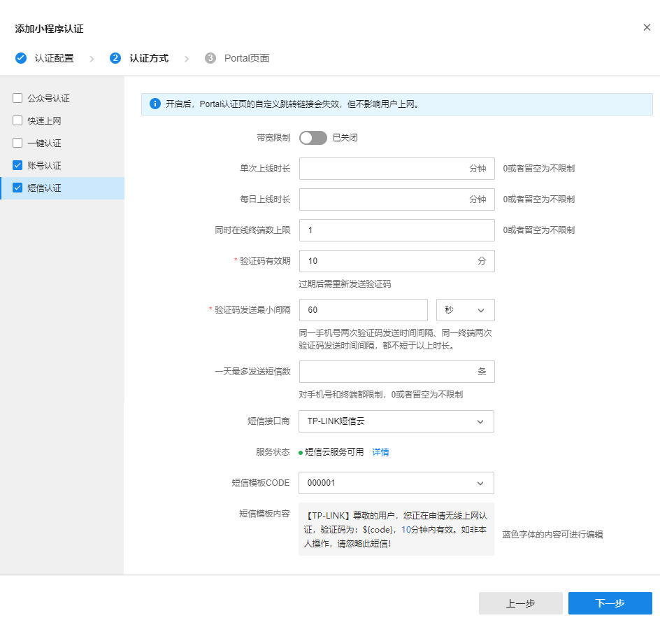

|   
---|---  
带宽限制| 可开启带宽限制，设置上行/下行带宽。  
单次上线时长| 可设置单次上线时长限制，0 或者留空为不限制。  
每日上线时长| 可设置每日上线时长限制，0 或者留空为不限制。  
同时在线终端数上限| 可设置同时在线终端数上限，0 或者留空为不限制。  
验证码有效期| 设置验证码有效期，过期后需重新发送验证码。  
验证码发送最小间隔| 同一手机号两次验证码发送时间间隔、同一终端两次验证码发送时间间隔，都不短于以上时长。  
一天最多发送短信数| 可设置一天最多发送短信数。对手机号和终端都限制，0 或者留空为不限制。  
短信接口商| 选择短信接口商并填写填写相关参数。  
  
> 说明：
> 
> 开启后，Portal 认证页的自定义跳转链接会失效，但不影响用户上网。

  3. Portal 页面

可选择已有 Portal 页面或点击<添加 Portal 页面>添加新页面。

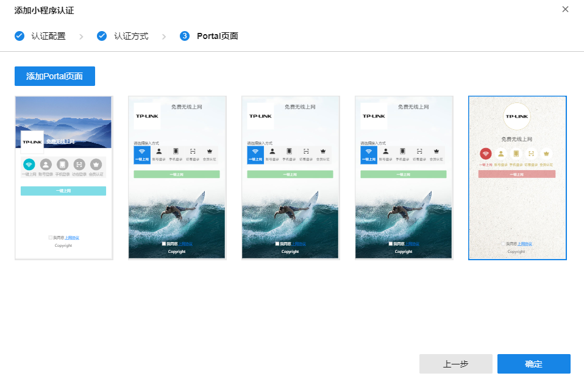

设置完成后，点击<确定>完成小程序认证添加。
