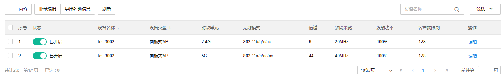
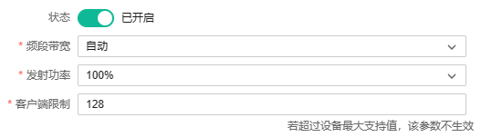
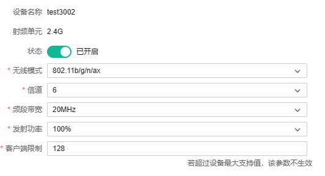
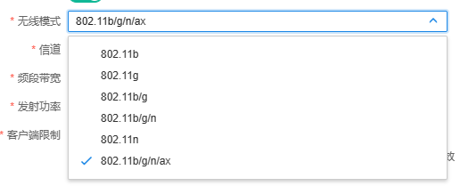
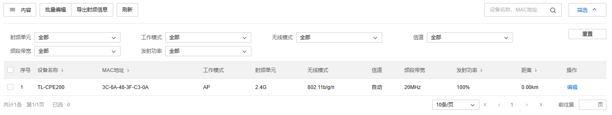

# 射频信息

#### 网络设备射频信息

查看和编辑当前项目内所有无线设备的射频单元及其配置。

**页面进入的方法：项目** **> >** **网络管理** **> >** **网络配置** **> >** **射频信息** **> >** **网络设备射频信息**

**功能栏介绍：**

（1）内容：选择状态、设备名称、设备类型、射频单元、无线模式等信息是否显示在列表中。

|   
---|---  
状态| 设置射频单元是否启用。  
设备名称| 无线设备的名称。  
设备类型| 无线设备的类型。  
射频单元| 显示无线设备的射频单元。  
无线模式| 显示射频单元的工作模式。  
信道| 显示射频单元工作的信道。  
频段带宽| 显示射频单元工作的频段带宽大小。  
发射功率| 显示射频单元的发射功率。  
客户端限制| 显示射频单元关联客户端的最大数目。  
  
（2）批量编辑：多选射频条目，批量编辑射频配置

（3）导出射频信息：将页面状态栏中的射频信息导出为表格文件

（4）刷新：手动刷新射频信息

点击<编辑>，可以对射频参数进行配置。相关参数介绍如下：

（1）无线模式：修改射频单元的射频模式

802.11n：即 Wi-Fi 4 标准

802.11ac：即 Wi-Fi 5 标准

802.11ax：即 Wi-Fi 6 标准

（2）信道：修改射频单元工作的信道，如果设置为"自动"，设备会自动选择一个合适的信道

（3）频段带宽：当无线射频模式支持 11n、11ac 或者 11ax 时，可设置频段带宽

（4）发射功率：修改射频单元的发射功率

（5）客户端限制：设置射频单元关联客户端的最大数目，若超过设备最大支持值，则该参数不生效

#### 网桥设备射频信息

查看和编辑商云账号内所有无线设备的射频单元及其配置

**页面进入的方法：项目** **> >** **网络管理** **> >** **网络配置** **> >** **射频信息** **> >** **网桥设备射频信息**

（1）工作模式：网桥设备当前的工作模式，分为 AP 模式或 Client 模式

（2）射频单元：查看网桥工作的射频单元

（3）无线模式：射频单元的射频模式

802.11n：即 Wi-Fi 4 标准

802.11ac：即 Wi-Fi 5 标准

802.11ax：即 Wi-Fi 6 标准

（4）信道：射频单元工作的信道，如果设置为"自动"，设备会自动选择一个合适的信道

（5）频段带宽：射频单元当前工作的频段带宽。当无线射频模式支持 11n、11ac 或者 11ax 时，可设置频段带宽

（6）发射功率：射频单元的发射功率

（7）距离：主子网桥间的距离，可自动检测或手动设置

