# 工具箱

#### 无线射频调优

**进入页面的方法：项目** **> >** **网络管理** **> >** **网络配置** **> >** **工具箱** **> >** **无线射频调优**

在一些酒吧、餐厅、宿舍等密集接入环境下，每个 AP 下都可能存在较大的无线流量，AP 与 AP 之间可能就存在较大的无线干扰，从而影响到整体网络的使用体验，典型的现象就是人少的时候网络很快，使用的人一多网络就慢了。使用 TP-LINK 的 AC 中的射频调优功能对网络的信道进行自动规划，功率进行自动调整，将网络中的干扰降到最小，保障无线使用的体验。

可通过 TP-LINK 商用云平台设置 AC 设备或开启 AP 管理功能的企业路由实现射频调优功能，实现一键自动规划 AP 的信道的功率，调优功能 5 分钟左右即可完成，智能减少 AP 之间的信号干扰。射频调优是通过动态信道分配（Dynamic Channe- Assignment，DCA）和发射功率调整（Transmit Power Control，TPC）实现统一对 AP 的信道和功率进行规划，尽可能的提高覆盖率，减少整个系统的信道干扰，从而提高整个无线网络的上网体验。

  * 收集邻居关系

AC 或路由器下发收集邻居关系的命令后，所有 AP 工作在同一信道并周期性发送特定的报文，所有 AP 将监听到的邻居信息上报给 AC 进行后续处理。

  * 动态信道调整

AC 或路由器根据收集到的邻居关系，通过 DCA 算法得到一个最优的 AP 信道划分结果，并将结果下发给所有的 AP。

  * 发射功率调整

AC 或路由器根据邻居关系、动态信道调整的结果，通过 TPC 算法得到一个最优的 AP 功率划分结果，尽可能的提高覆盖率，同时减少整个系统的同信道干扰，并将结果下发给所有的 AP。

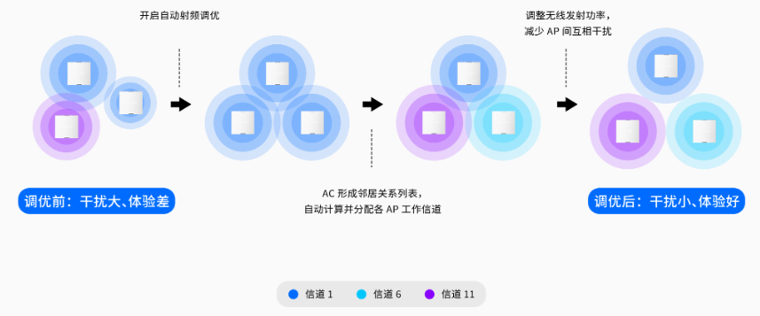

> 注意：
> 
> 只有网络中存在 AC，或开启 AP 管理功能的企业路由时，此功能才能生效。
> 
> 射频调优过程需要大约五分钟时间，且会导致 AP 无线中断。
> 
> 定时调优期间，请勿对相关设备进行重启、升级、射频修改等配置操作，以免影响无线射频调优。

**1.** **立即调优：设置调优参数，立即进行射频调优**

配置方法：

（1）项目 >> 网络管理 >> 网络配置 >> 工具箱 >> 无线射频调优，点击<立即调优>。

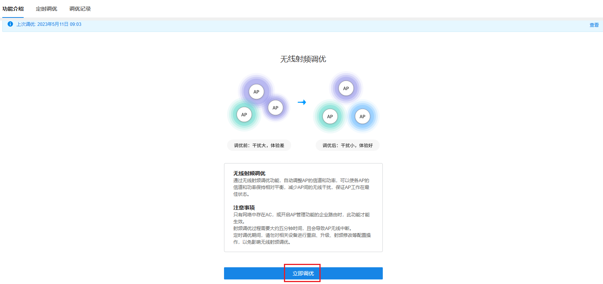

（2）填写调优参数

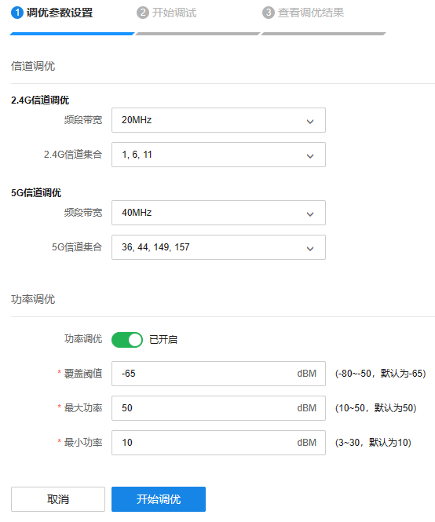

|   
---|---  
覆盖阈值| 当开启功率调优时，对于 AP 的布放场景不同，AP 布放距离不同或 AP 布放高度不同，TPC 的覆盖阈值不同，实际使用时需要根据 AP 的实际布放调整 AP 的 TPC，以使 TPC 的结果能达到最优的覆盖效果。阈值越大，TPC 调整的功率值会整体提高。  
最大/最小功率| 设置功率调优时，AP 允许调节的最大/最小功率。配置最大调优功率值和最小调优功率值后，AP 在进行功率调优后，最终生效的功率会在这两个值之间。  
  
（3）点击<开始调优>，完成后可查看调优结果

**2.** **定时调优：建立定时射频调优任务**

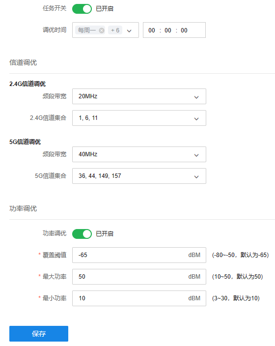

配置方法：点击启用定时调优 >> 填写调优参数 >> 点击保存

**3.** **调优记录：查看历史调优的记录**

#### 智能漫游

采用基于 802.11kv 协议的智能漫游技术，在会议室/办公区/酒吧/KTV 等多 AP 的高密度环境下，帮助手机、Pad、电脑等终端设备自动接入到信号质量最好的 AP，有效提升每个用户的使用体验和无线网络的整体性能。

**进入页面的方法：项目** **> >** **网络管理** **> >** **网络配置** **> >** **工具箱** **> >** **智能漫游** **> >** **设备列表**

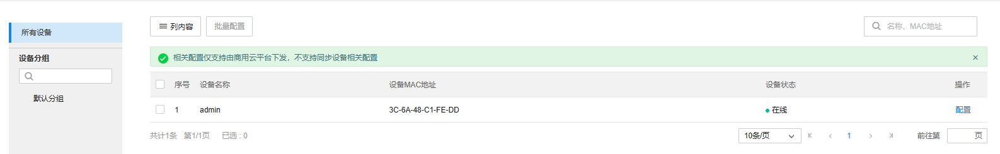

**功能栏介绍：**

|   
---|---  
设备分组| 选择不同分组的设备。  
内容| 可选择展示设备 MAC 地址和设备状态。  
  
点击设备对应<配置>按键，智能漫游功能设置如下：

  1. 基本设置

|   
---|---  
802.11k/v/r 快速漫游| 启用/禁用 802.11k/v/r 快速漫游功能。  
  2. 2.4G 漫游参数设置

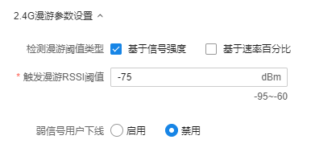

|   
---|---  
检测漫游阈值类型| 配置主动触发用户漫游的检测策略。基于信号强度：在信号强度低于阈值时触发终端漫游；基于速率：在终端速率低于阈值时触发终端漫游。同时启用时，只要满足其中一个条件，就会触发终端漫游。  
触发漫游 RSSI 阈值| 当终端的信号强度低于所设阈值时，将主动触发终端漫游。触发漫游 RSSI 阈值不能小于弱信号用户下线阈值。  
弱信号用户下线| 启用/禁用弱信号用户踢除功能，启用并设置踢除阈值，将在终端有更合适的目标 AP 可漫游，且信号强度低于设置的踢除阈值时，踢除终端，以迫使终端连接到体验更好的 AP 上。弱信号用户下线阈值不能大于触发漫游 RSSI 阈值。  
  3. 5G 漫游参数设置

|   
---|---  
检测漫游阈值类型| 配置主动触发用户漫游的检测策略。基于信号强度：在信号强度低于阈值时触发终端漫游；基于速率：在终端速率低于阈值时触发终端漫游。同时启用时，只要满足其中一个条件，就会触发终端漫游。  
触发漫游 RSSI 阈值| 当终端的信号强度低于所设阈值时，将主动触发终端漫游。触发漫游 RSSI 阈值不能小于弱信号用户下线阈值。  
弱信号用户下线| 启用/禁用弱信号用户踢除功能，启用并设置踢除阈值，将在终端有更合适的目标 AP 可漫游，且信号强度低于设置的踢除阈值时，踢除终端，以迫使终端连接到体验更好的 AP 上。弱信号用户下线阈值不能大于触发漫游 RSSI 阈值。  
  4. 高级设置

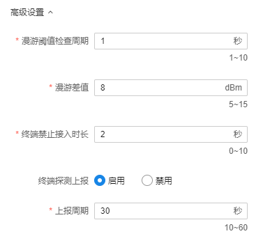

|   
---|---  
漫游阈值检查周期| 检测终端 RSSI 或速率的时间间隔。  
漫游差值| 触发终端主动漫游的信号强度差值，只有当邻居 AP 的信号强度减去当前连接 AP 的信号强度大于漫游差值时，才建议终端进行主动漫游。  
终端禁止接入时长| 当触发终端进行主动漫游时，将在非漫游目标的 AP 上设置黑名单，在终端禁止接入时长范围内不让终端接入。  
终端探测上报| 开启时 AP 会探测周围终端信息并上报给 AC，AC 根据这些信息构建在线终端的 AP 邻居表，对不支持 802.11k 的终端漫游有辅助作用。  

#### 设备重启

指定设备立即重启或定时重启，并查看设备的重启记录。

  1. 设备列表：查看账号内所有设备信息，并可勾选设备条目进行重启操作。

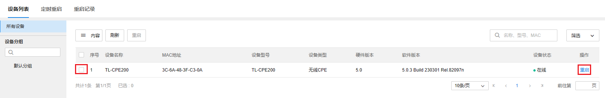

点击<重启>按钮，可选择立即重启或定时重启。

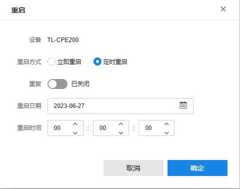

  2. 定时重启：查看并修改已配置的定时重启策略。

点击<详情>可查看定时重启策略的具体内容。

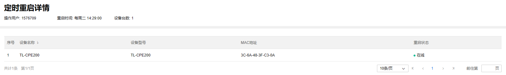

点击<编辑>可修改定时重启的策略内容，点击<保存>完成配置修改。

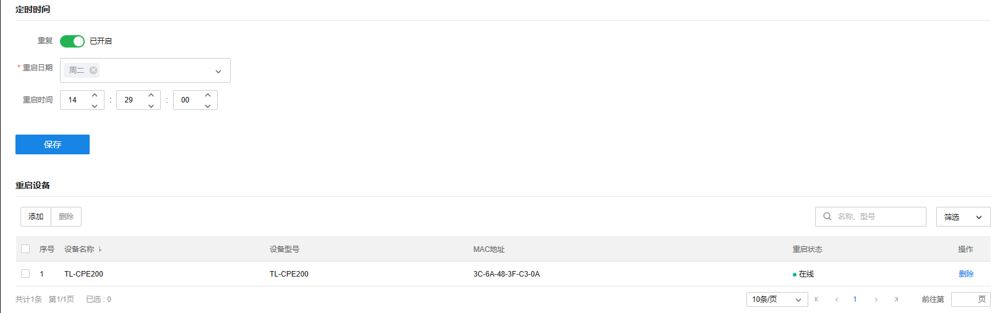

  3. 重启记录：查看账号内设备的重启记录。

可选择查看全部重启记录，或筛选近 1 天内、近 7 天内、近 30 天内的重启记录。

点击<详情>，可查看重启成功列表或重启失败列表

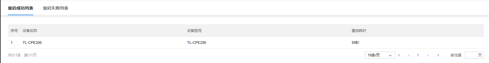

> 说明：
> 
> 若操作重启的设备已在账号中解绑，点击<详情>将无法看到相关记录详情

#### 软件升级

指定设备立即升级或定时升级，并查看设备的升级记录

  1. 设备列表：查看账号内所有设备信息，并可勾选设备条目进行升级操作

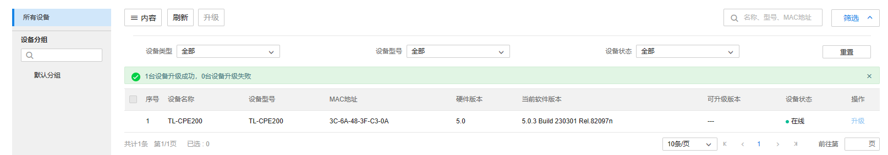

点击<升级>按钮，可选择立即升级或定时升级

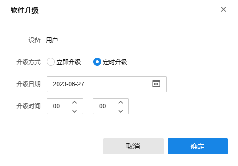

2、定时升级：查看并修改已配置的定时升级策略

点击<详情>可查看定时升级策略的具体内容

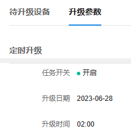

点击<编辑>可修改定时升级的策略内容，选择要升级的设备，点击<下一步>修改升级时间等参数，点击<确定>完成修改。

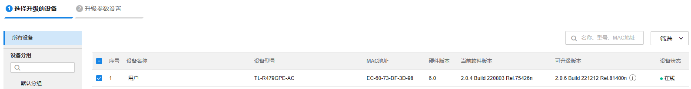

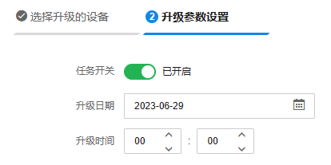

3、升级记录：查看账号内设备的升级记录

可选择查看全部升级记录，或筛选近 1 天内、近 7 天内、近 30 天内的升级记录

点击<详情>，可查看升级成功列表或升级失败列表

> 说明：
> 
> 新建定时升级任务，会使旧的定时升级任务失效。
> 
> 若操作升级的设备已在账号中解绑，点击<详情>将无法看到相关记录详情。

#### 连通性诊断

对账号内的设备进行连通性诊断测试。

  1. 连通性诊断：

（1）可选择诊断对象为设备或 IP/域名。

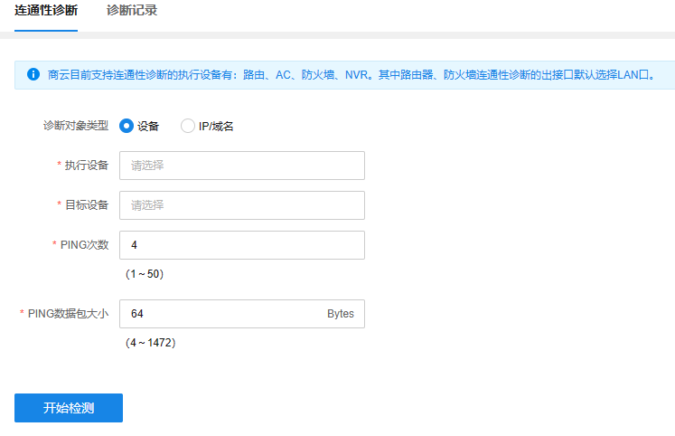

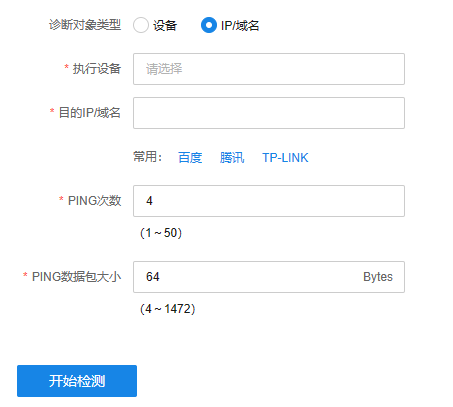

（2）点击<执行设备>，选择需要进行连通性诊断测试的设备。可选择<拓扑图>模式，在拓扑图上点击执行设备；或选择<列表视图>模式，在列表中勾选设备。

拓扑图模式：

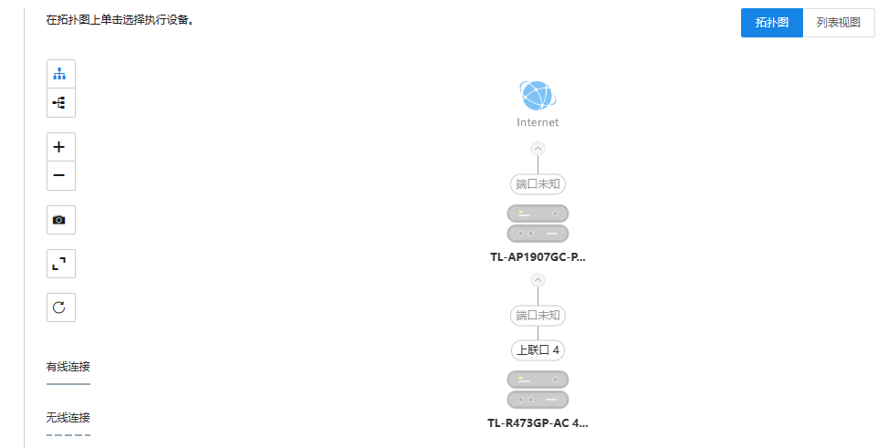

列表视图模式：

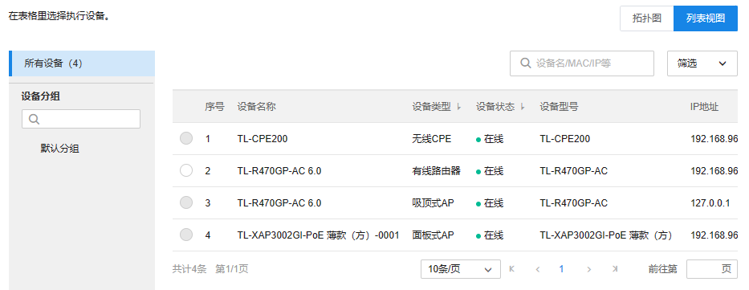

（3）完成相关设备选择和参数填写后，点击<开始检测>进行测试

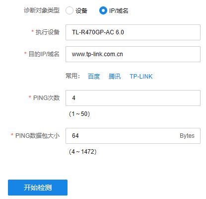

（4）检测结果实时显示

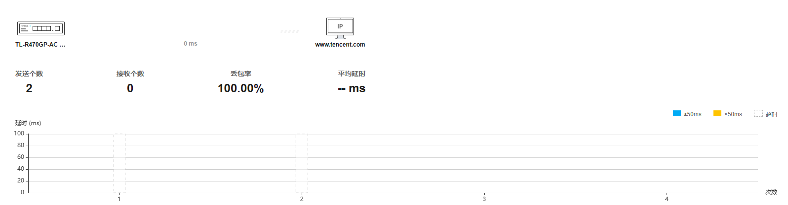

  2. 诊断记录：

查看连通性诊断测试记录，可以根据执行设备和目标设备筛选诊断记录，或根据目标 IP/域名搜索诊断记录。

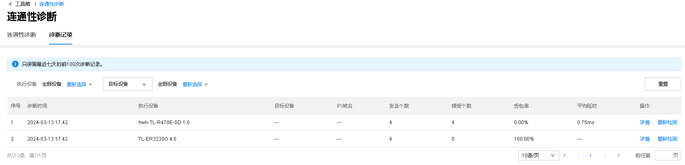

点击<详情>可查看相关测试的详细信息。

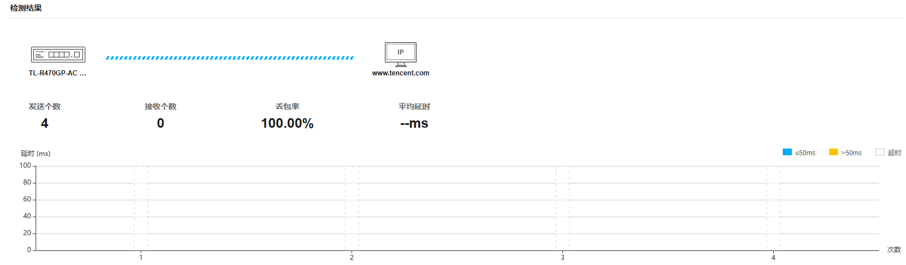

点击<重新检测>则跳转至<连通性诊断页面>。

> 说明：
> 
> 商云目前支持连通性诊断的执行设备有：路由、AC、防火墙、NVR。其中路由器、防火墙连通性诊断的出接口默认选择 LAN 口，ping 外网设备会显示丢包率 100%。
> 
> 商云只保留最近七天的前 100 次诊断记录。
> 
> 可以在设备管理-系统设置菜单下，点击“连通性诊断”或“查看诊断记录”快速跳转到“连通性诊断”功能页面或“诊断记录”页面。
> 
> 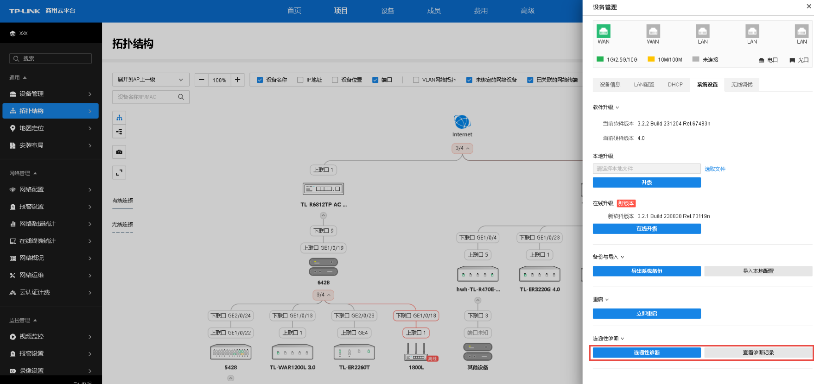

#### 生成交付报告

支持生成在线交付报告，可一键导出项目基本信息（网络拓扑，设备清单等）。

填写报告标题以及项目成员等项目相关信息，点击<生成报告>。

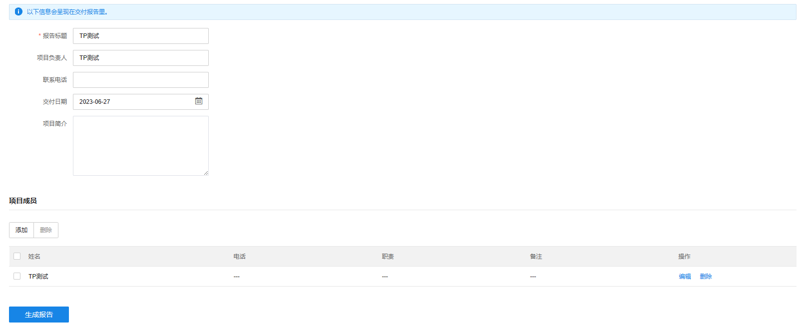

#### 5G 优先接入

自动计算 2.4G/5G 频段负载信息及终端信号强度，智能分配无线终端连接的频段，保证个体无线终端优质上网体验的前提下， 引导双频无线终端优先关联到 5GHz 射频上，避免无线终端扎堆 2.4GH 信道造成网络拥塞，使 2.4G/5G 频段负载更均衡，从而提高整体无线网络性能。

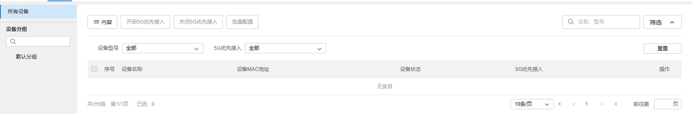

配置方法：

点击待配置设备的<配置>按钮。

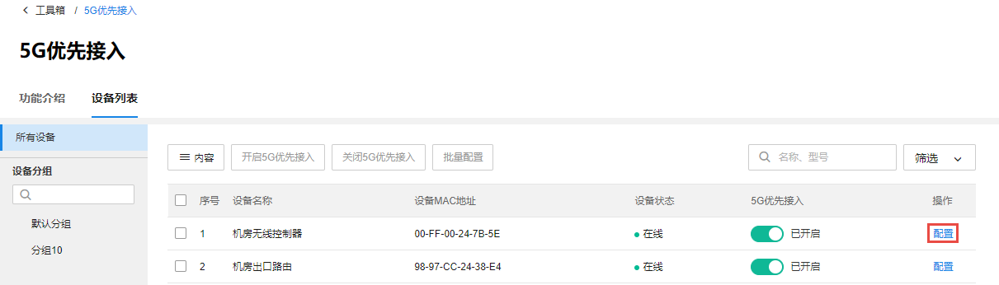

点击后会出现设置框，设置项与频谱导航功能一致，包括禁用/启用该功能、5G 频段连接门限、差值门限、最大失败次数。

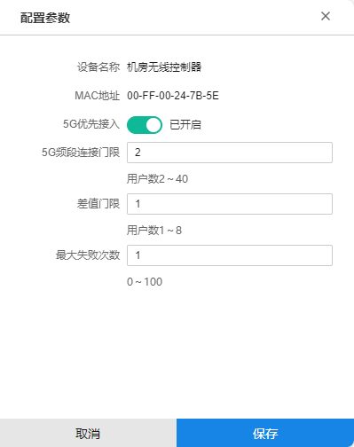

设置完成后，点击<保存>即可，此时设备端频谱导航的参数就可以成功被修改了。

> 说明：
> 
> 该功能需要设备端支持。支持该功能的设备才会在设备列表中显示出来。
