# 接口认证

可查看并配置开启了接口认证的 AC 和路由设备条目。

**进入页面的方法：项目 >> 网络管理 >> 网络配置 >> 接口认证**

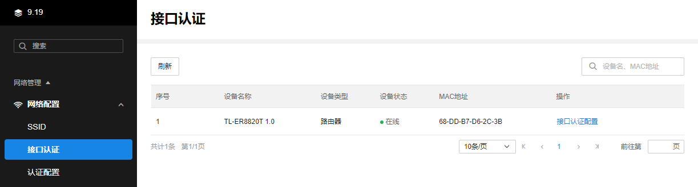

在接口认证界面点击<接口认证配置>，进入对应设备的接口认证配置界面，可查看并编辑各个接口的认证配置。

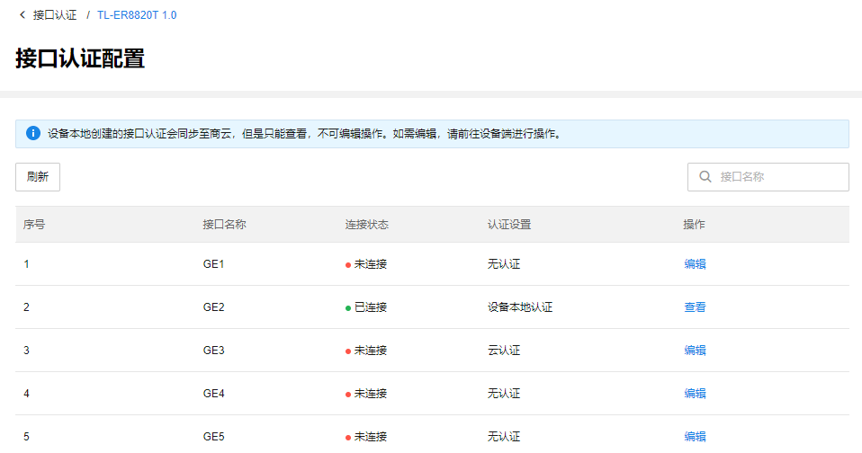

#### 查看本地接口认证配置

在设备接口认证配置页面，点击<查看>，可查看设备本地创建的接口认证。

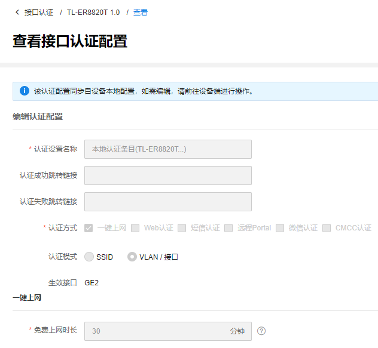

> 说明：
> 
> 设备本地创建的接口认证会同步至商云，但是只能查看，不可编辑操作。如需编辑，请前往设备端进行操作。

#### 编辑接口认证配置

在设备接口认证配置页面，点击<编辑>可编辑对应接口的认证配置。

选择认证设置方式，点击<完成>进入相应配置界面。可选无认证、设备本地认证及与云认证，其中本地认证的接口认证请于设备端进行配置。

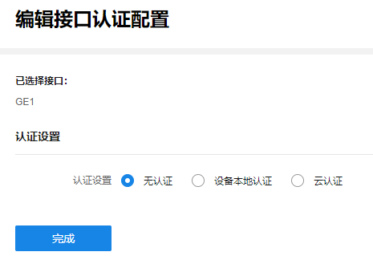

##### 认证设置

选择认证设置方式：无认证、设备本地认证、云认证。

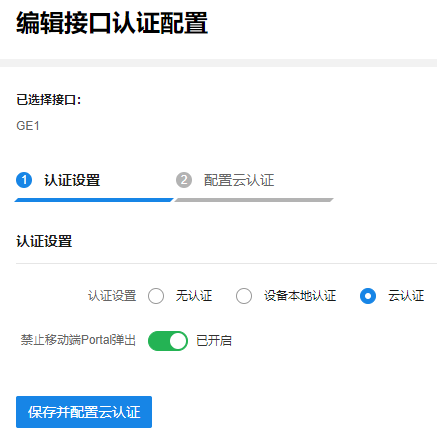

无认证：如无需认证，选择“无认证”后直接点击<下一步>即可。

设备本地认证：本地认证模式的接口认证请于设备端进行配置。

云认证：可选择禁止移动端 Portal 弹出，设置完成后点击<下一步>。后续需配置云认证，支持配置公众号认证和小程序认证。

##### 配置云认证

  * 云认证策略

点击<添加认证策略>可添加云认证策略，配策略名称及相关条件后，点击<确定>完成添加。

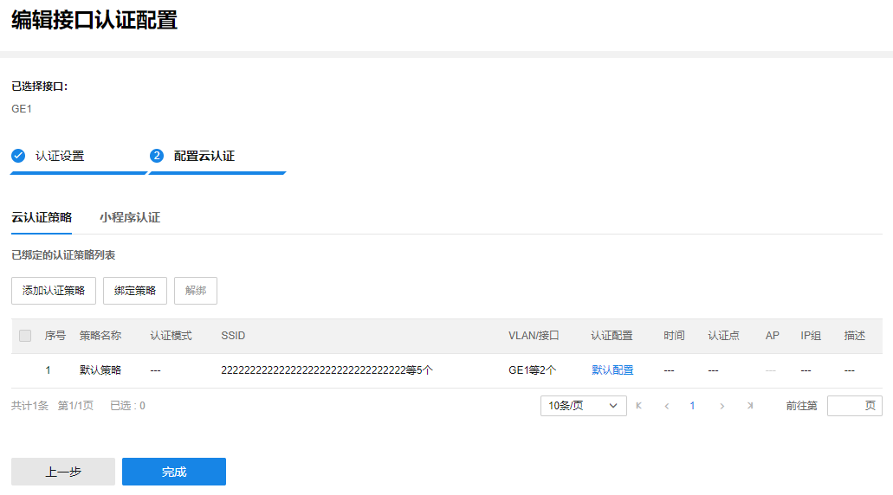

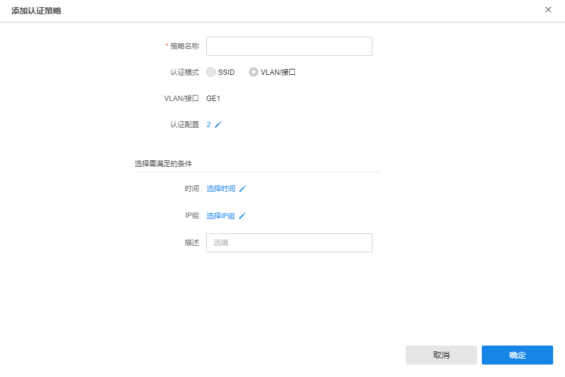

|   
---|---  
策略名称| 设置云认证策略名称。  
认证配置| 选择认证配置。  
认证点| 选择策略生效的路由器或 AC 设备。  
时间| 选择策略生效的时间范围。  
AP| 选择策略生效的 AP 设备。  
IP 组| 选择策略生效的 IP 组范围。  
描述| 可填写该策略的相关信息，用于区分策略。  
  
  * 小程序认证

支持小程序认证，用户可使用微信扫描小程序二维码认证上网，或通过微信公众号跳转小程序，关注微信公众号后方可进行认证上网。

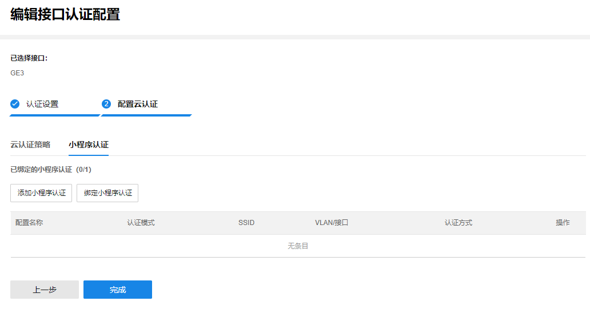

如需添加小程序认证，可参考如下步骤：

  1. 选择小程序认证，点击<添加小程序认证>，填写认证配置。

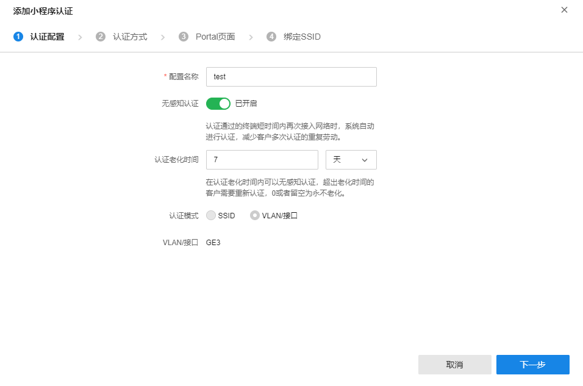

|   
---|---  
配置名称| 设置小程序认证名称。  
无感知认证| 可选择开启无感知认证；开启无感知认证后，认证通过的终端短时间内再次接入网络时，系统自动进行认证，减少客户多次认证的重复劳动。  
认证老化时间| 在认证老化时间内可以无感知认证，超出老化时间的客户需要重新认证，0 或者留空为永不老化。  
  
  2. 认证方式

支持公众号认证、快速上网、一键认证、账号认证及短信认证五种方式。其中，一键认证、账号认证和短信认证三种方式可复选。

1）公众号认证：

可配置公众号认证，实现公众号引流。开启公众号认证后，关注公众号即后可快速上网。

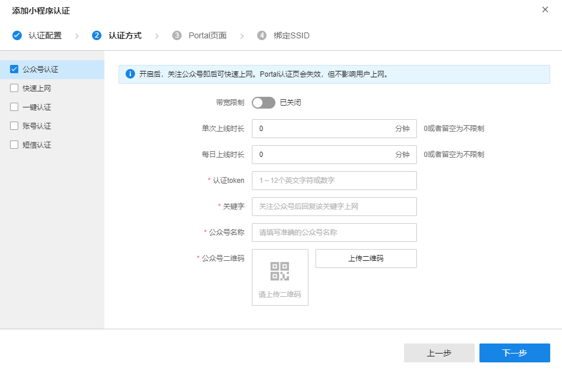

|   
---|---  
带宽限制| 可开启带宽限制，设置上行/下行带宽。  
单次上线时长| 可设置单次上线时长限制，0 或者留空为不限制。  
每日上线时长| 可设置每日上线时长限制，0 或者留空为不限制。  
认证 token| 1~12 个英文字符或数字，用于校验。  
关键字| 关注公众号后回复该关键字上网。  
公众号名称| 请填写准确的公众号名称。  
公众号二维码| 点击<上传二维码>，从本地上传微信公众号的二维码。  
  
> 说明：
> 
> 此种方式将使 Portal 认证页失效，但不影响用户上网。

2）快速上网：

开启快速上网后，通过微信扫码或公众号跳转链接可快速上网，无需选择认证方式。

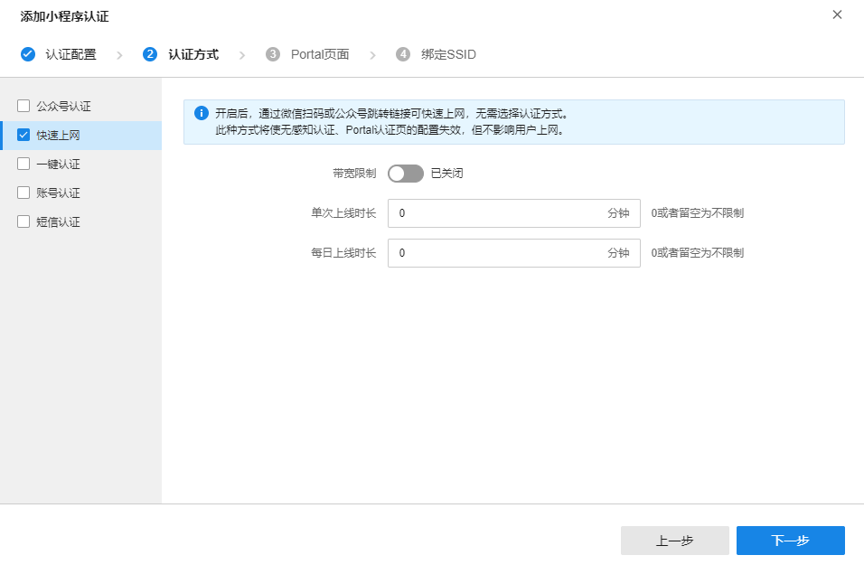

|   
---|---  
带宽限制| 可开启带宽限制，设置上行/下行带宽。  
单次上线时长| 可设置单次上线时长限制，0 或者留空为不限制。  
每日上线时长| 可设置每日上线时长限制，0 或者留空为不限制。  
  
> 说明：
> 
> 此种方式将使无感知认证、Portal 认证页的配置失效，但不影响用户上网。

3）一键认证：

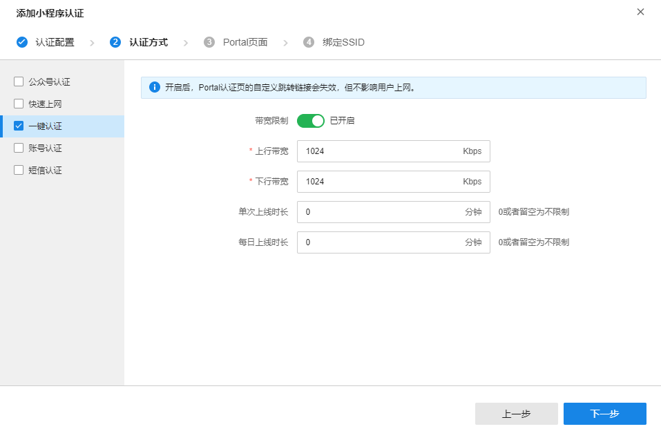

|   
---|---  
带宽限制| 可开启带宽限制，设置上行/下行带宽。  
单次上线时长| 可设置单次上线时长限制，0 或者留空为不限制。  
每日上线时长| 可设置每日上线时长限制，0 或者留空为不限制。  
  
> 说明：
> 
> 开启后，Portal 认证页的自定义跳转链接会失效，但不影响用户上网。

4）账号认证

支持账号认证。如需进行账号导入、创建和维护，请前往页面：网络管理 >> 云认证计费 >> AAA >> 账号管理

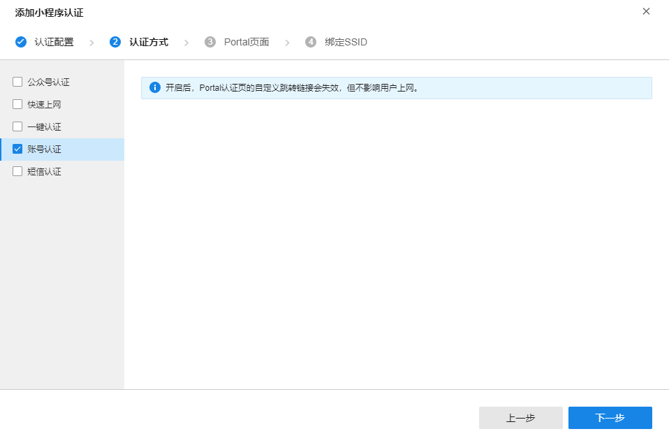

> 说明：
> 
> 开启后，Portal 认证页的自定义跳转链接会失效，但不影响用户上网。

5）短信认证

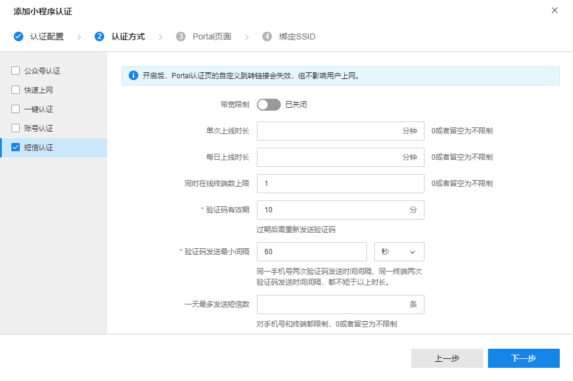

|   
---|---  
带宽限制| 可开启带宽限制，设置上行/下行带宽。  
单次上线时长| 可设置单次上线时长限制，0 或者留空为不限制。  
每日上线时长| 可设置每日上线时长限制，0 或者留空为不限制。  
同时在线终端数上限| 可设置同时在线终端数上限，0 或者留空为不限制。  
验证码有效期| 设置验证码有效期，过期后需重新发送验证码。  
验证码发送最小间隔| 同一手机号两次验证码发送时间间隔、同一终端两次验证码发送时间间隔，都不短于以上时长。  
一天最多发送短信数| 可设置一天最多发送短信数。对手机号和终端都限制，0 或者留空为不限制。  
短信接口商| 选择短信接口商并填写填写相关参数。  
  
> 说明：
> 
> 开启后，Portal 认证页的自定义跳转链接会失效，但不影响用户上网。

  3. Portal 页面

可选择已有 Portal 页面或点击<添加 Portal 页面>添加新页面。

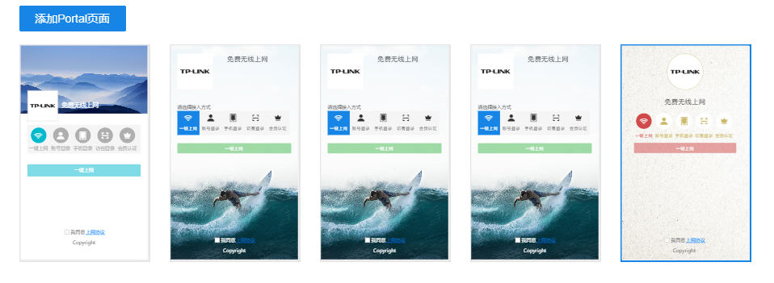

  4. 绑定 SSID

选择该认证策略生效的 SSID，点击<确定>完成小程序认证添加。
