# 认证配置

#### 认证配置

配置认证模板，用于绑定 SSID 实现无线认证功能。

**进入页面的方法：项目** >>**网络管理** >>**网络配置** >>**认证配置**

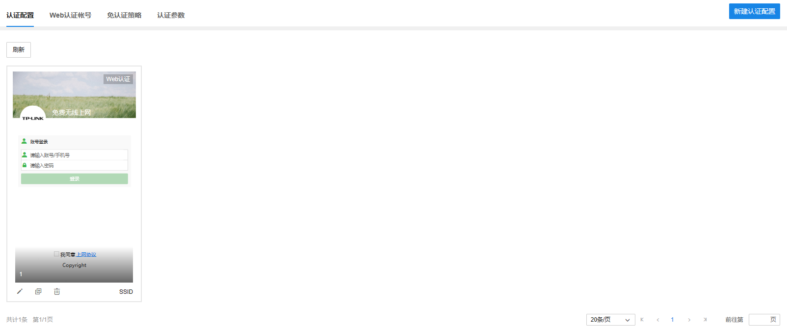

配置流程：

  1. 新建认证配置：填写认证设置名称、认证成功/失败的跳转链接以及勾选认证方式。

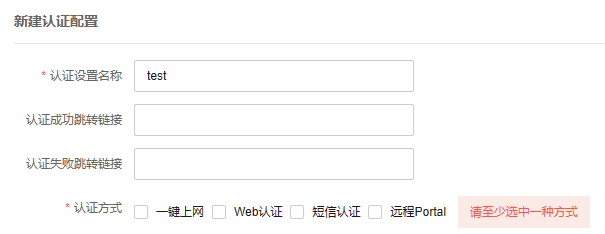

|   
---|---  
认证设置名称| 给新建的认证配置命名，方便管理和查找  
认证成功跳转连接| 终端认证成功后跳转的 URL 地址  
认证失败跳转连接| 终端认证失败时跳转的 URL 地址  
认证方式| 提供一键上网、Web 认证、短信认证以及远程 portal 认证四种方式，可进行详细配置  
  
**一键上网：最简单的认证方式，点击上网按钮即可上网**

|   
---|---  
免费上网时长| 认证用户免费上网的时长。认证时长设置范围受设备限制，若设备不支持设置的时长则自动调整为最接近设置时长的合法值。  
  
**Web** 认证：终端需输入用户名密码进行认证上网。Web 认证可对接本地服务器或远程服务器实现。

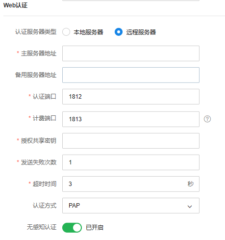

|   
---|---  
认证服务器类型| 选择对接本地服务器或远程服务器。  
本地服务器| 路由器或 AC 内置的认证服务器。  
远程服务器| 专门搭设的用于提供认证服务的服务器。  
主服务器地址| 远程服务器的 IP 地址或域名。  
备用服务器地址| 备用远程服务器的 IP 地址或域名。  
认证端口| 服务器监听认证报文的端口，默认为 UDP 1812 端口。  
计费端口| 服务器监听计费报文的端口，默认为 UDP 1813 端口。该配置仅对支持计费功能的机型生效。  
授权共享密钥| 在远程服务器上配置的共享密钥。  
发送失败次数| 当客户端发送请求后，如果没有收到回复，重复发送请求的次数。  
超时时间| 当客户端发送请求后，数据包超时时间。  
认证方式| 使用的认证协议，有 PAP、CHAP、MSCHAP 和 MSCHAPv2。  
无感知认证| 若启用无感知认证，无感知认证用户免费上网时长用尽或再次接入无线服务时会自动进行认证。  
  
> 说明：
> 
> 在认证配置组合认证中，只能同时选择一键上网、WEB 认证和短信认证，选择远程 portal 认证则其余三个配置项将置灰。

**短信认证：通过手机发送短信验证码进行认证上网**

配置流程：

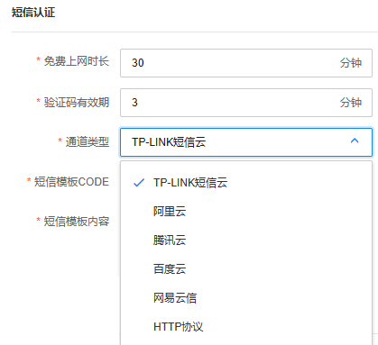

不同短信服务商相关参数介绍：

**TP-LINK** 短信云 **：**

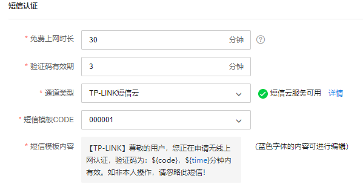

|   
---|---  
短信模板 CODE| 可选择不同的短信模板。  
短信模板内容| 显示短信模板的内容，蓝色字体内容可点击编辑。  
  
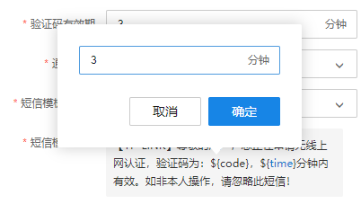

**阿里云：**

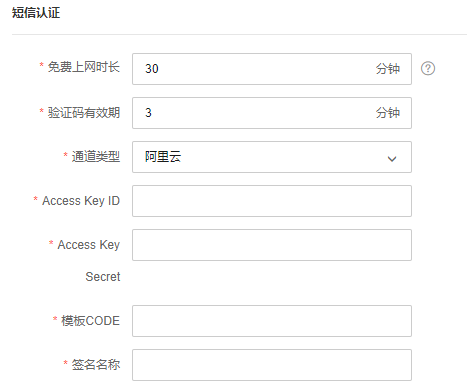

|   
---|---  
Access Key ID| 访问阿里云平台短信接口所对应的用户名。  
Access Key Secret| 访问阿里云平台短信接口所对应的密码。  
模板 CODE| 阿里云平台所提供的模板 ID 号。  
签名名称| 阿里云平台发送的短信模板对应的签名名称。  
  
**腾讯云：**

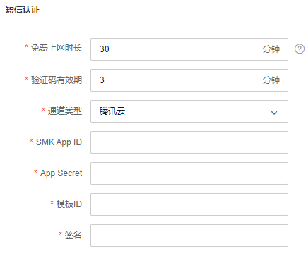

|   
---|---  
SMK App ID| 访问腾讯云平台短信接口所对应的用户名。  
App Secret| 访问腾讯云平台短信接口所对应的密码。  
模板 ID| 腾讯云平台所提供的模板 ID 号。  
签名| 腾讯云平台发送的短信模板对应的签名名称。  
  
**百度云：**

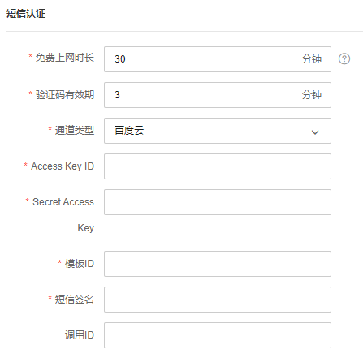

|   
---|---  
Access Key ID| 访问百度云平台短信接口所对应的用户名。  
Secret Access Key| 访问百度云平台短信接口所对应的密码。  
模板 ID| 百度云平台所提供的模板 ID 号。  
短信签名| 百度云平台发送的短信模板对应的签名名称。  
调用 ID| 百度云平台调用短信发送应用的调用 ID。  
  
**网易云信：**

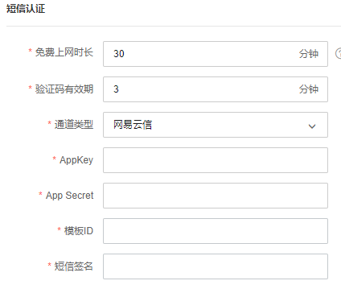

|   
---|---  
AppKey| 访问网易云信平台短信接口所对应的用户名。  
App Secret| 访问网易云信平台短信接口所对应的密码。  
模板 ID| 网易云信平台所提供的模板 ID 号。  
短信签名| 网易云信平台发送的短信模板对应的签名名称。  
  
**HTTP** 协议：

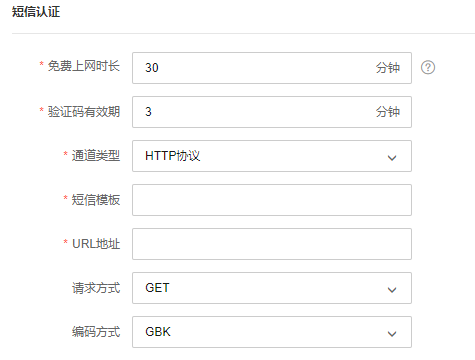

|   
---|---  
URL 地址| 所选择平台的 URL 地址。  
请求方式| 向服务器发送请求的 HTTP 报文类型。  
编码类型| 所选择平台要求的编码格式。  
短信模板| 当为 http 类型时，短信模板为 url 参数。其中，手机号与验证码分别采用'{PHONE}'与'{CODE}'关键字替换，例如： user=zhangsan&password=12345678&phone={PHONE}&msg=您的验证码为{CODE}，请不要告诉他人！。参数中可增加其它固定的参数信息，如：action=send。不可添加不固定项，主要包括时间戳、MD5 项、校验和项等。  
  
**远程** portal**认证：对接远程** Portal**服务器进行** Web**认证**

填写相关参数，对接远程 portal 服务器。认证服务器可选择本地或远程服务器。

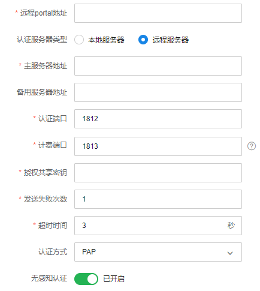

|   
---|---  
主服务器地址| 远程服务器的 IP 地址或域名。  
备用服务器地址| 备用远程服务器的 IP 地址或域名。  
认证端口| 服务器监听认证报文的端口，默认为 UDP 1812 端口  
计费端口| 服务器监听计费报文的端口，默认为 UDP 1813 端口。该配置仅对支持计费功能的机型生效。  
授权共享密钥| 在远程服务器上配置的共享密钥。  
发送失败次数| 当客户端发送请求后，如歌没有收到回复，重复发送请求的次数。  
超时时间| 当客户端发送请求后，数据包超时时间。  
认证方式| 使用的认证协议，有 PAP、CHAP、MSCHAP 和 MSCHAPv2。  
无感知认证| 若启用无感知认证，无感知认证用户免费上网时长用尽或再次接入无线服务时会自动进行认证。  
  
> 说明：
> 
> 如果配置了认证失败跳转链接，链接地址会自动加入免认证策略，无需用户配置。
> 
> 认证服务器类型为远程服务器时，若服务器配置了用户上网时间，则免费上网时长为服务器返回的时间，否则为本配置页面的免费上网时长

  2. 设置 Portal 界面：设置 Portal 界面的模板，可选择已有的默认 Portal 界面或新建 Portal 界面

**选择已有** Portal**界面：使用默认** Portal**模板**

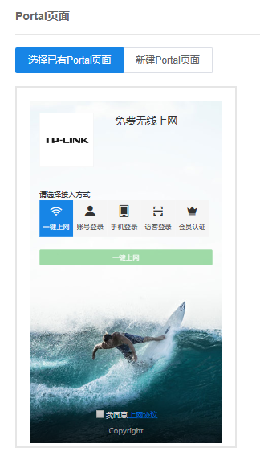

**新建** Portal**界面：可选择不同模板，并自定义** Portal**页面的展示内容**

（1）设置认证页

|   
---|---  
页面标题| 跳转页面的页面标题。  
欢迎语| 显示跳转页面的欢迎信息。  
版权信息| 显示跳转页面的版权声明信息。  
上网协议| 开启后，用户需要勾选同意协议才能进行上网认证。  
上网协议文本| 点击“上网协议”链接后显示的具体内容。  
背景图片| 用于页面的背景展示图，图片大小限制在 200KB 以内。  
Logo 图片| 设置页面的 Logo 图片，图片大小限制在 100KB 以内。  
自定义跳转链接入口| 在认证界面设置额外的跳转链接入口，可自定义文案和链接 URL。  
  
（2）设置认证成功页

|   
---|---  
页面标题| 设置认证完成页的页面标题。  
公告| 设置页面的提示信息。  
背景图片| 用于页面的背景展示图，图片大小限制在 200KB 以内。  
Logo 图片| 设置页面的 Logo 图片，图片大小限制在 100KB 以内。  
  
#### Web 认证账号

配置用户的认证上网账号，用于对接本地 Web 认证使用。

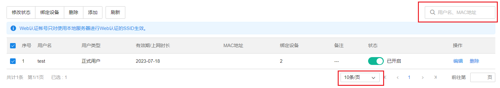

**页面进入的方法：项目** >>**网络管理** >>**网络配置** >>**认证配置** >>Web**认证账号**

|   
---|---  
| 通过用户名、MAC 地址搜索认证账号。  
| 设置页面展示的条目数  
  
**功能栏介绍：**

|   
---|---  
修改状态| 修改认证账号开启/关闭的状态。  
绑定设备| 将已选择的 Web 认证账号绑定至勾选的设备。  
删除| 删除认证账号。  
添加| 添加认证账号。  
刷新| 手动刷新认证用户列表。  
  
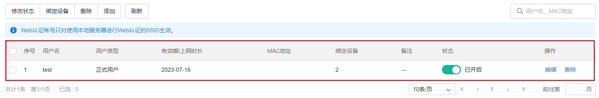

**账号状态栏介绍：**

|   
---|---  
用户名| 用于认证登录的用户名。  
用户类型| 分为正式用户和免费用户。  
正式用户| 存留在系统中的正式用户，具有一定的有效期，且可以绑定相应的设备 MAC 地址。可以记录更多用户的资料信息。  
免费用户| 免费用户具有一定的上网时长限制。  
有效期| 正式用户的有效期。  
上网时长| 免费用户的免费上网时长。  
MAC 地址| 绑定用户的 MAC 地址。  
绑定设备| 认证账号已绑定的设备数量。  
备注| 可选择记录当前用户备注。  
状态| 是否启用当前用户规则。  
  
**认证账号配置方法：**

流程：

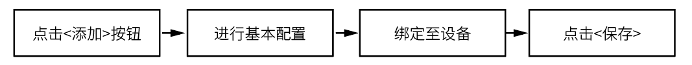

  1. 进行基本配置：选择用户类型，配置账号的基本设置。

（1）正式用户：

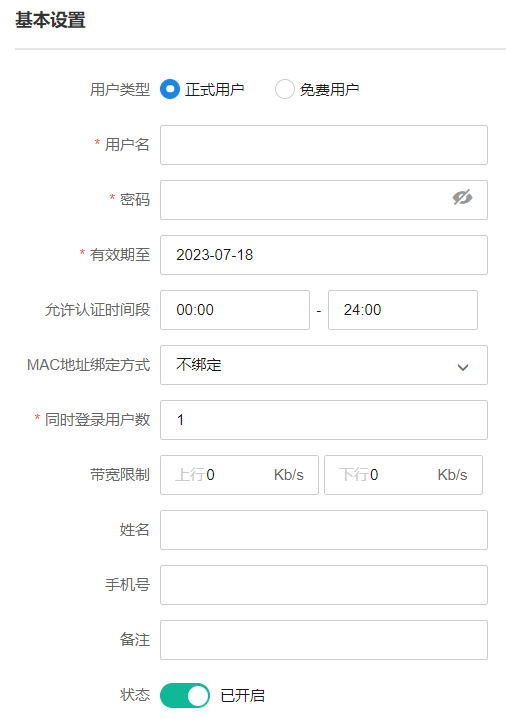

|   
---|---  
用户名| 用于认证登录的用户名。  
密码| 用于认证登录的密码。  
有效期| 正式用户账号的有效期。  
允许认证时间段| 允许用户进行认证的时间。  
MAC 地址绑定方式| 选择是否绑定 MAC 地址，以及绑定的方式。 l 不绑定：不绑定用户的 MAC 地址 l 静态绑定：绑定一个静态的 MAC 地址 l 动态绑定：进行动态绑定  
同时登录用户数| 最多允许同时使用该账号登录的用户数量。  
带宽限制| 设置用户允许使用的最大上/下行带宽，0 表示不限制。  
姓名| 可选择备注用户姓名。  
手机号| 可选择备注用户手机号。  
备注| 可选择记录用户备注。  
状态| 是否启用当前用户规则。  
  
（2）免费用户：

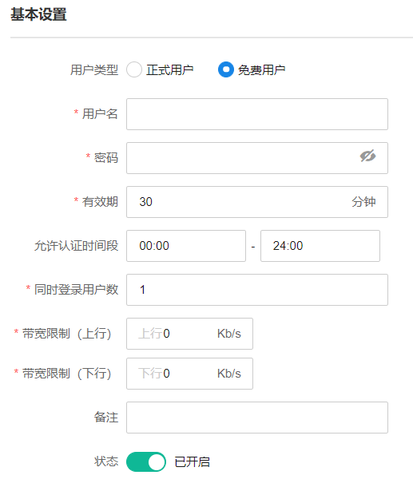

|   
---|---  
用户名| 用于认证登录的用户名。  
密码| 用于认证登录的密码。  
有效期| 免费用户账号的有效期。  
允许认证时间段| 允许用户进行认证的时间。  
同时登录用户数| 最多允许同时使用该账号登录的用户数量。  
带宽限制| 设置用户允许使用的最大上/下行带宽，0 表示不限制。  
备注| 可选择记录用户备注。  
状态| 是否启用当前用户规则。  
  
  2. 绑定设备：将认证用户绑定至路由器/AC 设备上

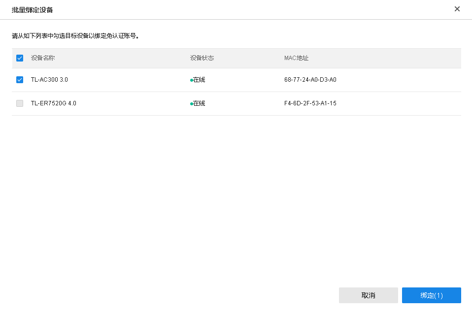

  3. 点击<保存>，完成 Web 认证账号的配置。

> 注意：
> 
> Web 认证帐号只对使用本地服务器进行 Web 认证的 SSID 生效。
> 
> 用户名称配置设置后无法修改。

#### 免认证策略

设置用户在 Portal 认证成功前，允许访问的资源。

**页面进入的方法：项目** **> >** **网络管理** **> >** **网络配置** **> >** **认证配置** **> >** **免认证策略**

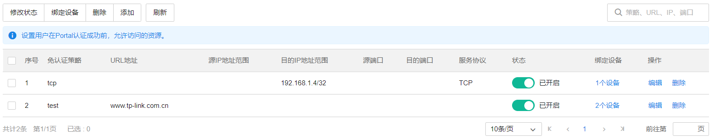

**功能栏介绍：**

|   
---|---  
修改状态| 修改免认证策略开启/关闭的状态。  
绑定设备| 将已选择的免认证策略绑定至勾选的设备。  
删除| 删除免认证策略。  
添加| 添加免认证策略。  
刷新| 手动刷新免认证策略列表  
  
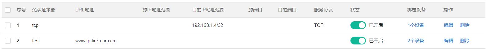

**免认证策略状态栏介绍：**

|   
---|---  
免认证策略| 免认证策略条目的名称。  
URL 地址| 当选择 URL 免认证策略时，需要匹配的 URL 地址。  
源 IP 地址范围| 设置免认证策略的源 IP 地址和网络掩码。  
目的 IP 地址范围| 设置免认证策略的目的 IP 地址和网络掩码。  
源端口| 设置免认证策略的源端口范围。  
目的端口| 设置免认证策略的目的端口范围。  
服务协议| 设置免认证策略的服务协议。  
状态| 设置免认证策略是否生效。  
绑定设备| 免认证策略已绑定的设备。  
  
**免认证策略配置方法：**

流程：

  1. 进行基本配置：设置策略名称，选择免认证方式并设置具体内容。

（1）五元组方式：

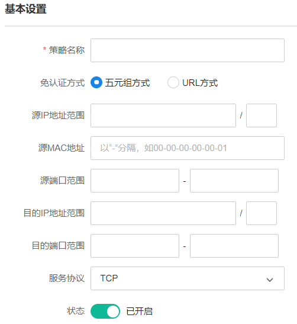

|   
---|---  
策略名称| 填写免认证策略条目的名称。  
五元组方式| 通过源 IP、源 MAC、源端口、目的 IP、目的端口五个参数匹配免认证策略。  
源 IP 地址范围| 设置免认证策略的源 IP 地址和网络掩码。  
目的 IP 地址范围| 设置免认证策略的目的 IP 地址和网络掩码。  
源端口范围| 设置免认证策略的源端口范围。  
目的端口范围| 设置免认证策略的目的端口范围。  
服务协议| 设置免认证策略的服务协议。  
状态| 设置免认证策略是否生效。  
  
（2）URL 方式：

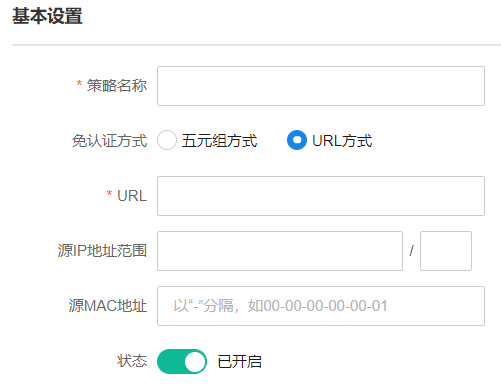

|   
---|---  
策略名称| 填写免认证策略条目的名称。  
URL| 免认证策略需要匹配的 URL 地址。  
源 IP 地址范围| 设置免认证策略的源 IP 地址和网络掩码。  
源 MAC 地址| 设置免认证策略的源 MAC 地址。  
状态| 设置免认证策略是否生效。  
  
  2. 绑定设备：将免认证策略绑定至路由器/AC 设备上。

  3. 点击<保存>，完成免认证策略的配置。

#### 认证参数

查看和编辑路由器/AC 设备的认证参数。

**页面进入的方法：项目** >>**网络管理** >>**网络配置** >>**认证配置** >>**认证参数**

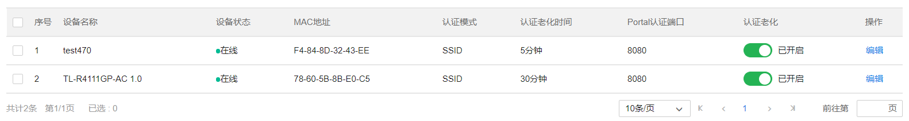

**认证参数状态栏介绍：**

|   
---|---  
设备名称| 路由器/AC 设备的名称。  
设备状态| 设备的在线状态。  
MAC 地址| 设备的 MAC 地址。  
认证模式| 设置 Portal 认证的认证模式，开启云管理后仅支持 SSID 认证。  
Portal 认证端口| 用于 Portal 认证的服务端口，默认为 8080 端口，不能与其他服务端口重复。  
认证老化| 点击按钮开启/关闭认证老化功能。  
  
点击<编辑>，可以对认证参数进行配置。相关参数介绍如下：

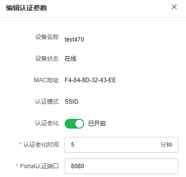

|   
---|---  
认证老化时间| 当已认证客户端断开连接后，对应的认证条目的老化时间。客户端在老化时间内重新连接，不需要重新认证，超过老化时间后接入的客户端需要重新认证。
