# 班级管理

用户可以在此界面新建/删除班级、修改班级名称、查看班级概览，包括班级数量、所有班级的教师总数、家长总数、学生总数、摄像机总数，并可以点击具体班级进入该班级的管理界面。

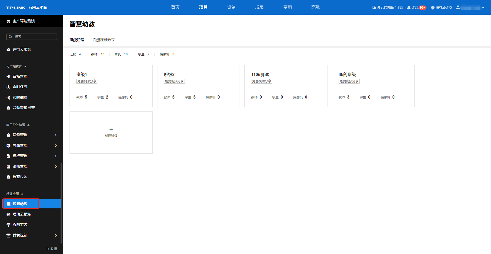

  * **新建班级**

点击<新建班级>，输入班级名称后即可新建班级。新建的班级按照时间顺序排列。

  * **修改班级名称**

点击班级卡片上的<修改班级名称>，输入班级新名称即可修改该班级名称。

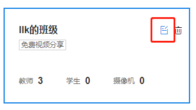

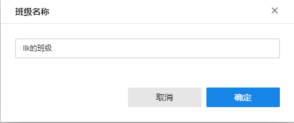

  * **删除班级**

点击班级卡片上的<删除>，点击<确认>即可删除该班级。

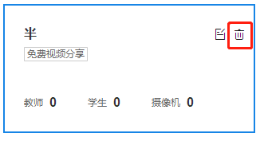

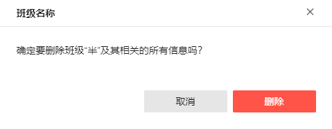

#### 班级管理详情

点击班级卡片，即可进入该班级的班级管理详情界面。在此界面可管理监控点、进行视频分享设置、管理学生通讯录、管理教师通讯录。

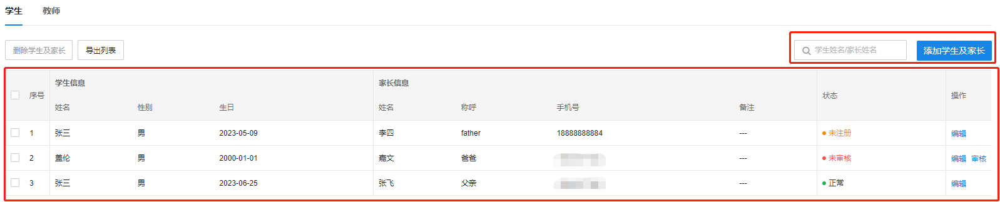

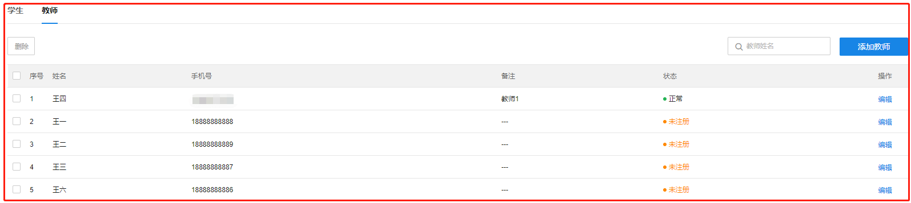

  * **管理监控点**

点击<管理监控点>，打开关联监控点弹窗。选择要关联到该班级的监控点后，点击<确定>，即可将监控点与班级关联，家长和教师可以观看监控点对应班级的实时视频。每个班级最多可以关联 5 个监控点。

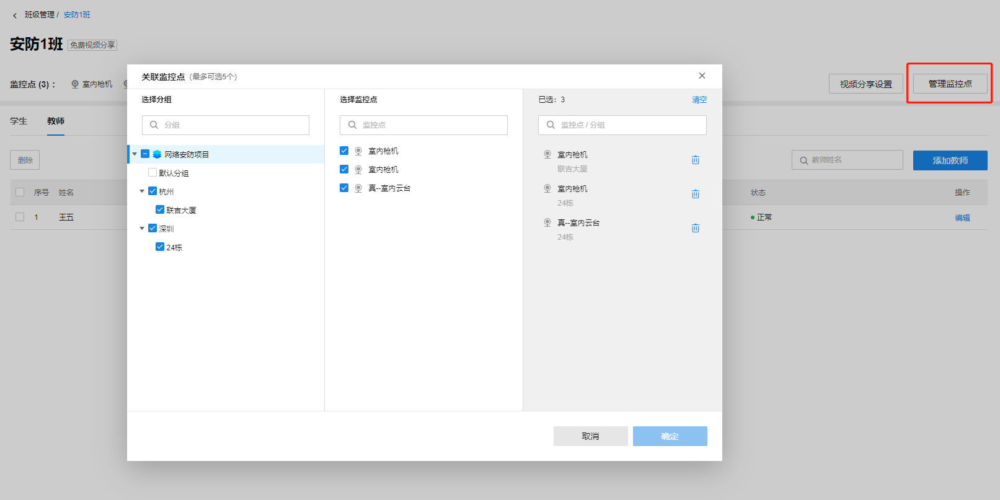

  * **视频分享设置**

点击<视频分享设置>，打开设置弹窗，可设置“对家长的开放时间”、“对教师的开放时间”和“视频操作权限”。

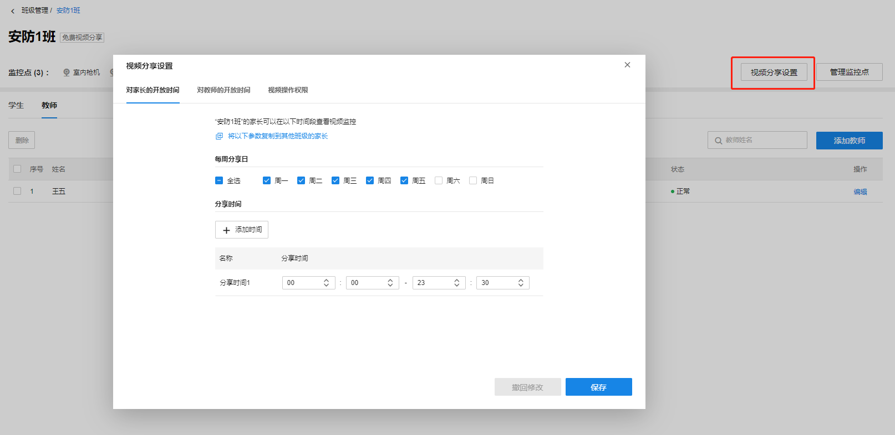

  * 对家长的开放时间

可以设置”每周分享日”和”分享时间”，设置完成并保存后，该班级中所有家长都可以通过商云小程序或物联 APP 在每周分享日的分享时间查看该班级所关联的所有监控点的视频。

设置好本班级的对家长的开放时间后，点击<将以下参数复制到其他班级的家长>并选择其他班级后确定，可将此参数复制给已创建的其他班级。

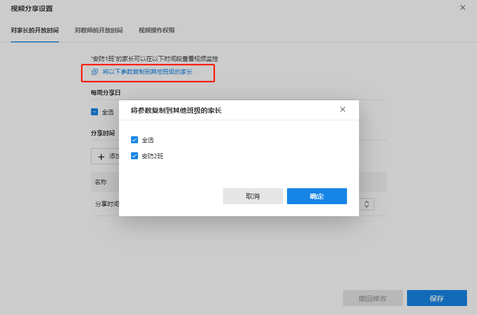

  * 对教师的开放时间

可以设置”每周分享日”和”分享时间”，设置完成并保存后，该班级中所有教师都可以通过商云小程序或物联 APP 在每周分享日的分享时间查看该班级所关联的所有监控点的视频。

设置好本班级的对教师的开放时间后，点击<将以下参数复制到其他班级的教师>并选择其他班级后确定，可将此参数复制给已创建的其他班级。

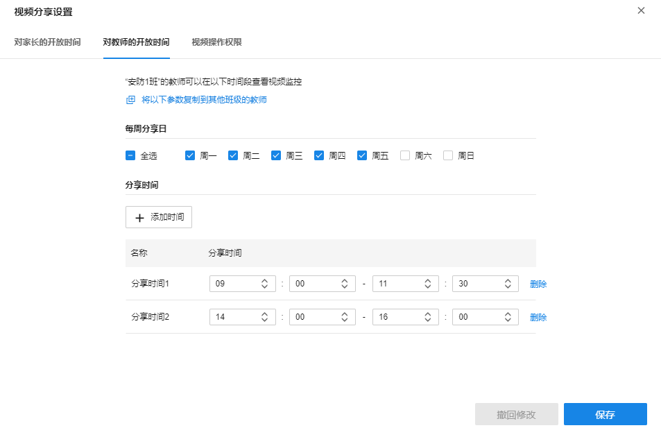

  * 视频操作权限

可设置家长和教师的视频操作权限。设置好本班级的视频操作权限后，点击<将以下参数复制到其他班级>并选择其他班级后确定，可将此参数复制给已创建的其他班级。

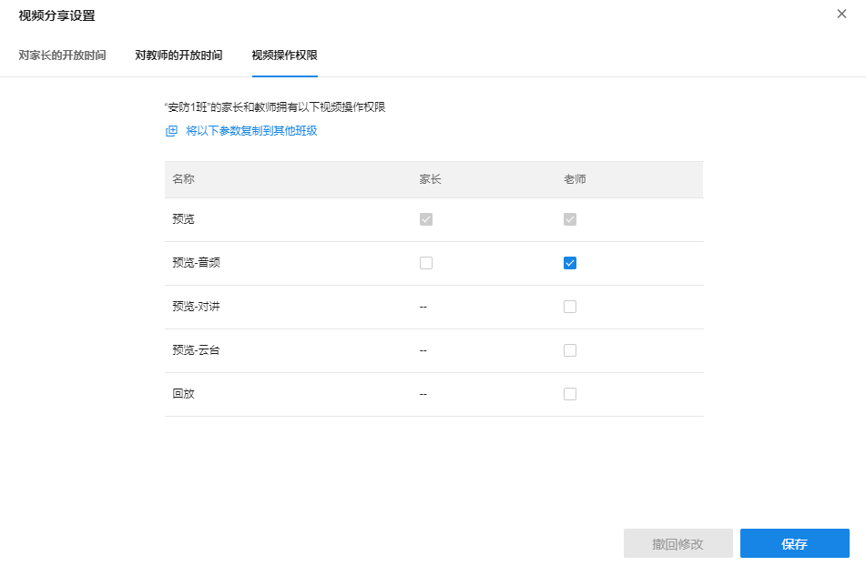

> 说明：
> 
> 共有五种权限，其中“预览”为默认权限且不可取消。
> 
> 家长可选择“预览-音频”操作权限，不可选择“预览-对讲”“预览-云台”“回放”操作权限。
> 
> 老师可选择全部操作权限。

  * **添加学生及家长**

学生通讯录支持从本地导入、输入信息添加、二维码邀请家长三种方式往通讯录中添加学生及家长的信息。添加完成后，商云会通过短信告知被添加的家长。

  * 从本地导入学生及家长信息

在学生通讯录界面点击<添加学生及家长>后，点击“从本地导入”的<模板下载>得到智慧幼教学生信息导入模板，按照模板填入学生及家长信息后，点击<从本地导入>，选择填好的模板文件即可将学生及家长信息导入班级通讯录。

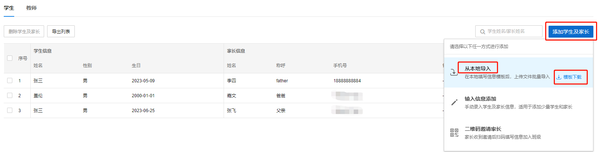

  * 输入信息添加学生及家长信息

在学生通讯录界面点击<添加学生及家长>后选择<输入信息添加>，在填写学生和家长信息后即可添加成功。

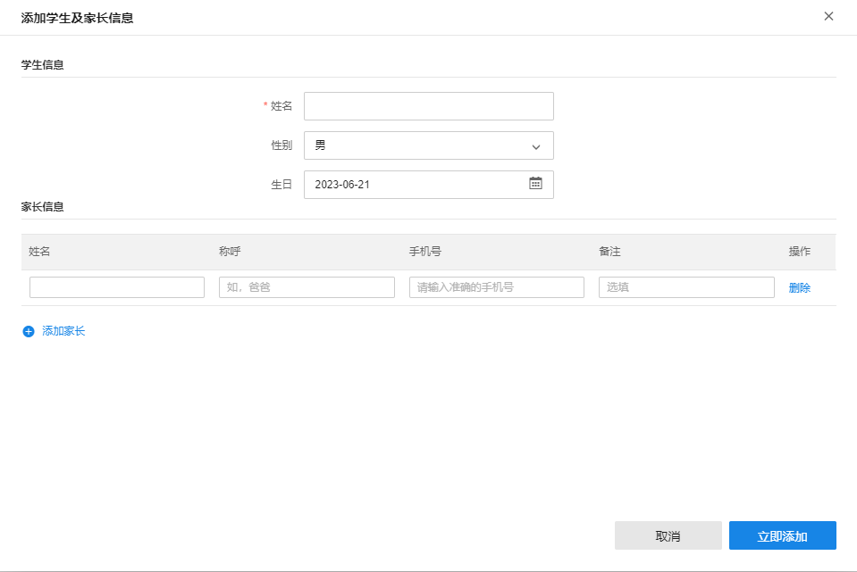

  * 二维码邀请家长

点击<添加学生及家长>，选择<二维码邀请家长>，即可生成邀请二维码。家长通过手机扫码填写学生及家长信息并提交。

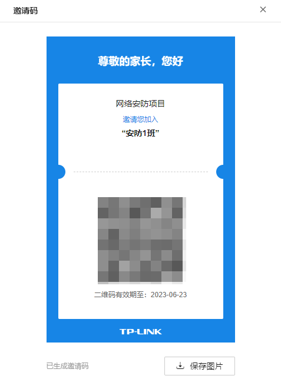

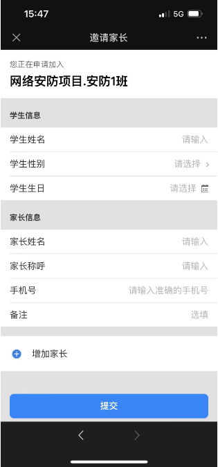

填写的信息会展示在该班级的学生通讯录列表中，等待审核。审核通过即保留在该班级通讯录中，并短信通知家长，家长可对该班级关联的监控点进行预览；审核被拒绝后，该学生家长信息条目从列表中删除，并短信通知家长。

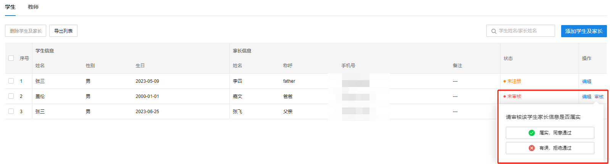

> 说明：
> 
> 每个班级最多可以添加 40 位家长。
> 
> 添加学生信息时，至少需添加一位家长信息，至多添加两位家长信息。

  * 学生通讯录列表条目介绍：

序号| 按条目的添加顺序排列。  
---|---  
|   
学生信息-姓名| 学生的姓名，至多 10 个汉字。  
学生信息-性别| 学生的性别，男或女。  
学生信息-生日| 学生出生的年月日，通过日期选择期输入。  
家长信息-姓名| 家长的姓名，至多 10 个汉字。  
家长信息-称呼| 对家长的称呼，如“爸爸”。  
家长信息-手机号| 家长的手机号，需输入合法的手机号。  
家长信息-备注| 对家长的备注信息，如“很忙”。  
状态| 家长手机号的状态，有“未审核、未注册、正常”。未审核表示通过二维码邀请的家长信息还未通过审核，无法预览视频；未注册表示该家长手机号未注册 TP-LINK ID，且未通过商云小程序用过智慧幼教模块，相当于未预览过视频；正常表示该家长手机号已注册过 TP-LINK ID 或已通过商云小程序预览过视频，在正常使用中。  
操作| 对于已审核的条目，有<编辑>选项；对于未审核的条目，有<审核>选项。  
搜索| 在搜索框中输入学生姓名或家长姓名后按回车即可在学生通讯录中搜索信息。  
编辑| 点击列表操作栏的<编辑>后，可对该信息条目进行编辑。  
删除学生及家长| 选择列表中的条目，点击<删除学生及家长>并确定，即可将选中的学生及家长删除  
导出列表| 可将该班级的全部家长及学生信息导出到 excel 表格中。  
  
  * **添加教师**

教师通讯录支持输入信息添加、二维码邀请教师两种方式往通讯录中添加教师信息，添加完成后，商云会通过短信告知被添加的教师。每个班级最多可以添加 5 名教师。

  * 输入信息添加

在教师通讯录界面点击<添加教师>后选择<输入信息添加>。填写教师姓名和手机号后即可添加成功。

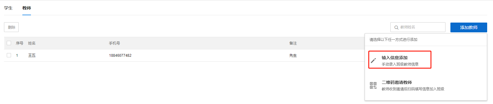

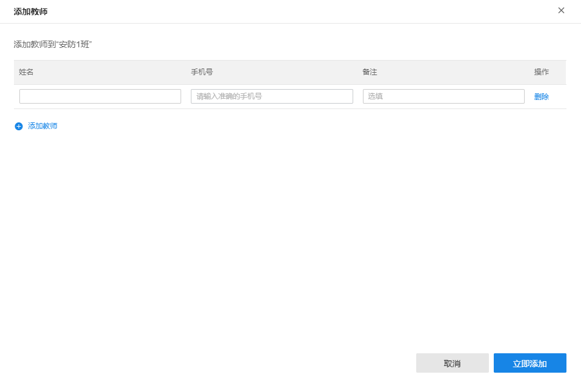

> 注意：
> 
> 填写的手机号若已在教师列表中存在，新增教师信息会直接覆盖原有的条目。

  * 二维码邀请教师

在教师通讯录界面点击<添加教师>后选择<二维码邀请教师>。

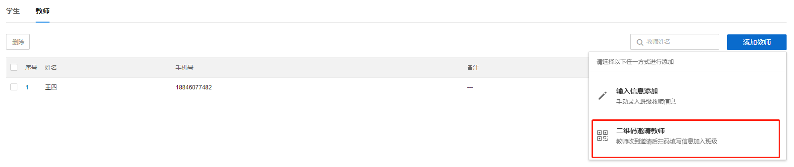

点击后会生成一个邀请二维码。用户需用手机扫码后填写信息提交，待管理员审核。

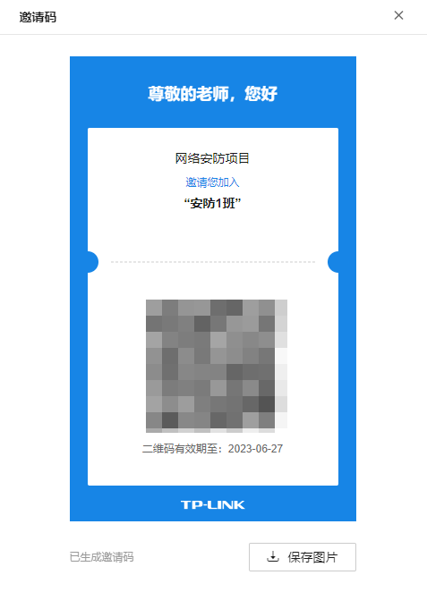

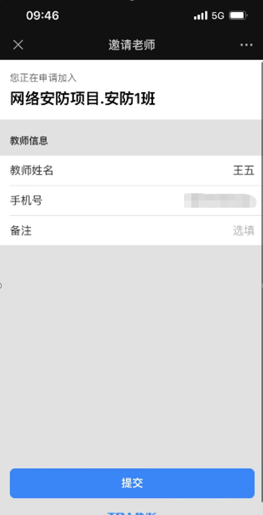

管理审核通过则该信息保存在教师通讯录中，管理员可对其进行编辑，该手机号获得班级的教师权限；审核拒绝通过则在列表中删除并短信告知审核结果。

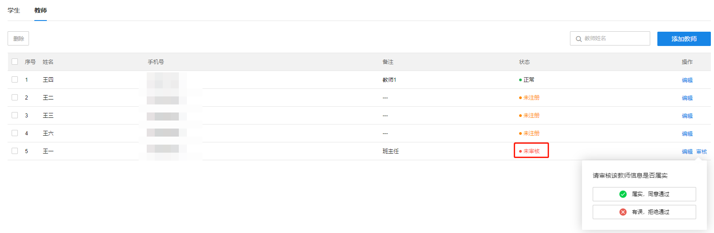

  * 教师通讯录列表条目介绍：

|   
---|---  
序号| 按条目的添加顺序排列。  
姓名| 教师的姓名，至多 10 个汉字。  
手机号| 教师的手机号，不允许重复。  
备注| 对教师的备注信息，如“班主任”。  
状态| 教师手机号的状态，有“未审核、未注册、正常”。未审核表示通过二维码邀请的教师信息还未通过审核，无法预览视频；未注册表示该教师手机号未注册 TP-LINK ID，且未通过商云小程序用过智慧幼教模块，相当于未预览过视频；正常表示该教师手机号已注册过 TP-LINK ID 或已通过商云小程序预览过视频，在正常使用中。  
操作| 对于已审核的条目，有<编辑>选项；对于未审核的条目，有<审核>选项。  
搜索| 在搜索栏输入教师姓名后按回车即可在教师列表中搜索教师。  
编辑| 点击列表操作栏的<编辑>后，可对该信息条目进行编辑。  
删除| 选择列表中的条目后点击<删除>并确定，即可将选中的条目删除，被删除的教师手机号对班级关联监控点的预览权限也被删除。
