# 高级视频分享

智慧幼教提供免费视频分享服务，每个监控点支持最多 2 人同时观看实时视频。开通高级视频分享套餐后，不再限制同时观看人数，所有家长、老师都可以随时观看班级视频。

高级视频分享服务提供 A、B、C 共 3 种套餐，校方可以根据班级数量选择合适的套餐。为了让用户能放心购买套餐，智慧幼教提供 A 套餐免费试用。每个项目可试用 A 套餐一个月，每个企业可试用 3 次。

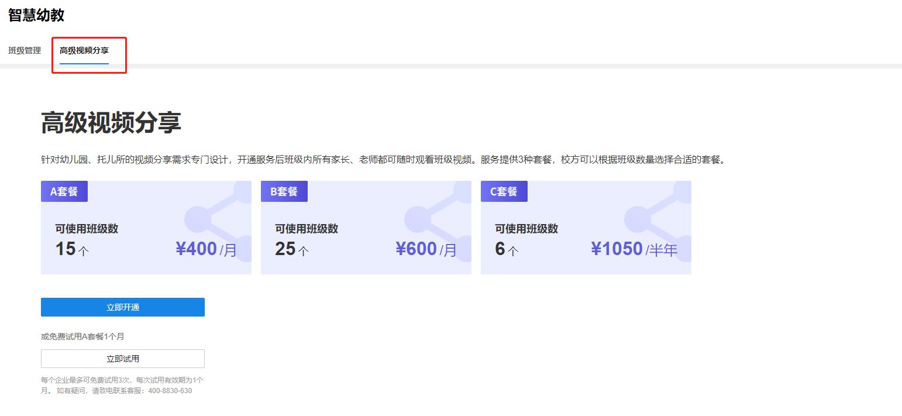

#### 套餐试用

在项目未开通过高级视频分享套餐时，可点击<立即试用>开通 A 套餐的试用。同意“TP-LINK 高级视频共享服务协议”并成功开通后，可以添加享受高级视频分享服务的班级。

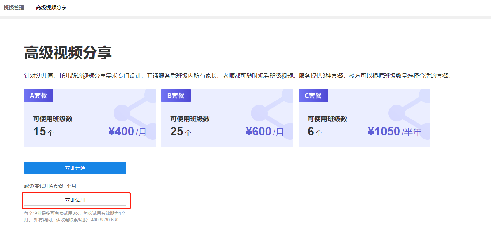

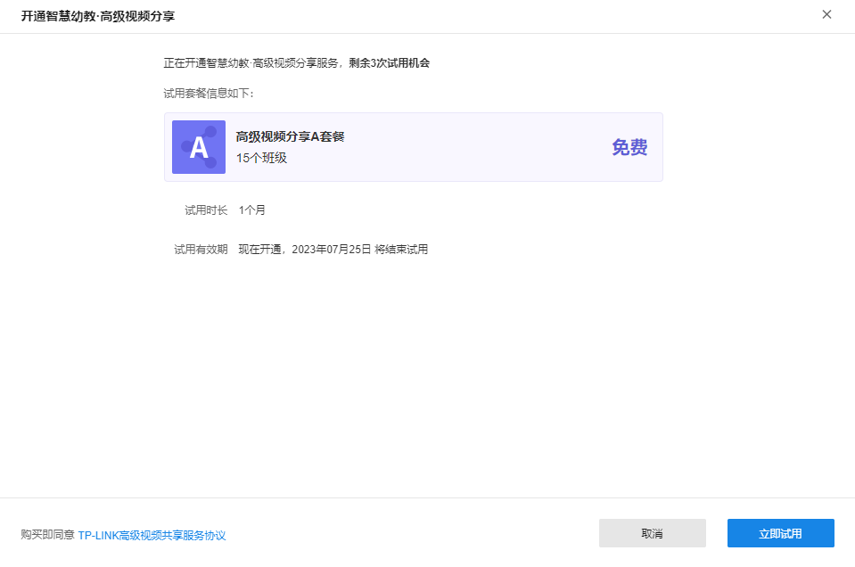

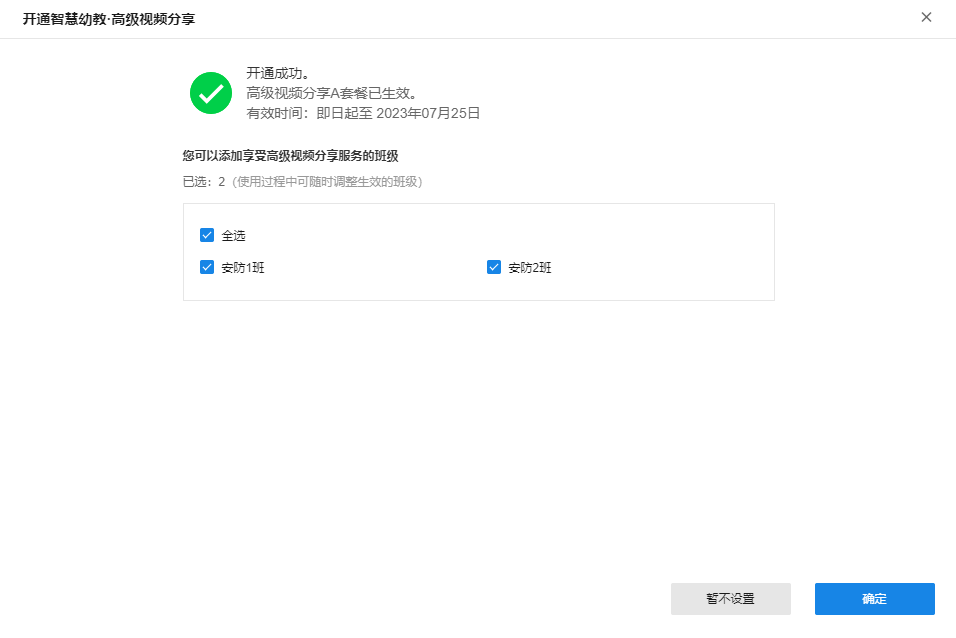

设置完成或选择<暂不设置>，返回高级视频分享界面，展示已开通的套餐及享受此套餐服务的班级信息。

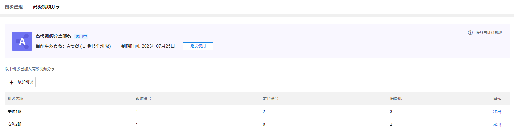

#### 开通正式套餐

点击未开通套餐界面的<立即开通>或已开通套餐界面的<延长使用>，即可进入开通正式套餐的界面。

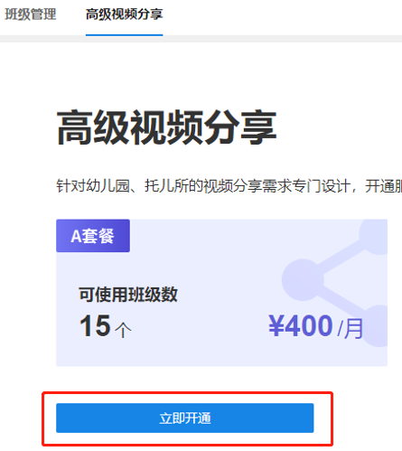

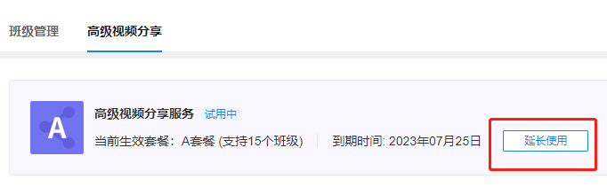

选择要开通的套餐类型及开通时间并同意"TP-LINK 高级视频共享服务协议"，点击<余额支付>，支付成功后即可开通正式套餐。

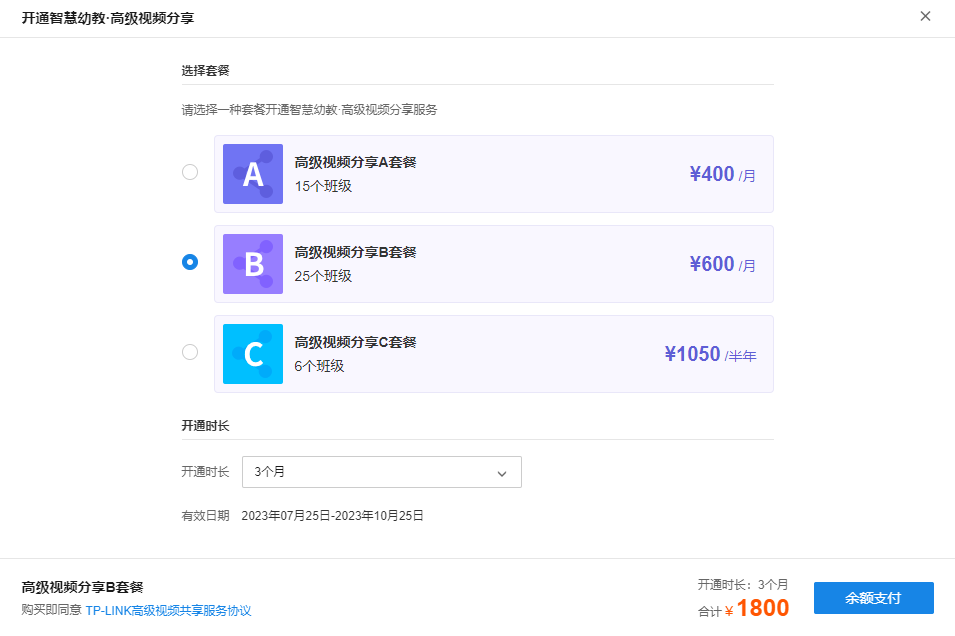

若当前无正在使用的套餐，则开通后的设置同套餐试用；若当前已有正在使用的套餐，则作为待使用套餐，待当前套餐到期后按开通时间自动生效。

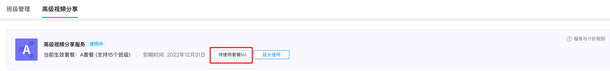

用户可点击<待使用套餐>查看详情。

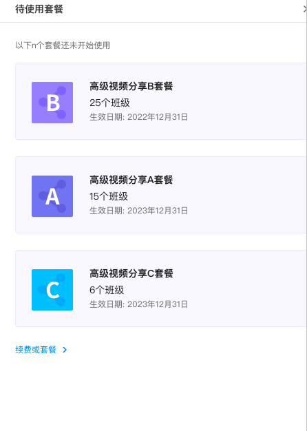

#### 加入高级视频分享服务

  * 班级列表条目：

|   
---|---  
班级名称| 加入高级视频分享的班级的名称  
教师账号| 该班级添加的教师的数量，最大为 5  
家长账号| 该班级添加的家长的数量，最大为 40  
摄像机| 该班级管理的摄像机的数量，最大为 5  
操作| <移出>选项，可以将班级移出高级视频分享服务  
  
  * **添加班级**

点击<添加班级>后，打开选择班级界面。

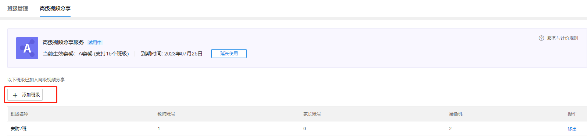

从未生效服务的班级中选择要添加的班级，点击<确定>即可将选中的班级加入高级视频分享服务。添加完成后，班级享有的视频分享服务由"免费视频分享"变为"高级视频分享"。

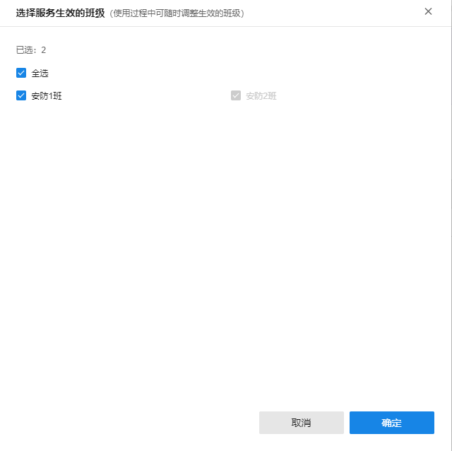

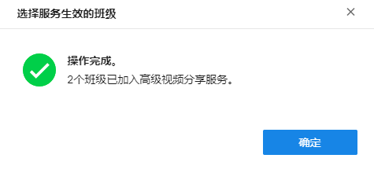

  * **移出班级**

点击班级列表中对应班级操作的<移出>并确定后，即可将该班级移出高级视频分享服务。

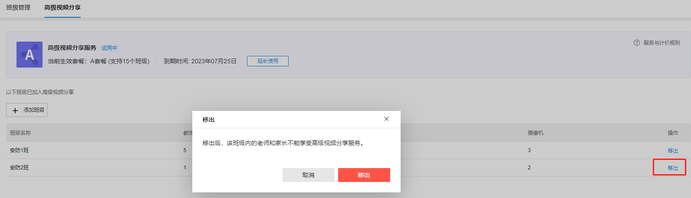

成功移出后，班级享有的视频分享服务由“高级视频分享”变为“免费视频分享”。
