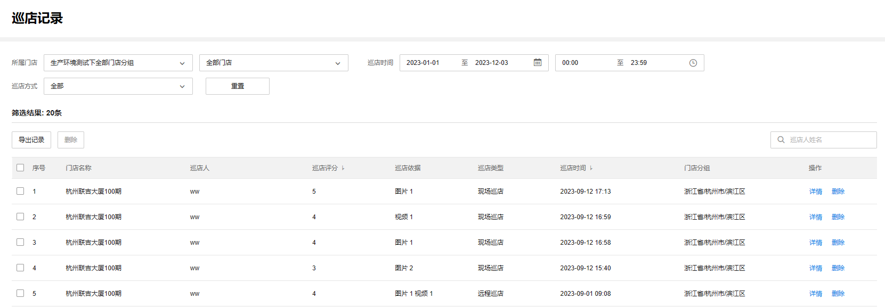

# 巡店记录

门店督导可通过 TP-LINK 商云小程序进行巡店管理，进入<巡店记录>可参看巡店情况反馈。

**进入页面的方法：项目** **> >** **行业应用** **> >** **智慧连锁** **> >** **巡店记录**

**巡店记录页面介绍：**

|   
---|---  
所属门店| 可筛选门店，包括门店所属分组、门店名称  
巡店时间| 可筛选对应日期、时间的巡店记录  
巡店方式| 可筛选远程巡店或现场巡店的记录  
重置| 恢复默认筛选项目下的所有门店，筛选单日全天的巡店记录  
门店名称| 显示门店名称  
巡店人| 显示巡店督导姓名  
巡店评分| 显示督导巡店打分，0-5 分  
巡店依据| 显示巡店的图片数量  
巡店类型| 显示远程巡店或现场巡店  
门店分组| 显示门店所属分组  
详情| 查看巡店详情，包括门店信息、抓拍监控点信息和巡店依据图片  
删除| 删除该巡店记录
