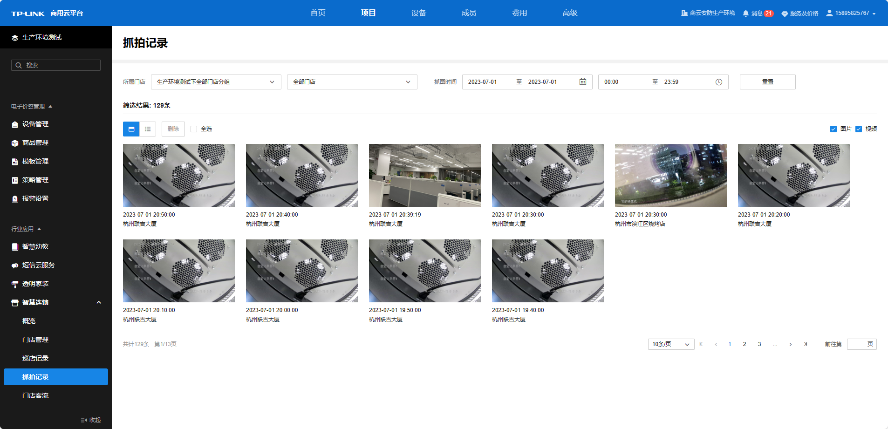
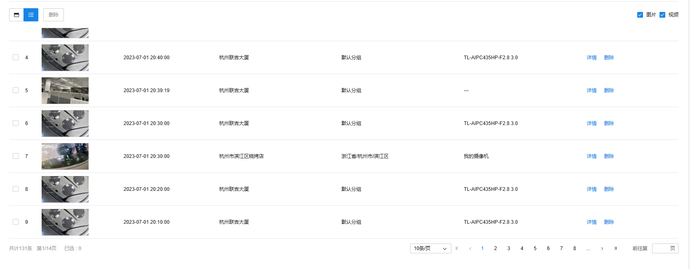

# 抓拍记录

管理员可查看门店关联设备的抓拍图片或视频，以及督导现场巡店的抓拍记录。

**进入页面的方法：项目** **> >** **行业应用** **> >** **智慧连锁** **> >** **抓拍记录**

**巡店记录页面介绍：**

|   
---|---  
所属门店| 可筛选门店，包括门店所属分组、门店名称  
抓图时间| 可筛选对应日期、时间的抓拍记录  
重置| 恢复默认筛选项目下的所有门店，筛选单日全天的抓拍记录  
切换视图| 切换视图图标可切换平铺或列表视图  
单选| 选中单个抓拍记录右上角方框  
全选| 点击全选可全选抓拍记录  
删除| 可删除选中的抓拍记录  
视频/图片| 可筛选视频/图片类抓拍记录  
抓图/录像| 显示抓拍的图片/录像  
所属门店| 显示门店名称  
门店分组| 显示门店所属分组  
抓拍设备| 显示抓拍设备的名称，现场巡检的抓拍记录无抓拍设备名称  
详情| 查看抓拍详情，包括门店信息、抓拍监控点信息；现场巡检的抓拍记录无抓拍设抓拍监控点信息  
删除| 删除该抓拍记录  
  

