# 概览

用户可在概览界面查看总体连锁门店的数据，包括：门店总数、职员总数、监控设备总数、智慧连锁·存储空间、存储空间占用排名以及昨日客流总量。

**进入页面的方法：项目** **> >** **行业应用** **> >** **智慧连锁** >> **概览**

#### 智慧连锁·存储空间

智慧连锁存储空间用于存储连锁门店的抓拍记录，可点击<套餐及计费规则>查看智慧连锁高级存储服务套餐详情。开通存储服务后即可存储抓图或录像。存储空间容量不足时，可随时加购套餐进行扩容。

  * **免费试用**

TP-LINK 商云对每个项目免费赠送【7 天 10GB】容量套餐，点击<立即免费试用>，并提示操作即可为项目开通【7 天 10GB】试用存储服务。

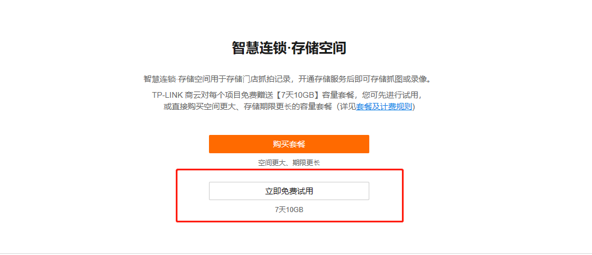

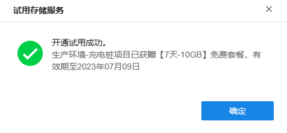

如需提升存储空间容量，可点击<购买高级存储套餐>或<存储扩容>，并选择一种容量套餐后，点击<余额支付>并<确定>即可扩容成功。

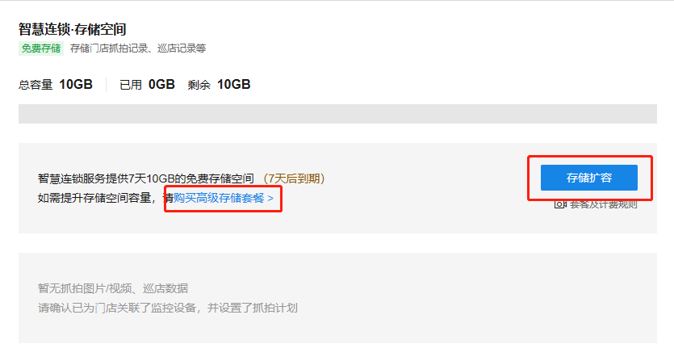

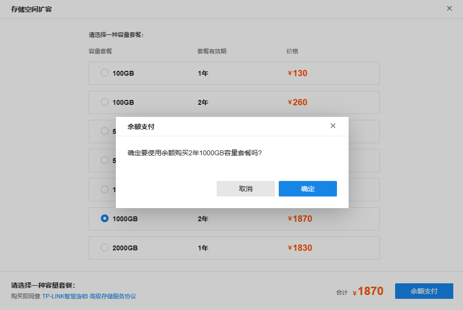

  * **购买套餐**

试用结束后可购买套餐，或直接购买空间更大、存储期限更长的容量套餐。

点击<购买套餐>并选择一种容量套餐后，点击<余额支付>并<确定>，套餐即购买成功。

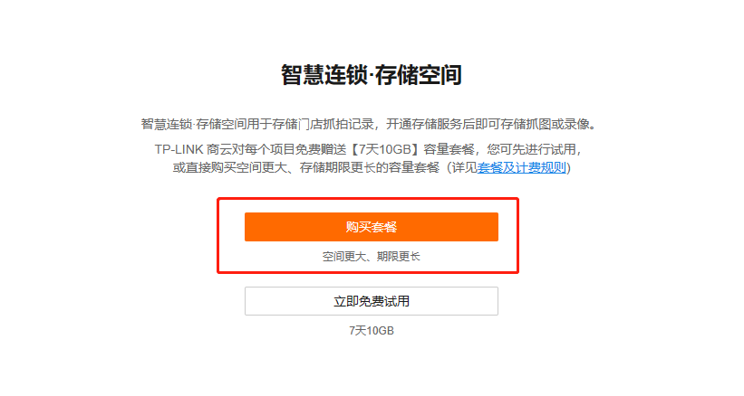

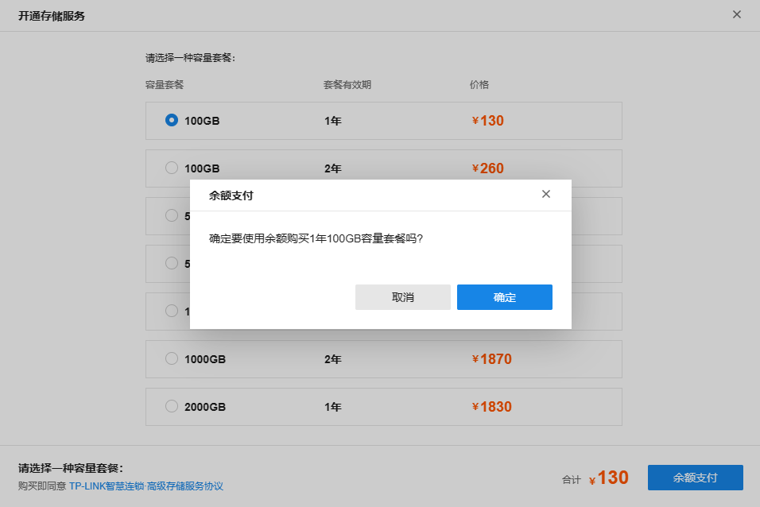

  * **存储空间详情**

在开通高级存储服务的界面，点击<详情>可查看存储空间详情，包括：剩余存储空间、开通套餐总数、开通套餐存储空间总量、各套餐详情（有效期、存储空间、到期日期）。

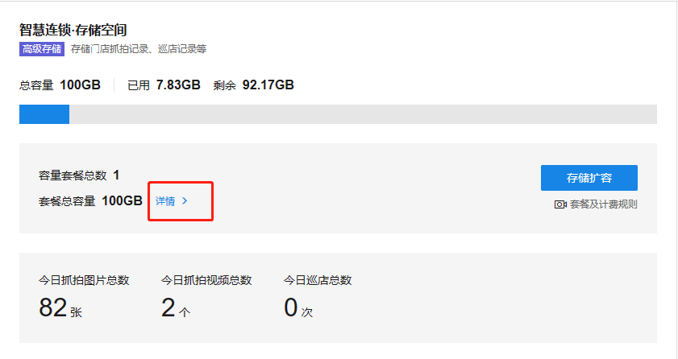

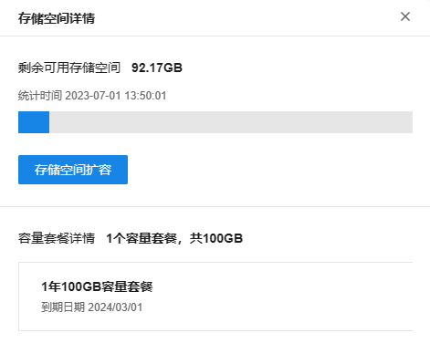

> 注意：
> 
> 购买高级存储服务套餐即同意<TP-LINK 智慧连锁·高级存储服务协议>，可点击<TP-LINK 智慧连锁·高级存储服务协议>参看协议内容。
> 
> 高级存储套餐的有效期分为 1 年和 2 年，用户按需购买，到期后套餐内容量将会失效，需重新购买套餐进行扩容。若套餐到期后未及时扩容，则已存数据中超出有效储存空间总容量的部分将在 7 天后自动清除。

#### 存储空间占用排名

如图所示，可查看存储空间占用排名前五的门店，移动光标至图中蓝色虚线可显示所有门店平均占用空间。点击<完整数据>，可查看所有门店的存储空间排名详情。

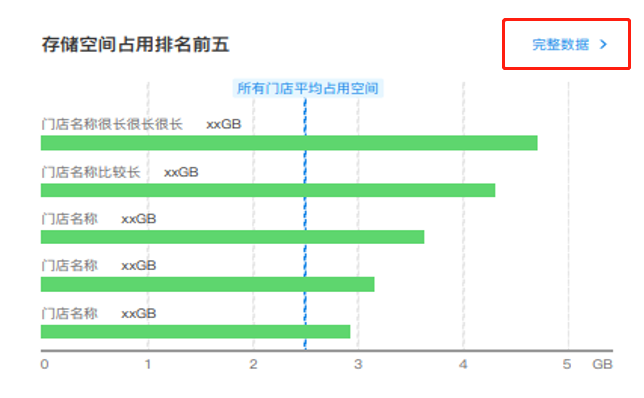

  * **存储空间排名详情**

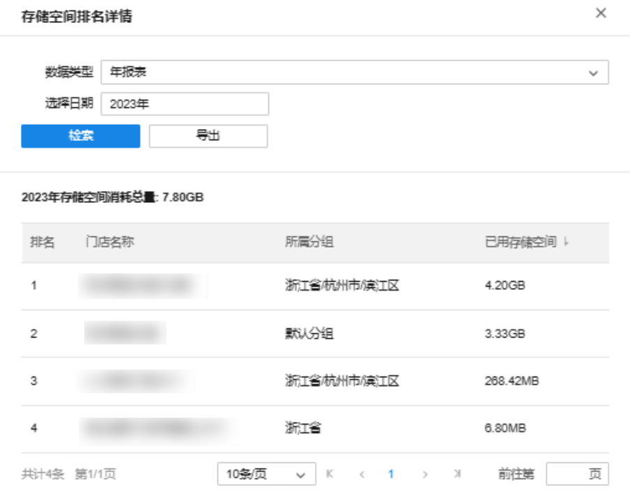

**存储空间排名详情报表介绍：**

|   
---|---  
排名| 显示门店存储空间排名  
门店名称| 显示门店名称  
所属分组| 显示门店所属分组名称  
已用存储空间| 显示门店已用存储空间  
数据类型| 可选择年报表或月报表  
选择日期| 可选择需要查看的年份或月份  
检索| 选择需要查看的年份或月份后，点击空白处，并点击<检索>即可查询对应日期的门店存储空间使用详情  
导出| 点击<导出>，可导出对应日期的门店存储空间使用详情的报表  
  
#### 昨日客流总量

基于门店配置的客流统计摄像机，可在智慧连锁的概览界面查看门店的昨日客流总量，包括进入人数和离开人数，以及人数的同比变化情况。

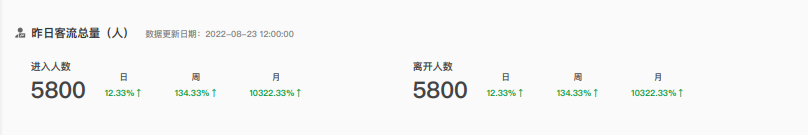
