# 门店客流

管理员可查看门店客流数据概览，门店客流单店统计、交叉对比、区域累计，门店繁忙程度，支持导出门店客流统计报表。

**进入页面的方法：项目** **> >** **行业应用** **> >** **智慧连锁** **> >** **门店客流**

#### 门店客流概览

商云搭配客流统计专用摄像机， 可查看门店客流统计数据，包括门店总数、客流统计设备总数、所有门店客流总量和各门店平均客流量。其中所有门店客流总量包括进入门店人数和离开门店人数。各门店平均客流量包括进入门店人数和离开门店人数。

可查看进入人数排名前五的⻔店的客流数据，包括日排名、周排名、月排名和年排名。点击选择时间图标，可选择统计的时间。点击<查看趋势>可定位到下方门店客流趋势统计折线图。

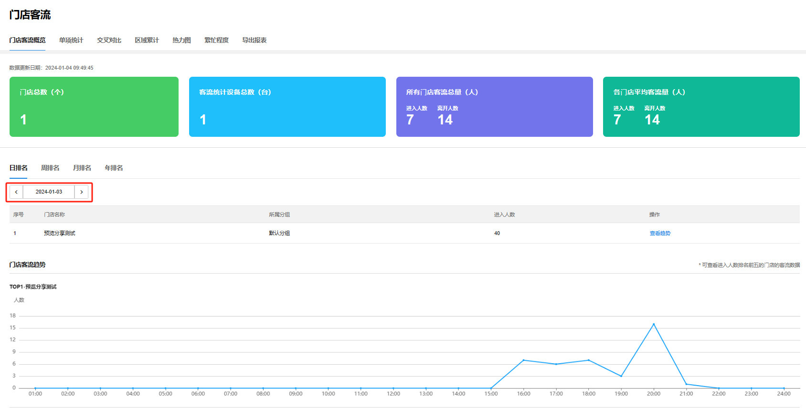

#### 单项统计

可选中单个门店，查看单个门店的客流数据。点击<日报表><周报表><月报表><年报表>可以从不同时间维度查看单一门店的客流数据。日报表可查看本日总量、昨日总量。周报表可查看本周总量、上周总量、本周日均、上周日均。月报表可查看本月总量、上月总量、本月日均、上月日均。月报表可查看今年总量、去年总量、今年日均、去年日均。

点击<添加对比日期>，可查看不同时间段单一门店的客流统计折线图。点击<查看排序>，可参看不同时间段的客流排序。

移动光标至客流统计折线图各个时间点，可查看不同时间点客流统计数据。

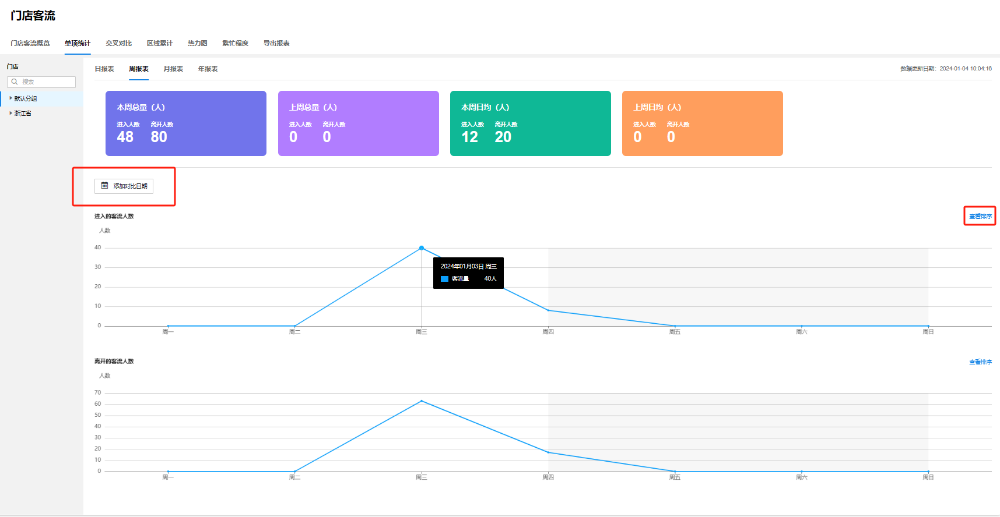

#### 交叉对比

可选中多个门店，查看相同时间段内多个门店的客流数据。点击<日报表><周报表><月报表><年报表>可以从不同时间维度对比多个门店的客流数据。点击选择时间图标，可选择统计的时间。

点击<查看排序>，可参看多个门店在相同时间段的客流排序。

移动光标至客流统计折线图各个时间点，可查看不同时间点各个门店的客流统计数据。

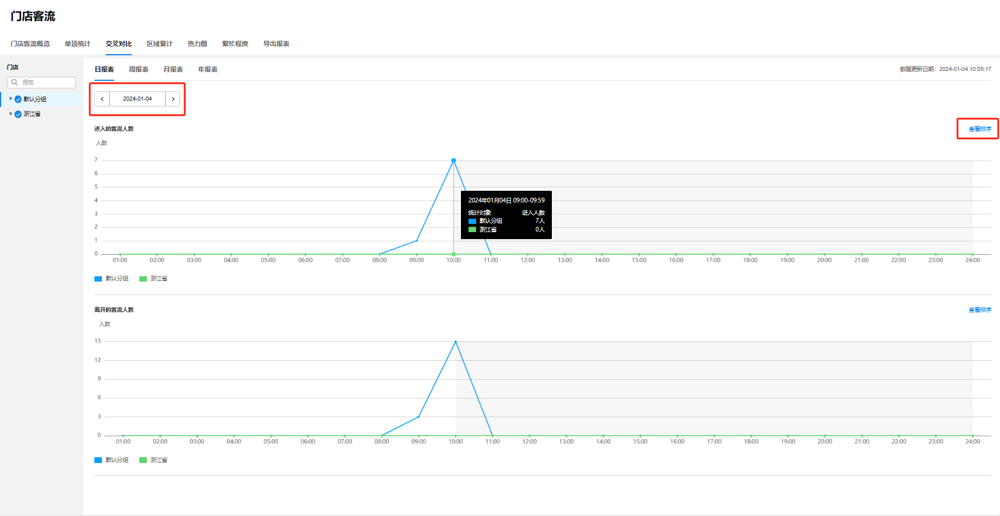

#### 区域累计

可选中多个门店，查看区域内所有选中门店的客流总量。点击<日报表><周报表><月报表><年报表>可以从不同时间维度查看区域内所有门店的客流总量。点击选择时间图标，可选择统计的时间。

移动光标至客流统计折线图各个时间点，可查看不同时间点客流总量。

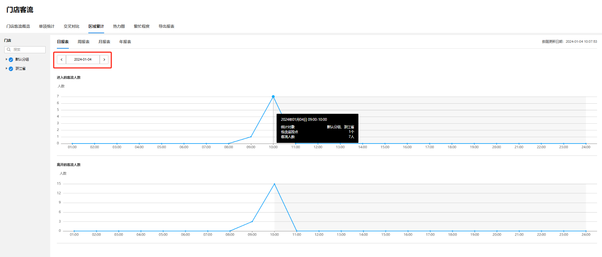

#### 热力图

商云搭配热力图专用摄像机， 可查看门店不同区域的客流人次、驻足人力和热力分布。

点击<编辑热力区域>，可在视频监控画面上划分区域。

画面原始大小为默认区域，选中区域拖动锚点可编辑区域范围，选中区域鼠标光标变化后可拖动区域。

点击<添加区域>可新增统计区域，最多可设置 4 个区域。点击<清空>将恢复默认区域。选中区域后，点击<重命名>可以编辑区域名称。选中区域后，点击<删除>可删除区域。

编辑好区域后，可查看不同区域的客流、驻足人次、驻足率和驻足均时。

> 说明：
> 
> 编辑区域后将重新进行区域内的客流人次和驻足人次数据统计。

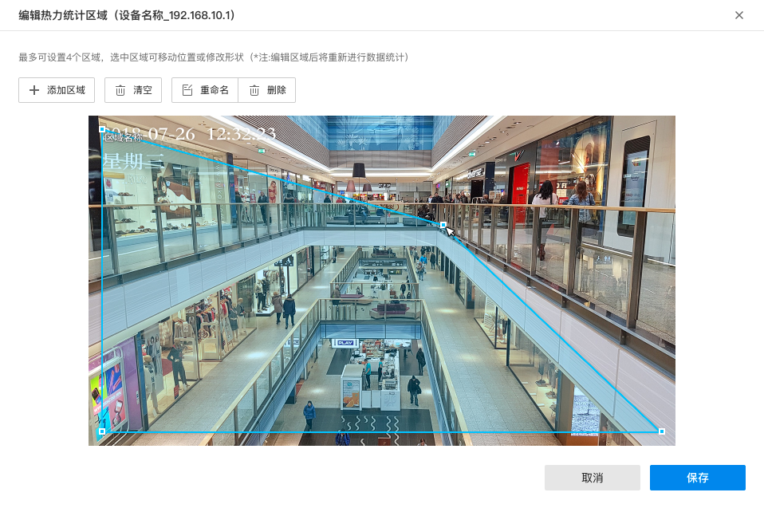

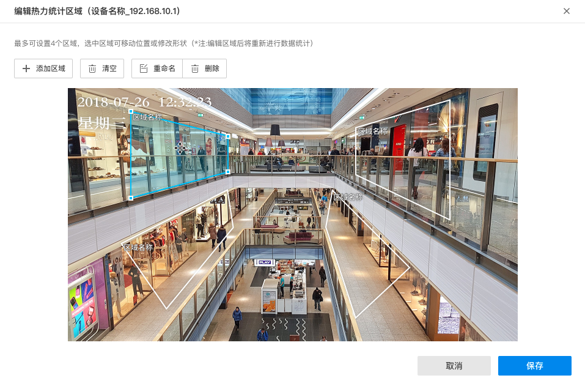

点击<统计时间>窗口，打开日历表可选择开始日期和结束日期。编辑成功后，点击刷新图标，可刷新对应时间段的热力分布图、区域客流和区域驻足人数。

点击<最短驻足时长>窗口，可设置记为驻足的最短时长，可选项有 5 秒钟、10 秒钟、15 秒钟。编辑成功后，点击刷新图标，可刷新客流分区数据统计表。

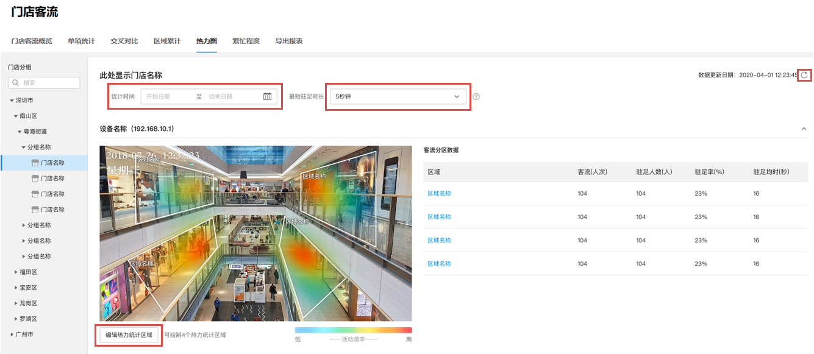

#### 繁忙程度

基于 IPC 抓拍人数或店内无线终端数，统计在店人数，以不同颜色对门店繁忙程度进行可视化展示。

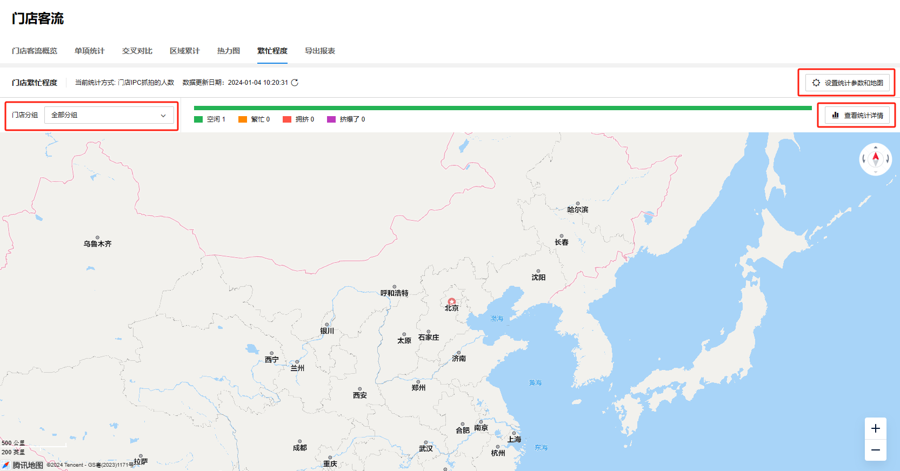

  * **设置统计参数与地图**

点击<设置统计参数与地图>，可设置统计方式与繁忙状态以及地图。

  * **统计方式与繁忙状态**

可选择统计方式为“IPC 抓拍人数“或”店内无线终端数“，统计门店内 IPC 抓拍的人数或店内接入 WiFi 的终端数作为在店人数的统计方式。

可点击<添加状态>，选择不同的颜色代表不同的繁忙状态。最多可设置 5 个状态，当统计人数处于对应繁忙程度的人数区间时，则以对应颜色在地图上显示门店的繁忙状态信息。

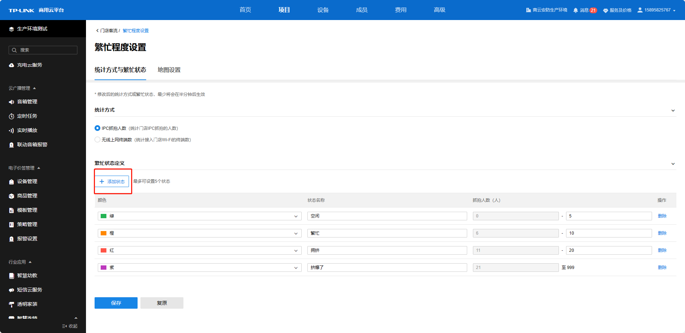

  * **地图设置**

可点击<修改地图类型>可选择地理地图或自定义地图。点击<自定义地图> — <使用自定义地图> — <上传图纸> — <选择图纸>，上传成功后可在自定义地图展示门店位置信息。

点击门店详情，点击<选择门店定位>可在地图上定位门店；点击<重置门店定位>可在地图上重新定位门店；点击<删除位置>可在地图上删除门店定位。

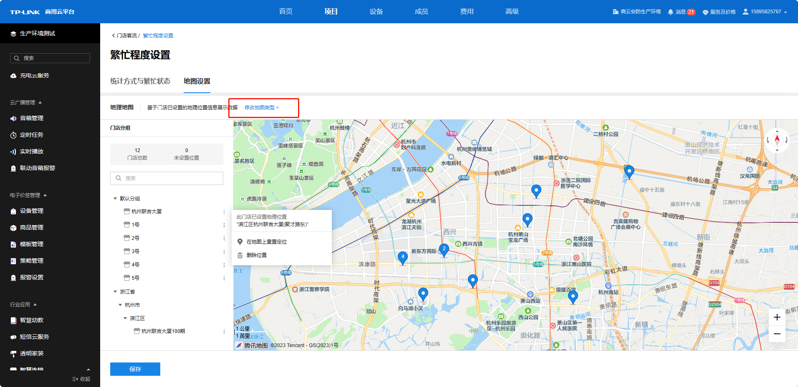

在地图上点击门店位置图标，可展示门店位置信息。点击<删除位置>可在地图上删除门店定位。点击<重置位置>可在地图上重新定位门店。

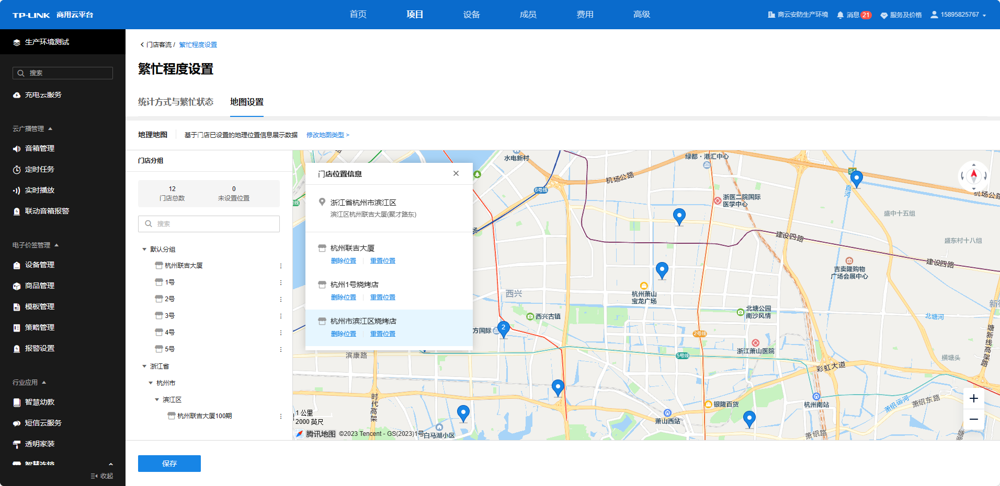

  * **门店繁忙程度总览**

点击<门店分组>可筛选门店分组。

点击查看统计详情，可查看门店位置及人数信息。点击<地理位置>可筛选展示是否有地理位置的门店。点击排序方式，可选择<按数量升序>、<按数量降序> 或按<门店名称>排序。输入门店名称，点击<搜索>可搜索查看对应门店详情。

点击不同颜色图标，可显示当前繁忙状态的门店数量。

点击刷新，可更新门店繁忙程度统计数据。

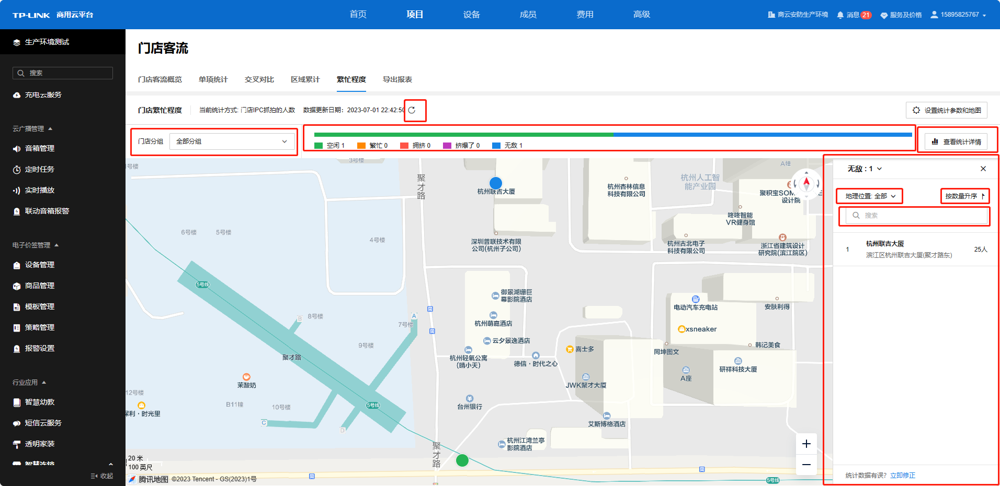

#### 导出报表

支持导出客流统计报表。可选择报表类型为日报表、周报表、月报表或年报表，并选择报表时间。可选择按监控点导出、按门店导出或按门店分组导出报表。

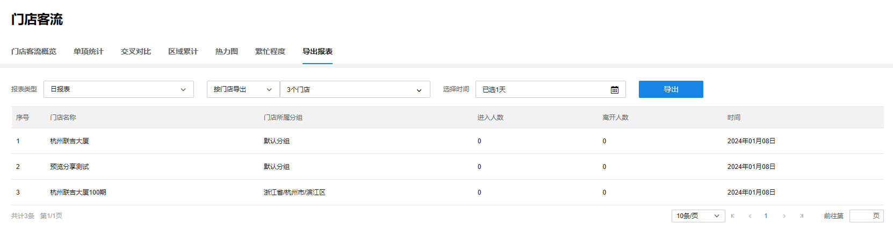
