# 门店管理

**进入页面的方法：项目** **> >** **行业应用** **> >** **智慧连锁** >> **门店管理**

#### 创建门店

未创建门店时，点击<立即创建门店>并按照操作指引即可创建门店。

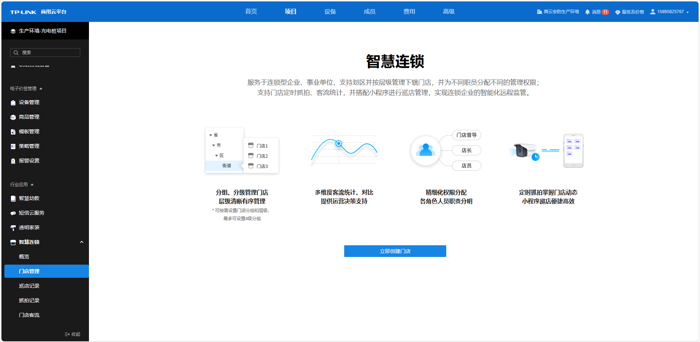

  * **基本信息**

完善门店基本信息，包括门店名称、所属分组、地理位置等。

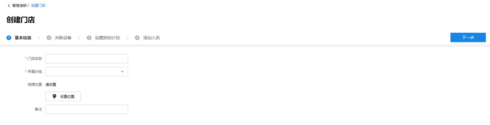

未创建分组时，输入分组名称，点击<立即创建分组>即可创建分组。

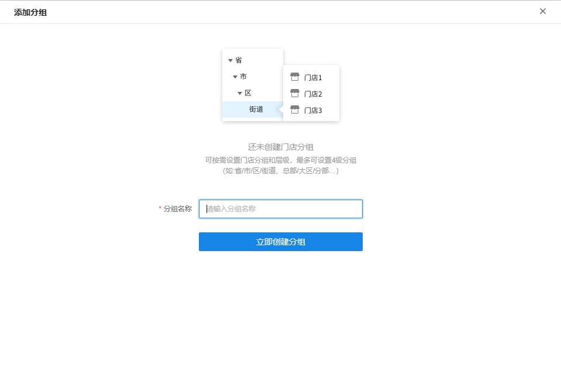

点击<添加分组>，可创建多个同级分组。选中分组，点击<添加子分组>，可创建子级分组。可按需设置分店分组和层级，最多可设置 4 级分组。支持<上移><下移><重命名><删除>分组。

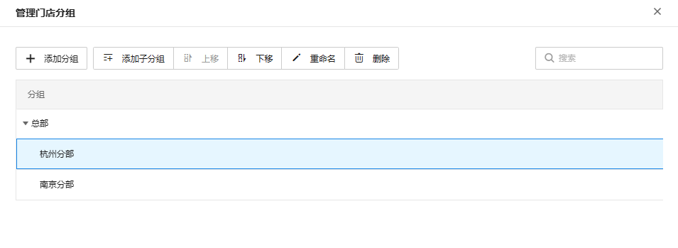

如需设置门店地理位置，点击<设置位置>，通过搜索或标记一个地理位置，点击<确定>，即可设置门店地理位置。

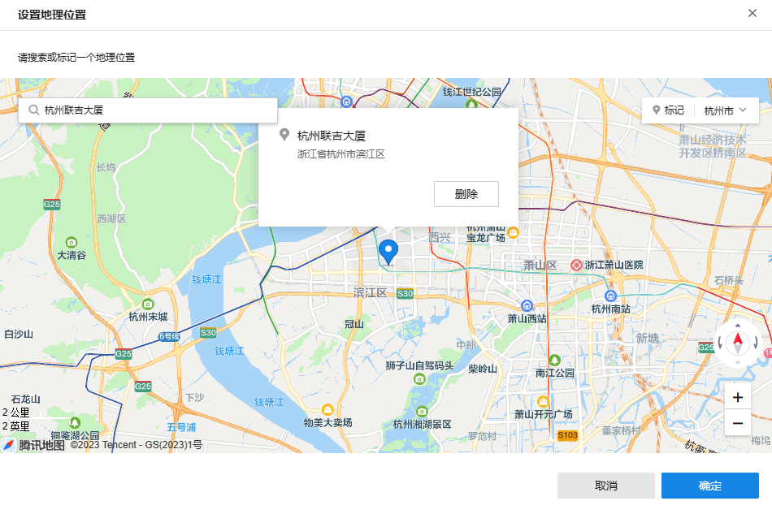

  * **关联设备**

点击<立即关联设备>，选中设备后，并点击<确定>即可为门店关联设备。只能关联项目中已添加的设备，若设备还未添加到本项目，请点击<添加设备>前往设备管理界面添加设设备。

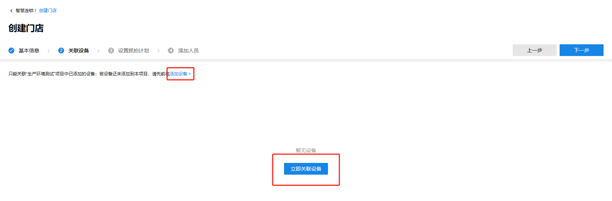

  * **设置抓拍计划**

可选用默认抓图计划，点击<管理>，可将默认抓图计划应用到设备，或者可以自定义抓拍计划，并应用到设备。

添加抓拍计划：点击<添加计划>，选择抓拍计划的类型为事件抓拍或定时抓拍。

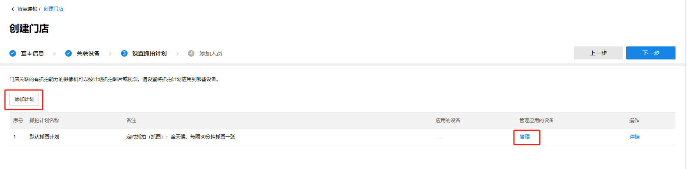

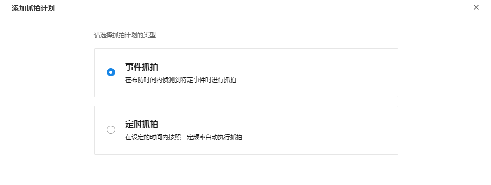

若选择事件抓拍，首先输入抓拍计划名称（抓拍类型默认为抓图）。

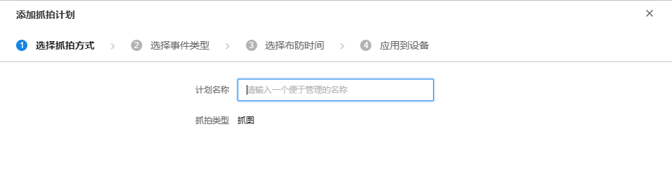

然后，选择需要抓拍的事件及事件报警方式。

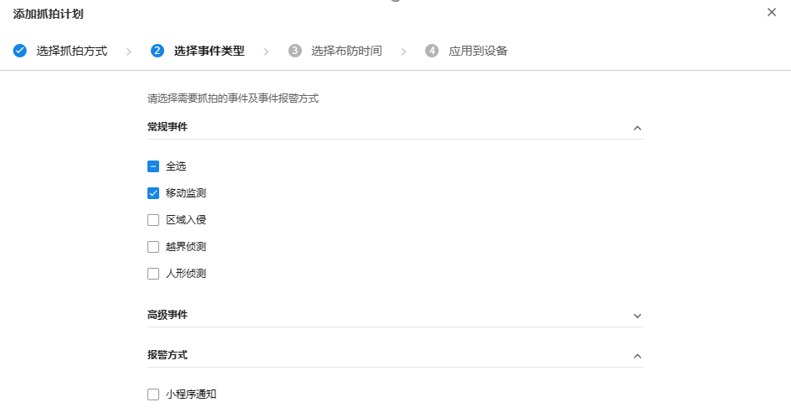

接下来，选择布防时间。系统提供了全天候、工作日和周末三种时间模板，用户可点击<编辑时间模板>自定义布防时间。

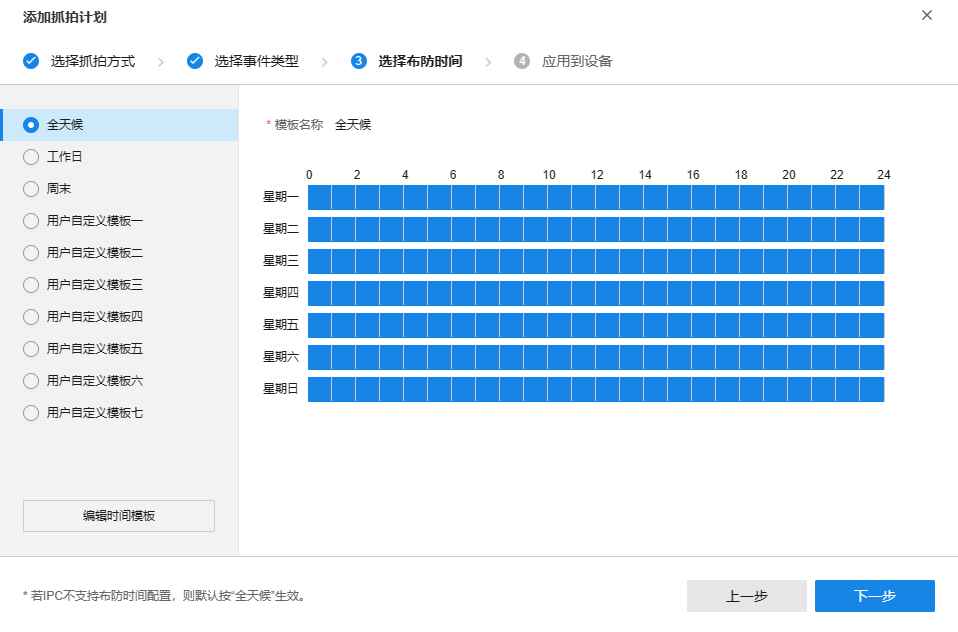

最后，将抓拍计划应用到设备。

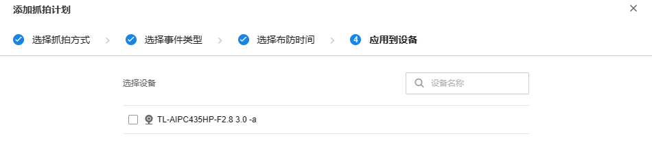

若选择定时抓拍，首先需要选择抓拍方式为抓图或录像。

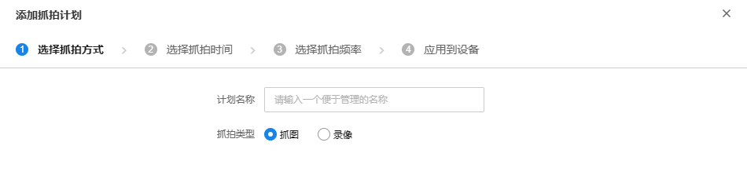

然后，选择抓拍时间。系统提供了全天候、工作日和周末三种时间模板，用户可点击<编辑时间模板>自定义抓拍时间。

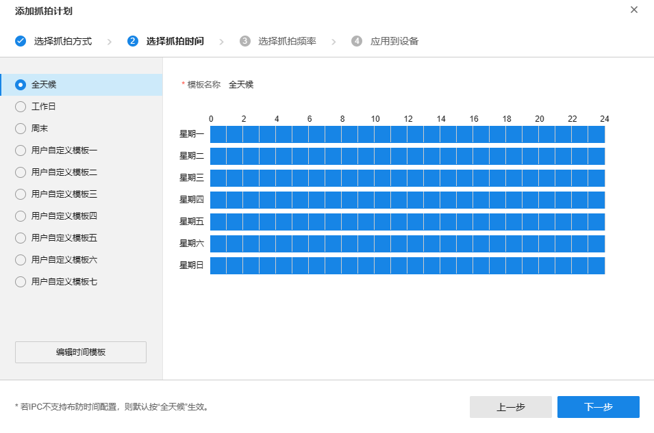

接下来，选择抓拍频率。最高抓拍频率为“每 10 分钟抓拍一张图片”。

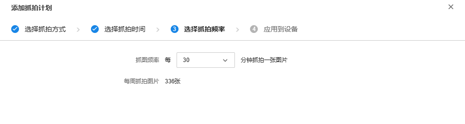

最后，将抓拍计划应用到设备。

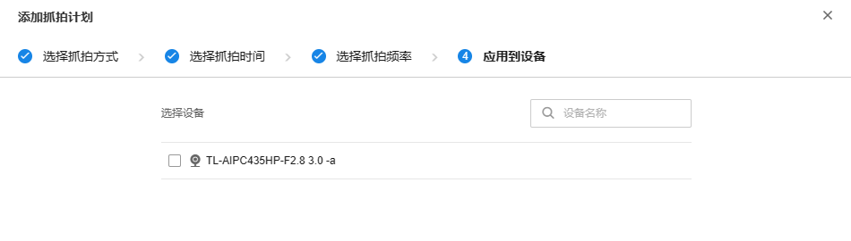

  * **添加人员**

支持通过<输入信息添加>和<二维码邀请人员>。

点击<输入信息添加>，点击<添加>并输入人员的姓名、角色、手机号等信息后，点击<立即添加>即可添加人员到对应门店中。

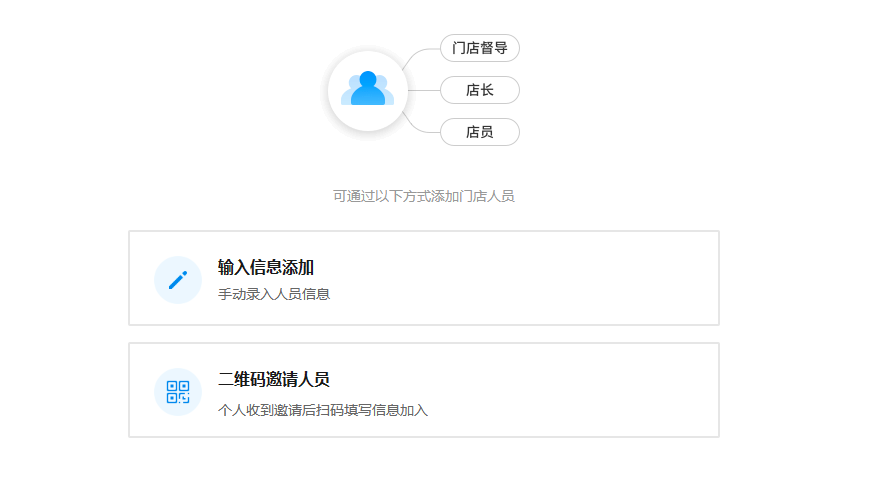

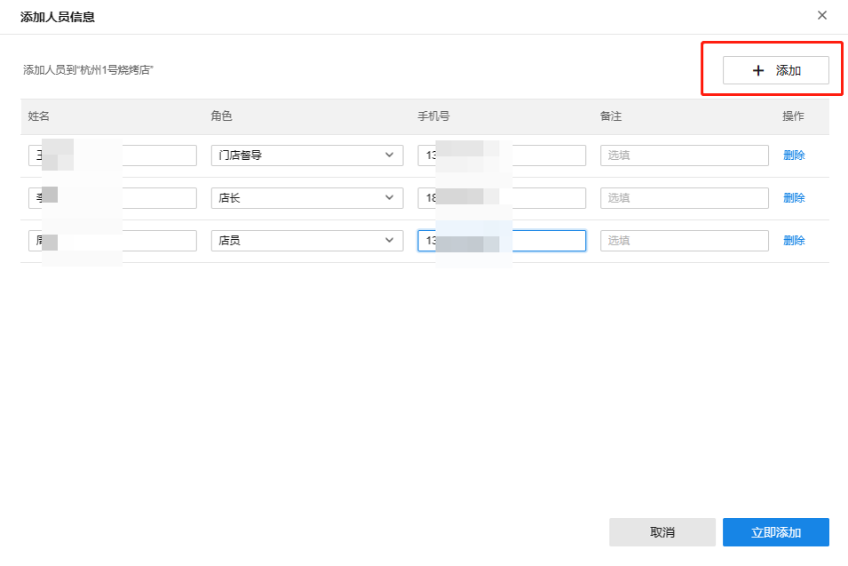

点击<二维码邀请>并选择需要邀请的人员类别，生成邀请码。人员可扫描二维码、填写个人信息后提交申请，等待管理员在人员列表中审核，审核通过后即可加入对应门店。

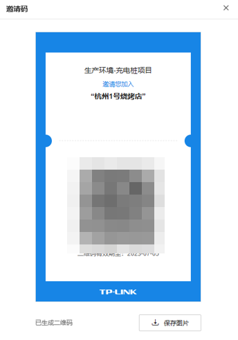

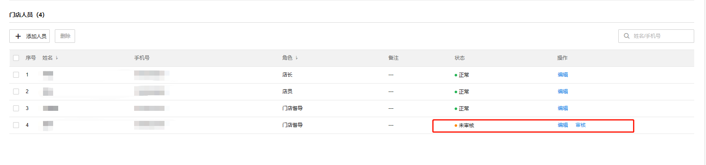

完成基本信息、关联设备和抓拍计划添加人员后，点击<完成>即可创建门店。

> 说明：
> 
> 门店角色分为“门店督导”“店长”和“店员”。门店督导可以设置在线巡店规则，可以在小程序上巡店、发出巡店结果通知，可以查看各门店的客流统计和对比数据；店长为门店负责人，可以查看门店的监控、巡店结果、客流统计数据，可管理店员；店员可以接受巡店通知。
> 
> 创建门店时，可以暂且跳过 “关联设备和抓拍计划”和“添加人员”步骤，完成门店创建后再进入门店详情界面补充。

#### 门店列表

**进入页面的方法：项目** **> >** **行业应用** **> >** **智慧连锁** **> >** **门店管理** **> >** **门店列表**

  * **添加门店**

点击<添加门店>，可创建门店。流程同“创建门店”，即完成“基本信息”、“关联设备”、“设置抓拍计划”、“添加人员”，点击<完成>即可创建门店。

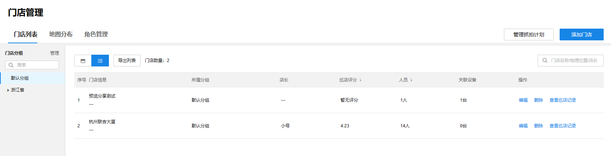

  * **管理门店**

点击可切换平铺和列表视图。

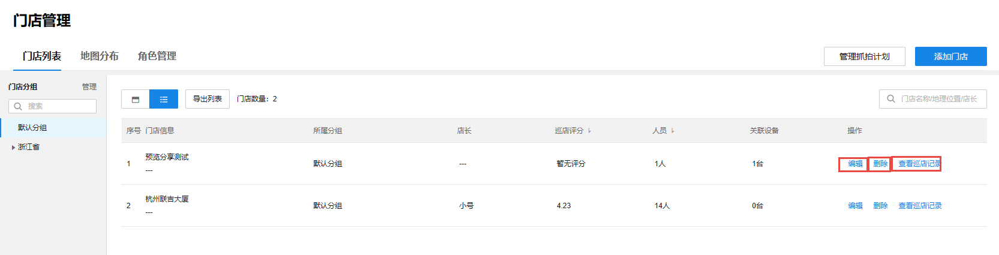

点击<编辑>可编辑门店名称、所属分组、地理位置、备注、抓拍计划、关联设备。

点击<删除>可删除门店。

点击<查看巡店记录>可查看当前门店巡店记录。

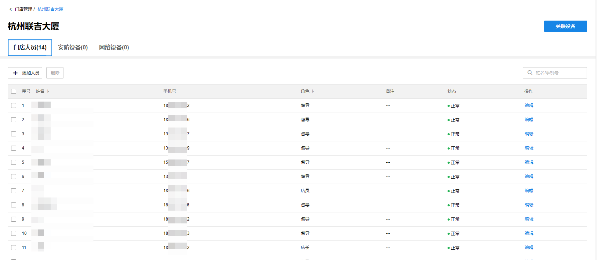

点击门店列表的门店，可进入门店详情。在门店详情中可为门店添加成员、关联设备。

在人员管理页面，点击<添加人员>可通过<输入信息添加>和<二维码邀请人员>。

选中人员，点击<删除>可删除人员。

输入人员姓名或手机号，点击搜索，可查询人员信息。

点击<编辑>可修改人员姓名、角色、备注。

通过扫描二维码申请加入门店的人员，管理员点击<审核>，确认申请<属实，同意通过>或<有误，拒绝通过>。

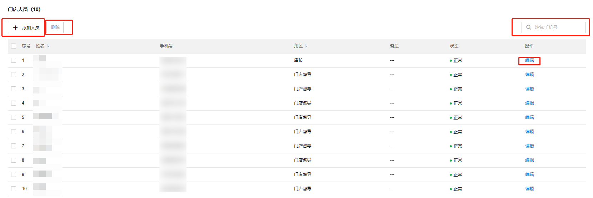

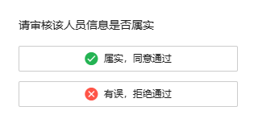

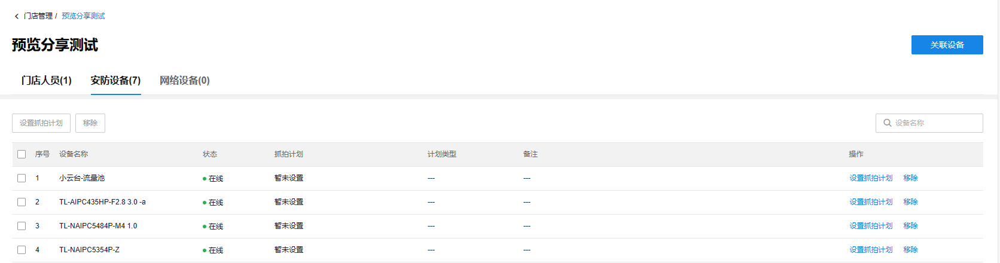

在安防设备页面，点击<关联设备>，选中设备，点击<确定>，可为门店关联安防设备。

可为单个设备或多个设备设置抓拍计划。选中抓拍计划，点击<应用>，或点击<添加新计划>创建新的抓拍计划。

点击<移除>，可解除设备与门店的绑定关系。

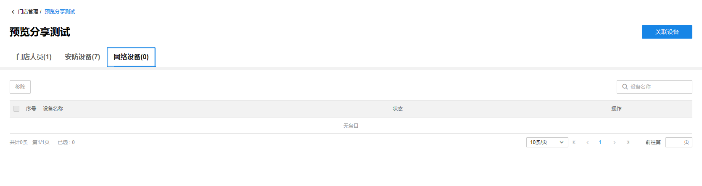

在网络设备页面，点击<关联设备>，选中设备，点击<确定>，可为门店关联网络设备。

点击<移除>，可解除设备与门店的绑定关系。

  * **管理门店分组**

输入分组名称，点击<搜索>可再列表中查询分组。

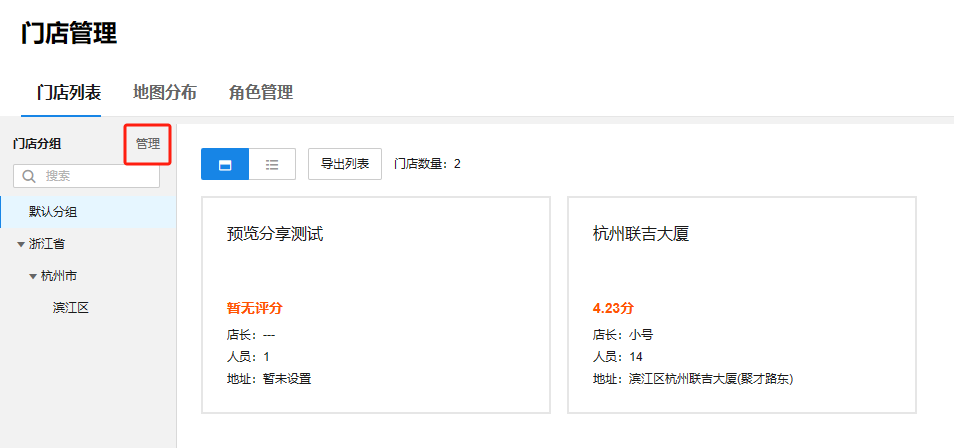

在门店分组列表，点击<管理>可对门店分组进行编辑。

点击<添加分组>，可创建多个同级分组。

选中分组，点击<添加子分组>，可创建子级分组。可按需设置分店分组和层级，最多可设置 4 级分组。

输入分组名称，点击搜索可查询分组。

选中分组，可点击<上移><下移>，移动分组位置。

选中分组，点击<重命名>，可修改分组名称。

选中分组，点击<删除>，可删除分组。

  * **管理抓拍模板**

点击<管理抓拍计划>，可进入抓拍计划管理界面。

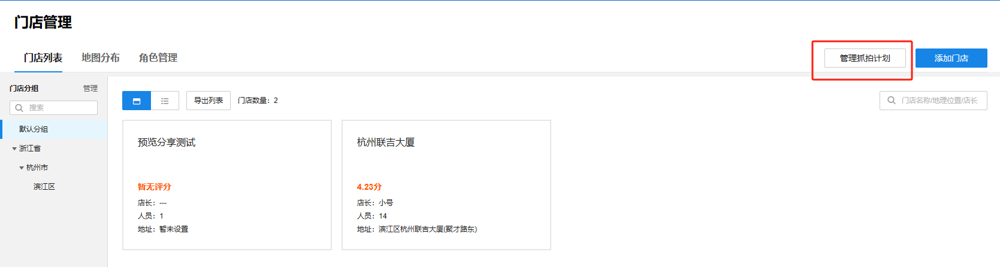

点击<添加计划>，选择事件抓拍或定时抓拍。若选择事件抓拍，首先输入抓拍计划名称（抓拍类型默认为抓图）。然后选择需要抓拍的事件及事件报警方式。最后，选择布防时间。系统提供了全天候、工作日和周末三种时间模板，用户可点击<编辑时间模板>自定义布防时间；若选择定时抓拍，首先需要选择抓拍方式为抓图或录像。然后，选择抓拍时间。系统提供了全天候、工作日和周末三种时间模板，用户可点击<编辑时间模板>自定义抓拍时间。最后选择抓拍频率。最高抓拍频率为“每 10 分钟抓拍一张图片”。

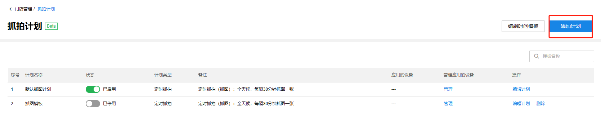

点击<编辑时间模板>，可自定义抓拍计划使用的时间模板，系统提供了全天候、工作日和周末三种时间模板，用户还可以自定义七种时间模板。长按鼠标左键并移动鼠标，可选择当日抓拍时间段（每半个小时为一个单位），可将当日抓拍时间复制到其他日期。

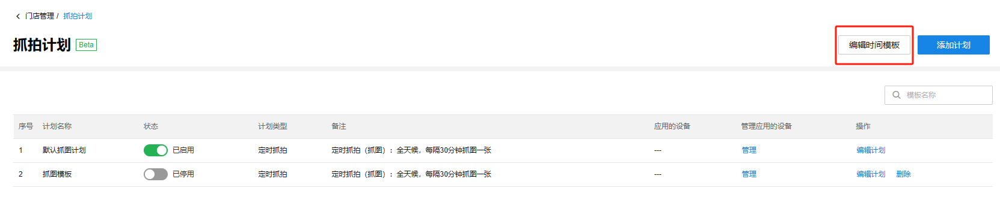

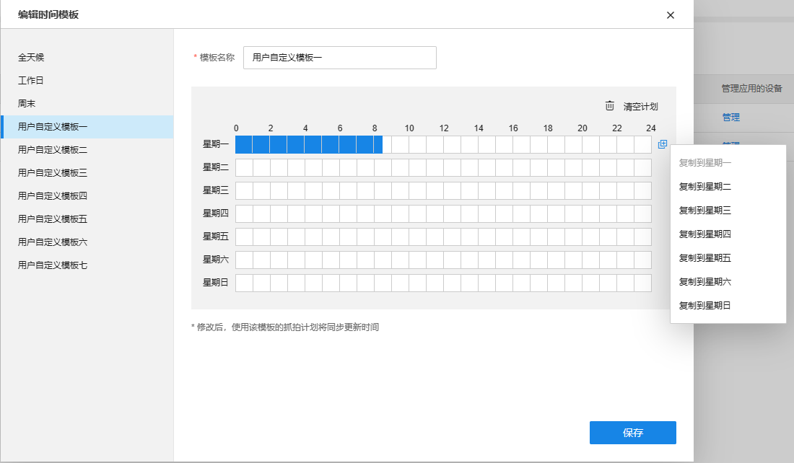

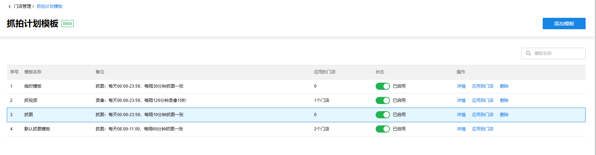

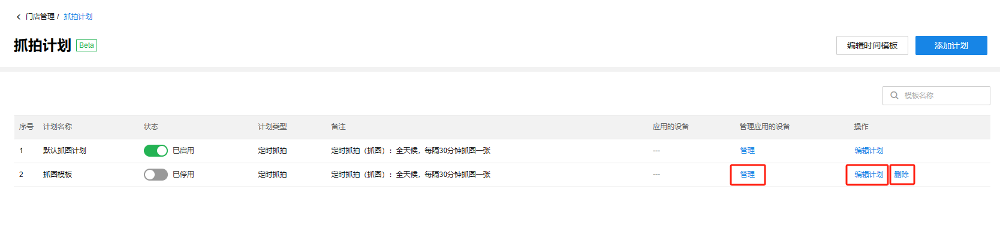

**抓拍计划表介绍：**

|   
---|---  
模板名称| 显示模板名称  
计划类型| 时间抓拍或定时抓拍  
备注| 显示抓拍类型及其配置  
应用的设备| 显示应用该模板的设备  
管理| 点击进入，可选择/取消设备应用该模板  
编辑计划| 可编辑抓拍计划的详细配置信息  
删除| 可删除该模板  
  
#### 地图分布

**进入页面的方法：项目** **> >** **行业应用** **> >** **智慧连锁** **> >** **门店管理** **> >** **地图分布**

点击<地图分布>，可查看所有分店的地理位置分布。

点击门店，可查看门店详情，包括门店名称、门店位置、门店分组、创建时间和门店人员数量。

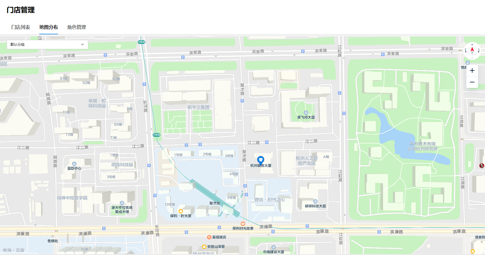

#### 角色管理

**进入页面的方法：项目 >> 行业应用 >> 智慧连锁 >> 门店管理 >> 角色管理**

点击<角色管理>，可自定义门店角色，并配置角色权限。

点击<添加角色>，输入角色名和备注，点击<下一步>选择角色在商云小程序上的权限。选择角色类型为管理人员或普通用户（只有管理人员可以在小程序上巡店），并设置每个门店下属于该角色的人员上限。设置小程序权限，门店管理中可设置的权限包括实时预览、查看抓拍记录、邀请用户和接收巡店通知，客流统计中可设置的权限包括客流统计和比对、繁忙程度统计和区域热力图。

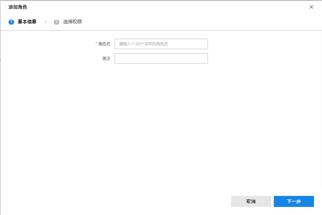

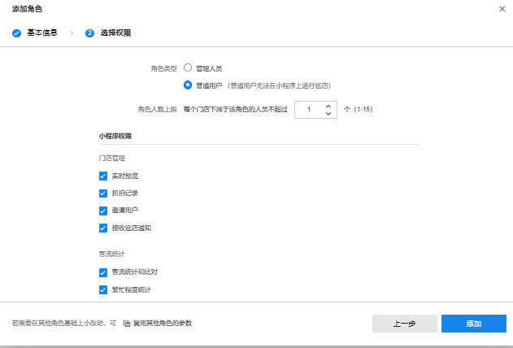
