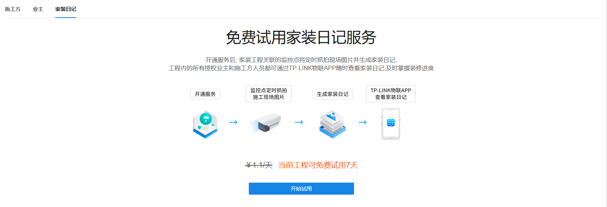
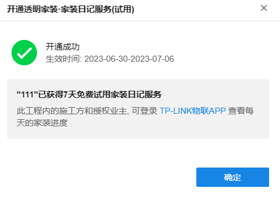
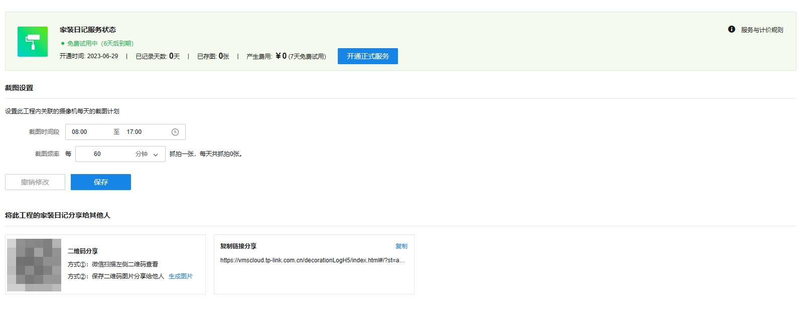
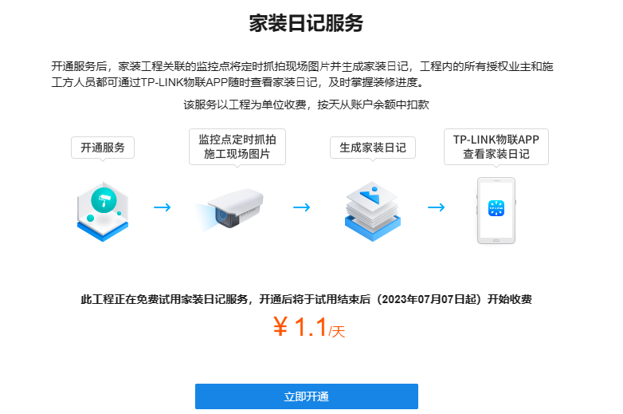
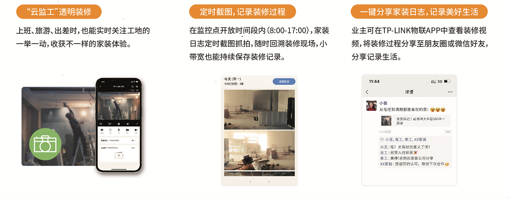

# 家装日记

家装日记的功能，系统每天截图记录装修过程，保留美好记忆，记录留存可溯源。

系统免费为用户提供七天的试用期。点击试用进入业务的试用界面，可以完美体验家装日记业务。

开通后可通过 TP-LINK 物联 APP 查看每天的家装进度。

开通后进入家装日记的设置页面：

在上述选择框内选择假装日记的截图计划，允许在 24h 内自由定义截图时间。截图频率最高 10min/张。

可以通过二维码以及连接的方式分享给家人朋友，共享家装的喜悦。

#### 开通正式服务

在试用期或者试用期结束后均可开通正式服务，正式服务的收费按照工程数量收费，收费标准为 1.1 元/工程/天。

#### 物联 APP 查看家装日记

在开通家装日记（正式/试用）服务后，可以通过物联 APP 远程巡检工地装修的实时画面，并且可以进入家装日记界面，随时溯源整个装修的全过程，并可将家装日记分享给朋友家人，一键同分享，家人共喜悦。

