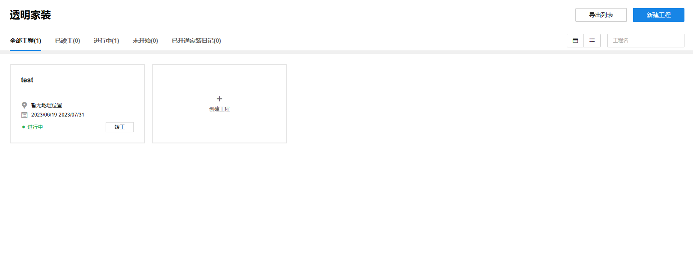
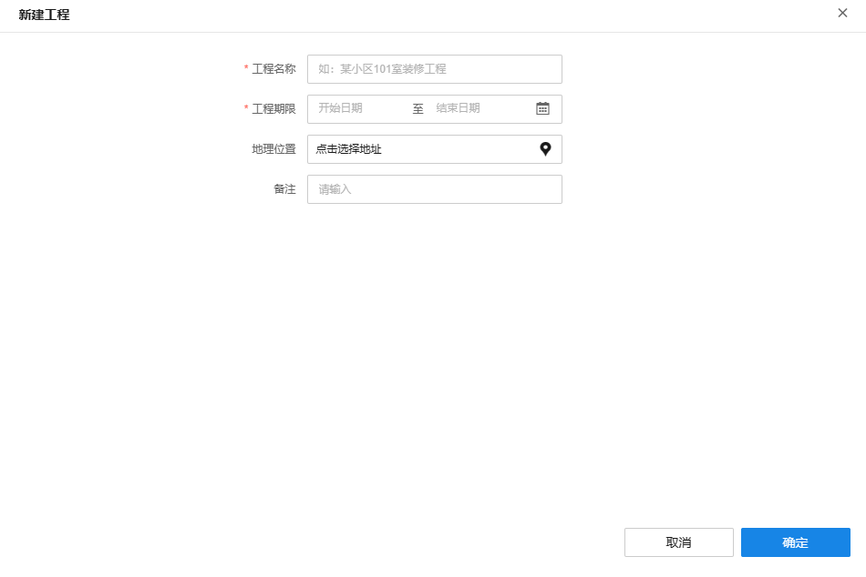
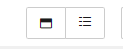
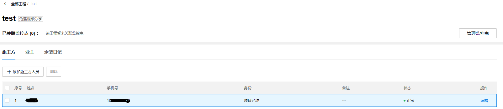
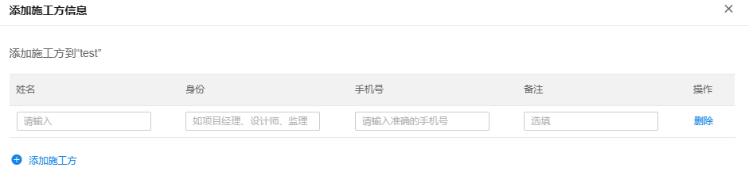
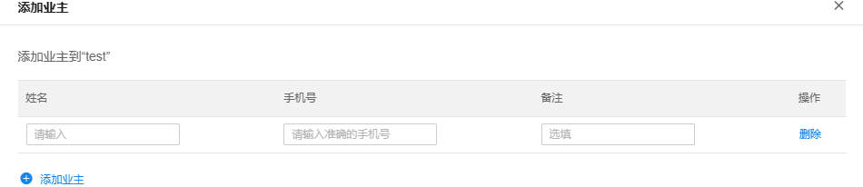
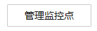
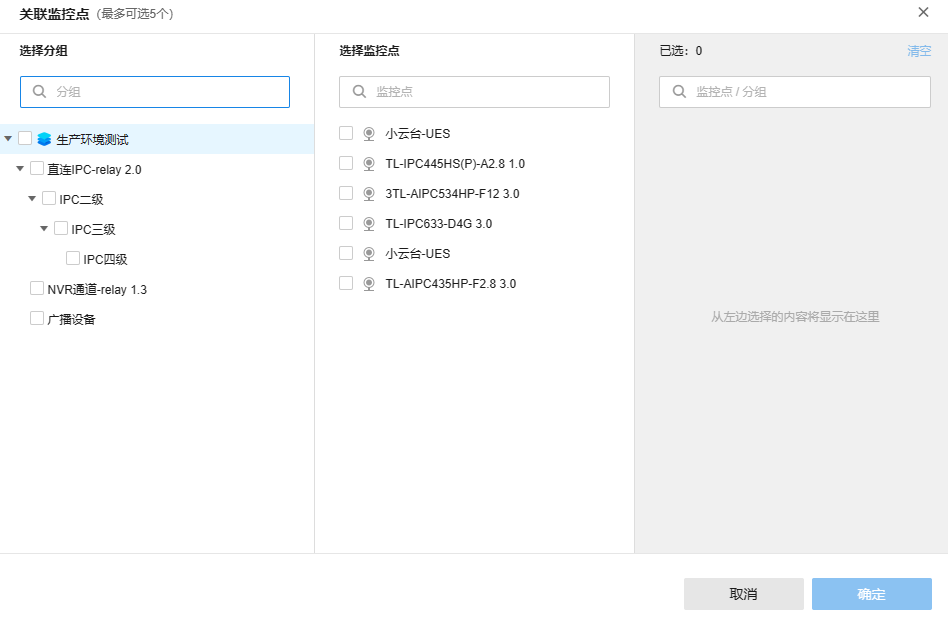

# 工程管理

**管理页面**

点击<创建工程>即可以创建新的工程，创建的工程会以创建的先后顺序排序展示。

**创建工程**

工程名称与工程的期限为必填项，地理位置与备注可以选填。

**控件说明** :

|   
---|---  
| 对工程的实施状态进行筛选。  
| 工程视图状态切换  
| 工程搜索  
  
**工程内部管理**

添加完工程后，点击具体的工程，可以进入该工程的内部管理页面，如下图。

  1. 添加施工方

点击<添加施工方>后，进入施工方信息的填写界面，其中"姓名"、"身份"、"手机号"为必填项，备注为选填项。

  2. 添加业主

在业主界面通过输入业主信息添加业主，其中"姓名"、"手机号"为必填项，备注为选填项。

  3. 关联监控点

点击管理监控点的控件，进入工程的监控点关联、管理流程。

通过勾选监控点，选择具体的监控点与工程项目进行关联，注意，每个工程最多关联五个监控点。
