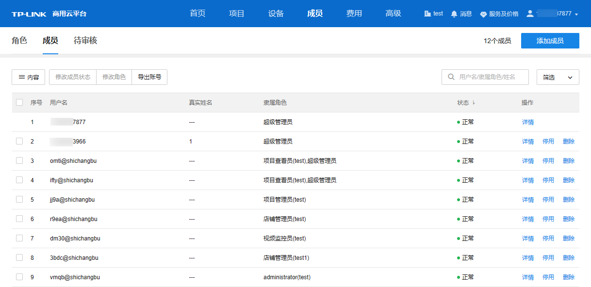
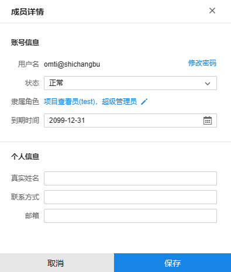
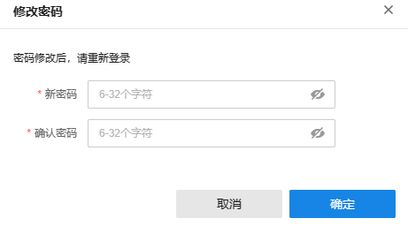

# 成员管理

|   
---|---  
停用/恢复| 点击<停用>可停用选中账号；账号停用后，点击<恢复>按钮可重新恢复使用。  
删除| 删除选中账号。  
修改成员状态| 可删除/暂停使用/恢复使用选中账号（可多选）。  
修改角色| 修改选中账号（可多选）的角色。  
导出账号| 将当前列表中的成员账号信息以列表形式导出到本地。  
内容| 可选择列表内是否显示真实姓名、隶属角色、账号状态、允许登录时间等信息。  
搜索| 可通过用户名、隶属角色或姓名对列表内的账户进行搜索。  
筛选| 可通过状态、隶属角色及最近登录时间对列表内的账号进行筛选。  
  
#### 成员详情

在成员列表中点击<详情>可修改账号密码、账号状态及隶属角色等账号信息，并管理真实姓名、联系方式及邮箱等个人信息。

修改完成后，点击<保存>按钮使配置生效。

#### 修改密码

在成员详情页面，点击<修改密码>，可修改当前账户密码。

输入新密码并确认后，点击<确定>使配置生效。密码修改后，该账号需重新登录。
