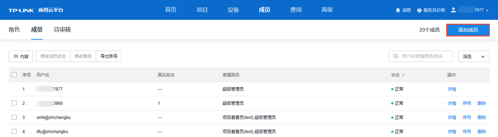
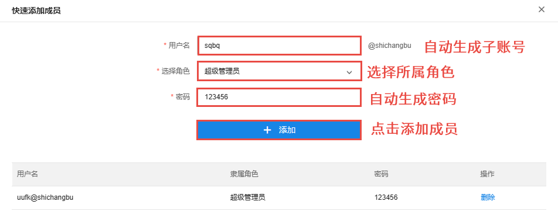
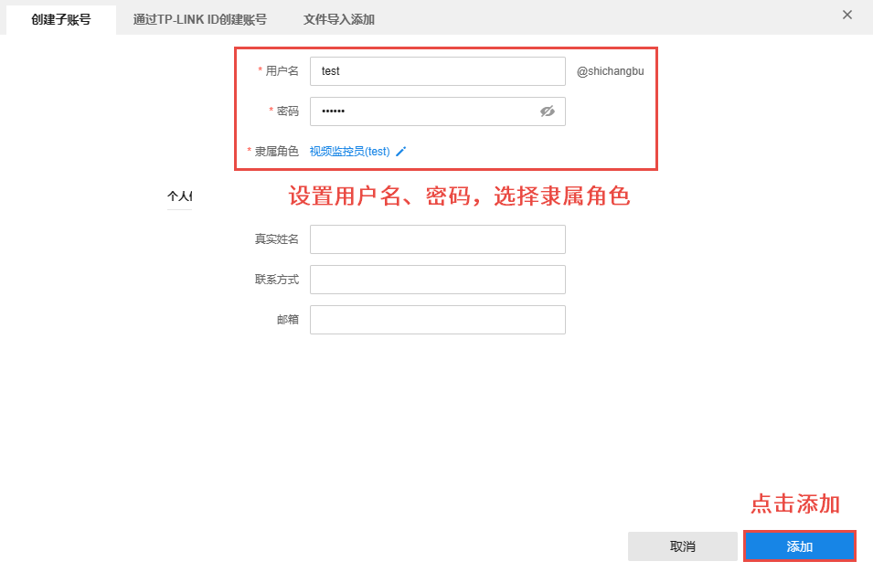
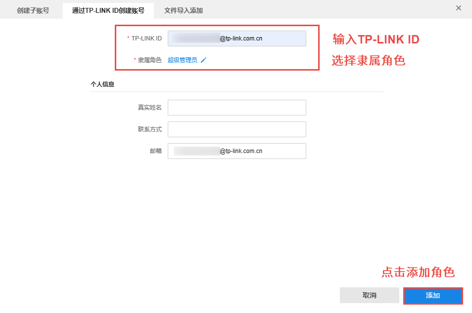
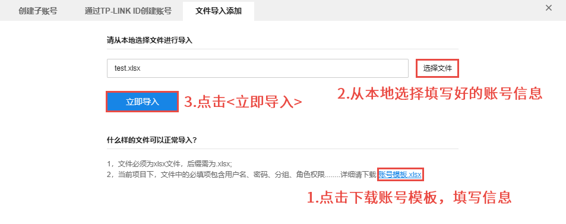

# 添加成员

在成员列表页面，点击右上角<添加成员>，可选择快速添加或自定义成员。

#### 快速添加

自动生成子账号及密码，为该成员选择超级管理员后，关闭窗口即可完成添加。如需添加多个子账号，点击<+添加>即可。

#### 自定义成员

##### 创建子账号

设置子账号用户名、密码，选择隶属角色，点击<添加>。

##### 通过 TP-LINK ID 创建账号

输入需要添加成员的 TP-LINK ID，选择隶属角色，点击<添加>。

##### 文件导入添加

点击<账号模板.xlsx>获取账户信息模板，填写用户信息后，点击<选择文件>，选择填写好的文件，点击<立即导入>即可。

