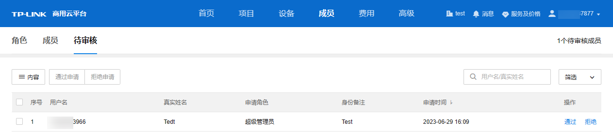
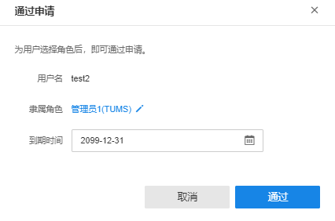
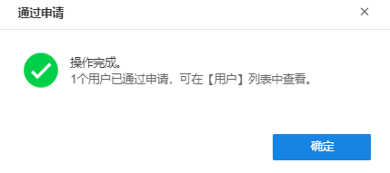

# 成员审核概述

使用管理员账号登录 TP-LINK 商用云平台，进入页面：成员 >> 待审核，可查看待审核成员信息。

##### 通过审核

  1. 点击<通过>，选择该成员隶属的角色及账户到期日期。如需添加或编辑角色列表，请前往：成员 >> 角色。

  2. 点击<通过>，通过该成员申请，可在成员列表中查看并编辑账号信息。

##### 拒绝审核

在待审核成员界面，点击<拒绝>，该成员将从列表中删除。

> 说明：
> 
> 点击页面左上角<内容>，可对页面显示信息进行选择。
> 
> 在待审核用户页面右上角可对列表内信息进行搜索和筛选。
> 
> 在待审核用户列表左侧进行勾选，可对待审核成员进行批量审核。
