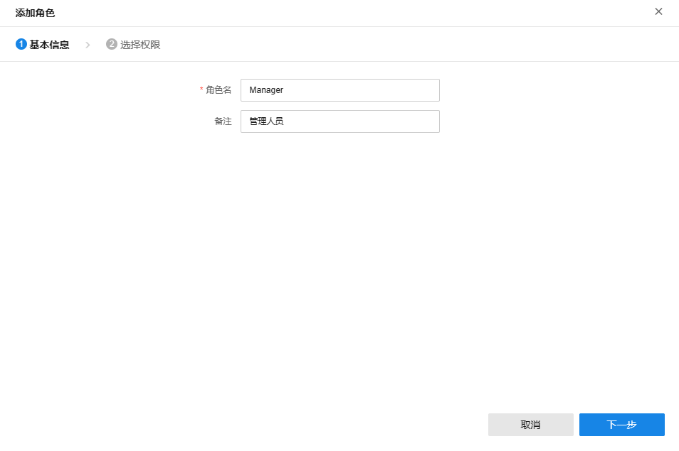
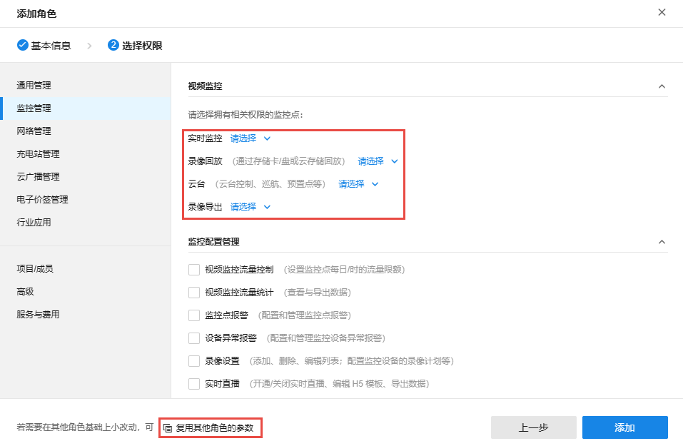

# 添加角色

进入页面：用户 >> 角色，点击页面右上角<添加角色>。

  1. 基本信息

输入角色名和备注，点击<下一步>。

  2. 选择角色权限，包括通用管理、监控管理、网络管理、充电站管理、云广播管理、电子价签管理、行业应用、项目及成员、高级、服务与费用。

点击下方<复用其他角色的参数>，可在已有角色权限基础上进行调整。

其中，在监控管理页面，如需开通视频监控相关权限，需要选择监控点。

设置完成后，点击<添加>添加角色。
