# 角色管理

进入页面：成员 >> 角色，可管理项目角色权限、对应成员等信息。

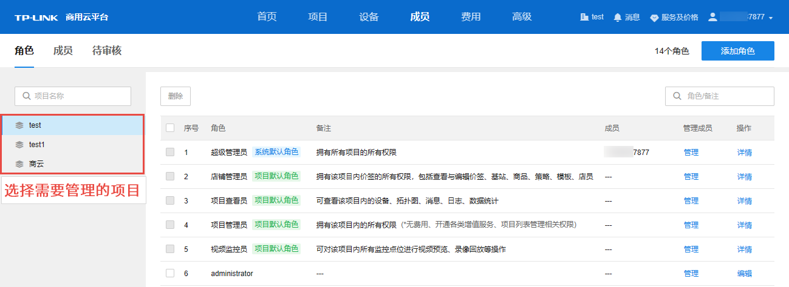

|   
---|---  
搜索| 支持通过项目名称对项目进行搜索，以及通过角色或备注信息对项目角色进行搜索。  
删除| 点击将选中角色（支持多选）从当前项目中删除。  
管理| 可对享有该角色权限的成员进行管理。  
详情| 点击查看系统/项目默认角色详情，默认角色权限不支持修改。  
编辑| 点击查看角色详情，可对角色名、备注及权限进行修改。  
  
#### 管理成员

在角色列表中，点击<管理>，可管理享有对应角色权限的成员。

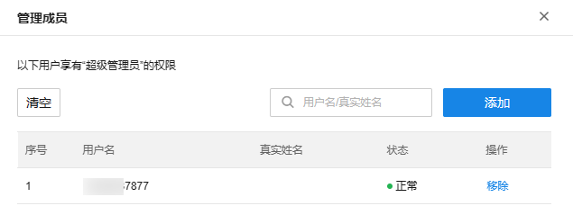

|   
---|---  
清空| 清空当前角色成员。  
移除| 将该成员从当前角色中删除。  
添加| 为当前角色添加成员，可从现有成员中选择或手动添加新账号。  
搜索| 可根据用户名或真实姓名对当前角色成员列表进行搜索。  
  
#### 添加成员

在管理成员界面，点击<添加>，可为当前角色添加成员。支持从现有成员中选择，或通过二维码邀请、手机号添加，以及添加子账号四种方式。

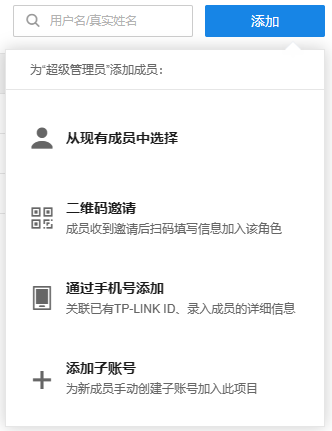

##### 从现有成员中选择

勾选需要设置为当前角色的成员，点击<确定>机型添加。

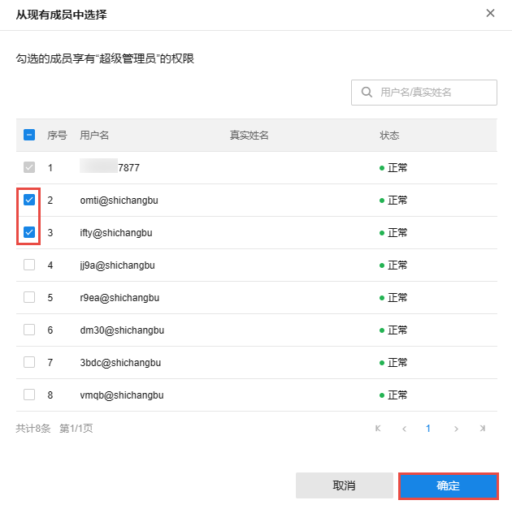

##### 通过二维码邀请

  1. 将生成的二维码发送至需要添加至该角色的成员。点击下方<保存图片>将生成的二维码保存到本地。

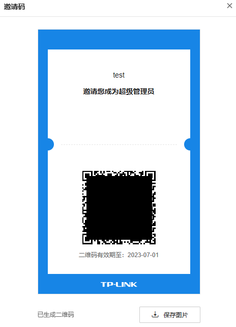

  2. 成员收到邀请后扫码，填写手机号、真实姓名及身份备注，点击页面下方<提交>提交申请。审核结果将以短信方式推送。

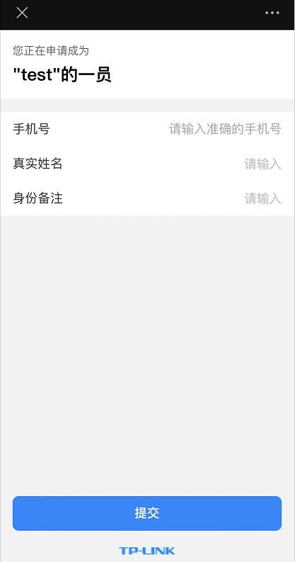

  3. 进入页面：成员 >> 待审核，点击<通过>，通过审核。

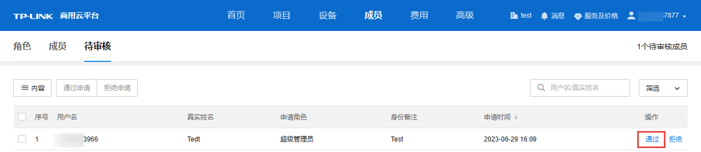

##### 通过手机号添加

支持通过手机号添加，关联已有的 TP-LINK ID，录入成员的详细信息。点击页面右上角<添加成员>可同时添加多个成员到该角色，输入需要添加的成员的手机号，点击右下角<立即添加>即可。

添加结果将通过短信通知。

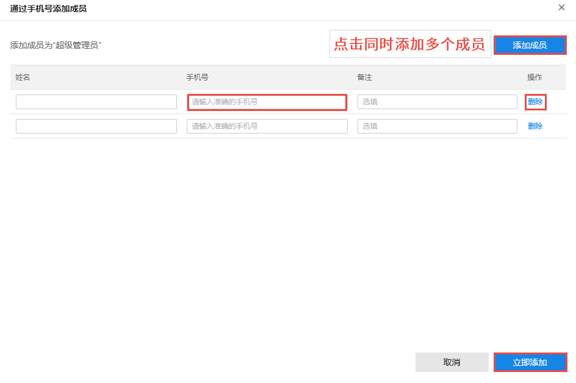

> 说明：
> 
> 若添加的手机号未注册 TP-LINK ID，添加后成员状态为"未注册"，请使用该手机号注册 TP-LINK ID。

##### 添加子账号

点击<添加成员>，将自动生成当前企业下的子账号及密码，设置完成后，点击右下角<确定>进行添加。

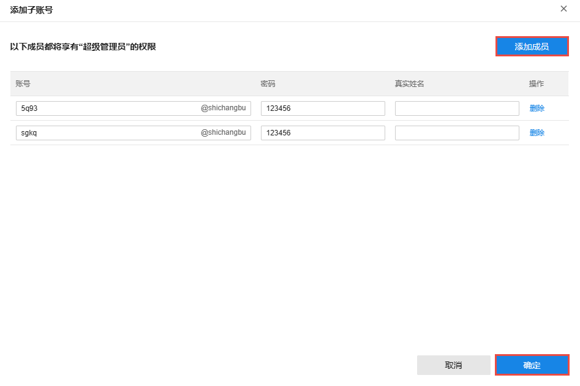

在 TP-LINK 商用云平台选择"子账号登录"，输入账号及密码即可登录到商云平台，管理项目。

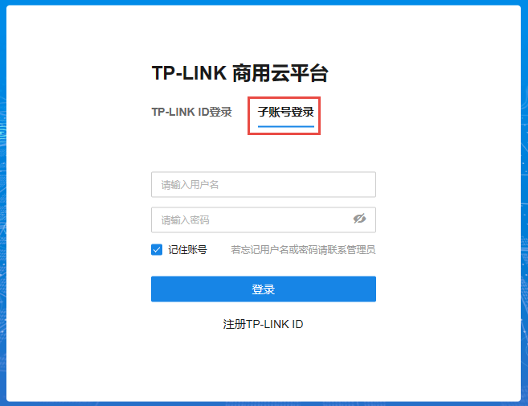

> 说明：
> 
> 创建子账号，需要拥有企业专属码作为唯一标识。如需设置企业专属码，请前往页面：账号信息>企业信息，详情请参考 [企业信息](<um_2_5_2>)。

#### 编辑角色信息

在角色列表中，点击<详情>按钮，可查看默认角色拥有的权限；点击<编辑>按钮，可查看并管理自定义角色的名称、备注及权限。

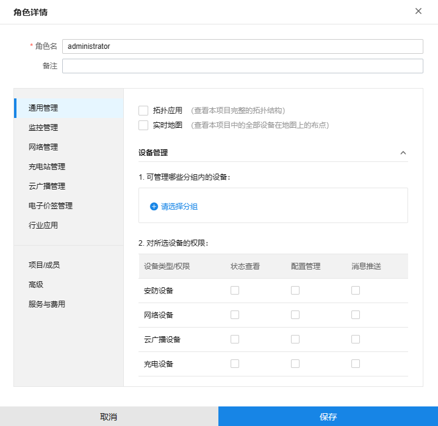

设置完成后，点击<保存>使配置生效。
