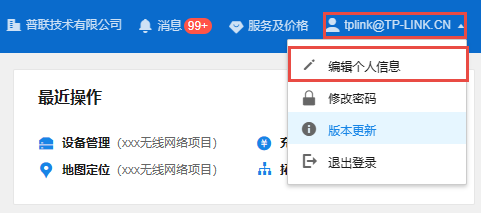
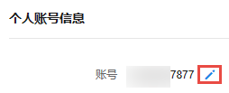
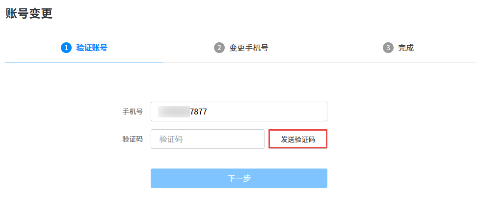
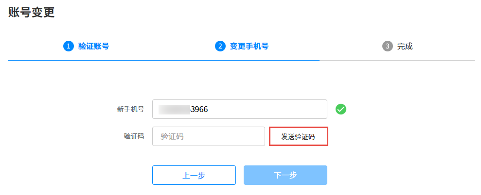

# 个人信息

在 TP-LINK 商用云平台中，点击右上角账号，选择<编辑个人信息>，进入页面：账号信息 >> 个人信息。

在个人信息页面，可修改账号、真实姓名、邮箱及电话。

修改完成后，点击<保存>使配置生效。

#### 修改账号

修改 TP-LINK ID 账号方法如下：

  1. 在个人信息页面，点击，进入账号变更页面。

  2. 输入当前 TP-LINK ID 绑定的手机号，点击<发送验证码>。

输入验证码后，点击<下一步>。

  3. 输入需要变更的手机号，点击<发送验证码>。

输入验证码后，点击<下一步>。

  4. 完成账号变更。

> 说明：
> 
> 变更后的手机号需要未注册过 TP-LINK ID，否则无法变更。
