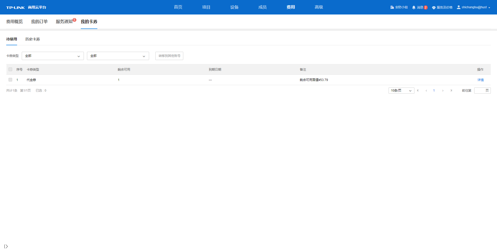
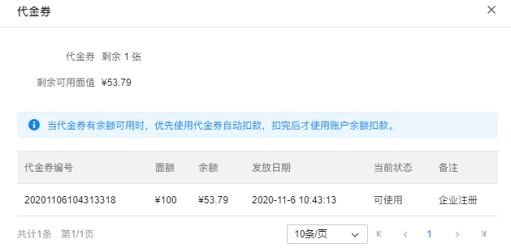
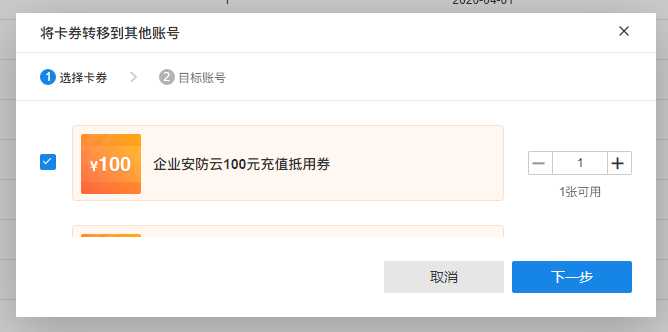

# 待使用卡券

进入：**费用** **> >** **我的卡券** **> >** **待使用。** 此界面可在列表中查看 ­­ 账户全部待使用卡券信息，可按卡券类型筛选查看相关卡券和转移卡券去其他账号。

  * 查看卡券详情

点击列表卡券对应操作栏下<详情>按钮，可查看卡券具体信息。

  * 卡券转移其他账号

当卡券可转移其他账户，可在列表中勾选可转移的卡券再点击<转移到其他账号>按钮，或点击列表可转移卡券的操作栏下<转移到其他账户>按钮，在弹窗内完成卡券转移到其他账号的操作。先选择转移卡券，点击<下一步>，再输入目标账号的 TP-LINK ID，最后点击<立即转移>即可将卡券转移到目标账号上。转移成功后，待使用卡券列表将刷新账户卡券信息。

> 注意：
> 
> 卡券的转移功能不可逆，请确保输入的 TP-LINK ID 准确无误。

