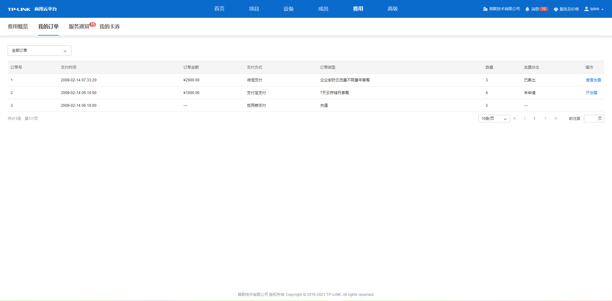
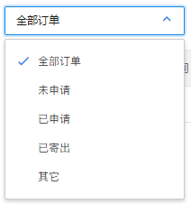
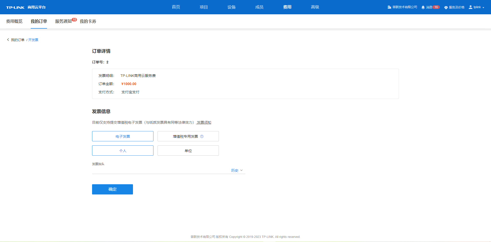
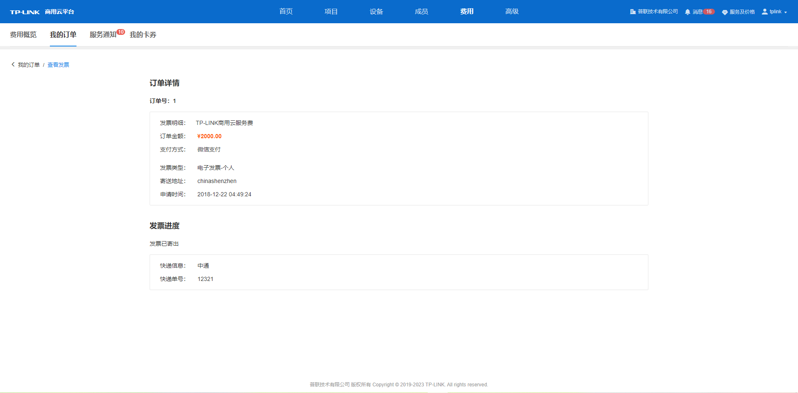

# 我的订单

**进入页面的方法：费用** **> >** **我的订单** ，在我的订单界面可查看充值和服务订单的支付时间、金额、支付方式、类型等信息和开具发票。

  * 查看订单

可根据订单的发票状态选择查看订单方式，列表将显示不同发票状态的订单条目。

  * 开发票

当订单发票状态显示“未申请”，点击对应<开发票>按钮，进入开发票页面。先选择开具发票类型再根据页面提示填写相关发票信息，可点击<发票须知>查看发票制度。

发票信息填写完成后点击<确定>，发票将提交申请，提交成功后将弹出发票申请提交成功提示弹窗，订单条目中的发票状态将进行刷新。

若该订单已开具发票，可点击对应<查看发票>按钮，可查看发票具体信息以及发票寄出进度。

