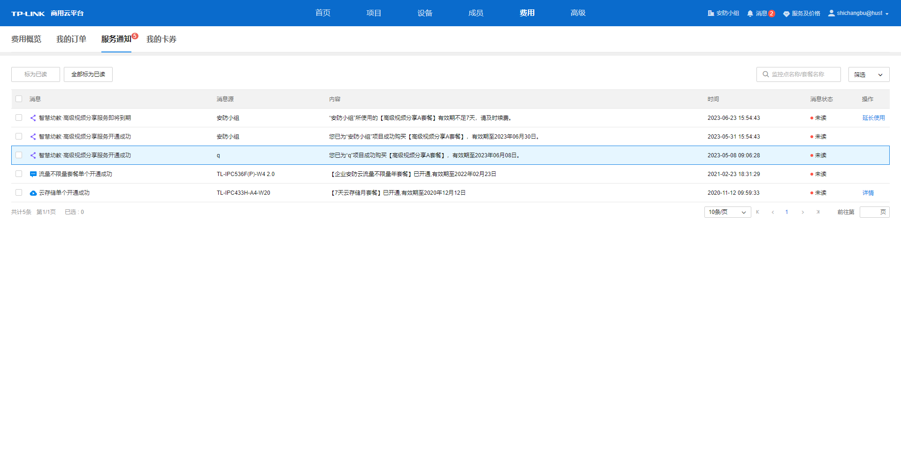
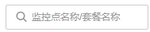

# 服务通知

**进入页面的方法：费用** **> >** **服务通知** ，此界面可查看账户的服务消息、消息来源、内容、通知时间等信息，可根据服务消息提示操作内容进行后续设置。

|   
---|---  
标为已读| 将选中的通知消息的消息状态改为已读  
全部标为已读| 将全部未读的通知消息的消息状态改为已读  
| ­­ 根据输入文字查询服务消息  
筛选| 根据服务类型筛选列表显示信息  
  
不同服务类型的提示消息操作不同，选取常见几种操作说明：

  * 详情：若消息操作栏下出现<详情>按钮，点击将跳转**高级** **> >**日志界面查看该服务的系统日志。
  * 延长使用：若消息操作栏下出现<延长使用>按钮，点击并在弹窗内完成该服务延长使用手续办理。

