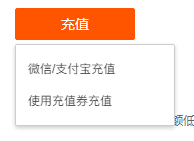
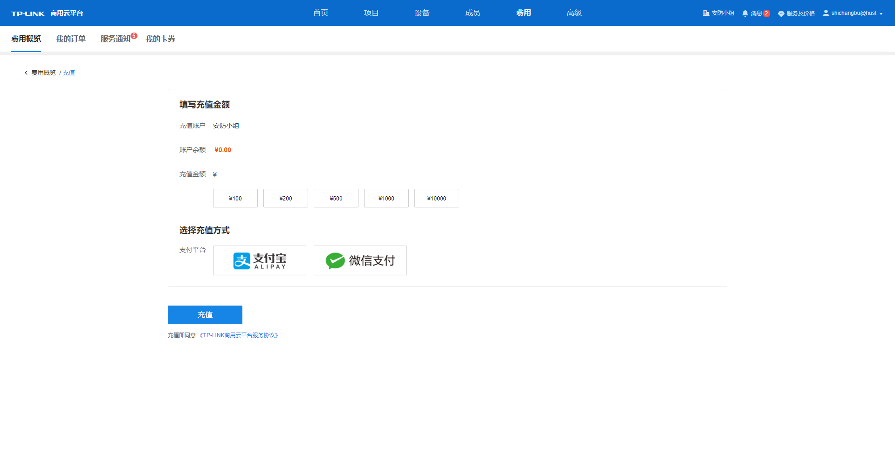
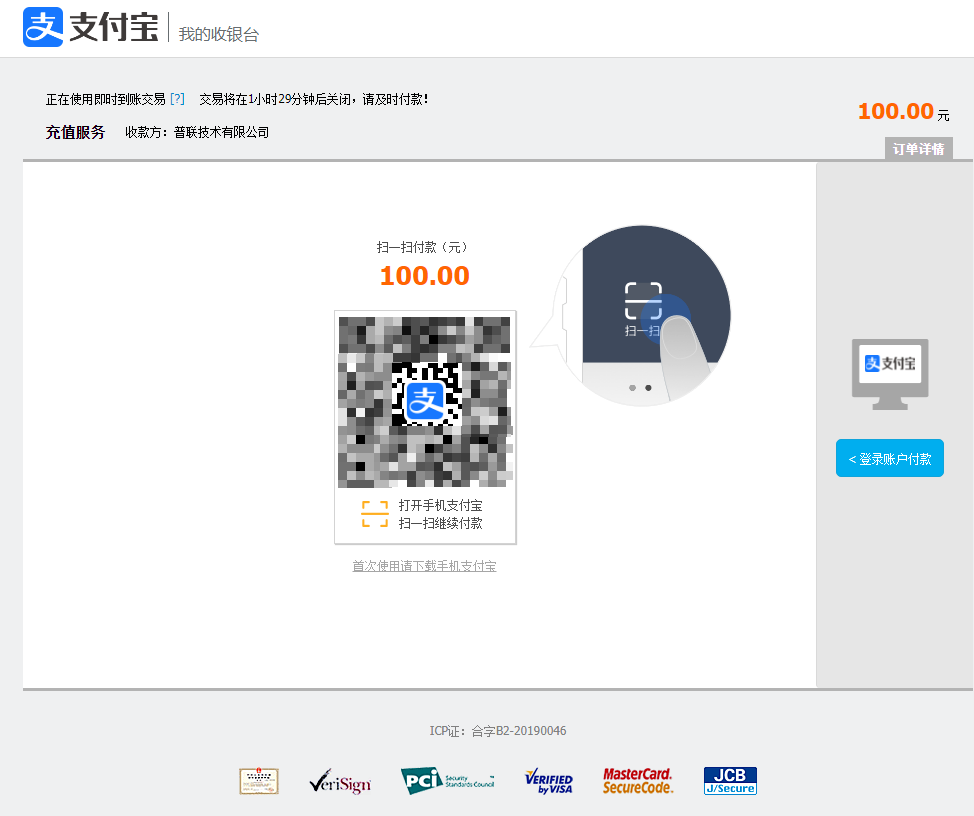
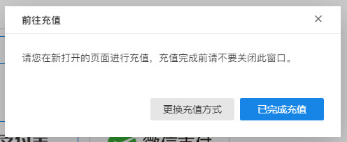
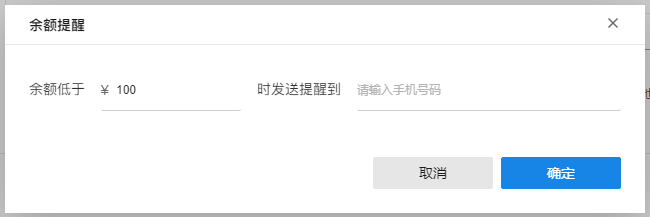

# 余额充值

在账户余额模块点击<充值>，选择充值类型。

  * 微信/支付宝充值

选择此项充值类型后将自动进入充值页面，TP-LINK 商用云平台费用充值支持支付宝/微信平台，填写充值金额，再选择支付平台点击<充值>将跳转支付宝/微信平台充值服务页面，按照页面提示完成充值。充值完成后点击原页面弹窗<已完成充值>，待平台查询充值成功即刷新账户费用情况。

当充值过程中若想更换充值平台和修改充值金额，点击原页面弹窗<更换充值方式>即可重新选择。

  * 使用充值券充值

若账户有充值券，可选择此项进行充值。在弹窗内勾选需充值券，点击<立即充值>，待平台查询充值成功即刷新账户费用情况。

  * 开启/关闭余额提醒

开启余额提醒功能后，当余额和可用代金券总金额低于设置金额时，系统自动发送短信通知提醒。具体操作如下：点击开启/关闭按钮，设置余额提醒触发的金额和接收通知短信的手机号码，点击<确定>即可设置完成。

若想关闭余额提醒功能，再点击<开启>/<关闭>按钮，直至按钮变灰即关闭该功能。若后续想修改触发余额提醒和接收信息的手机号码，可点击按钮，在提醒弹窗内修改相关信息。
