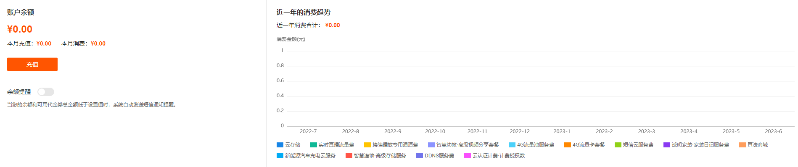
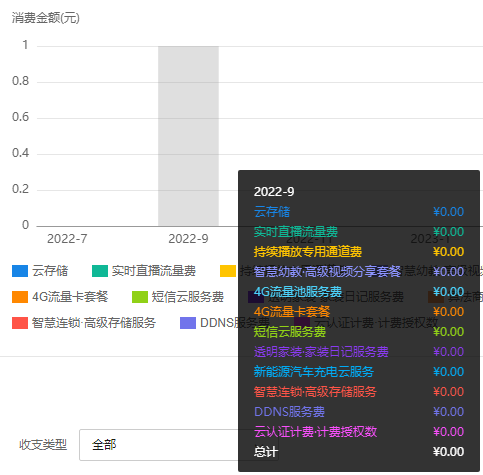
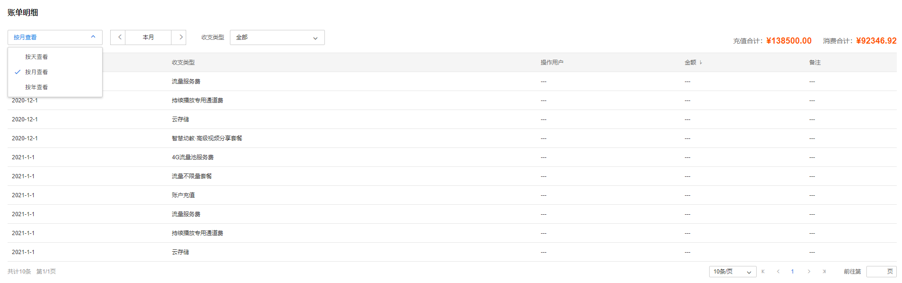
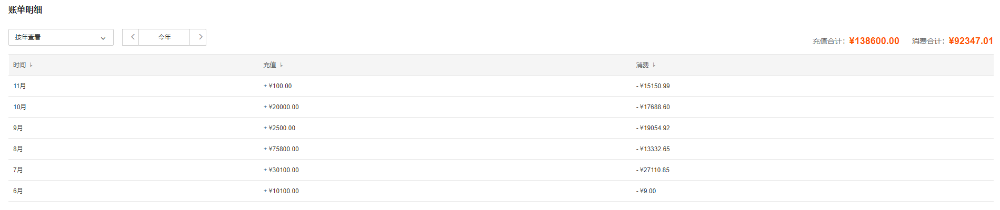
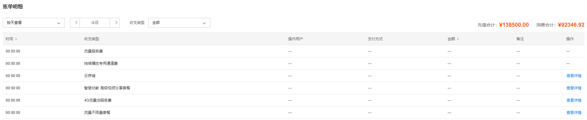

# 费用查看

  * 账户费用查看

在账户余额和近一年的消费趋势模块，可直观知道账户余额、充值消费以及各种服务的消费分布情况。点击底部菜单栏<服务与价格>进入页面可获取更多服务及价格明细。

将鼠标置于服务消费统计图中，可查看不同月份不同服务的消费数额。

  * 账单明细查看

在账单明细模块的右上角可查看当前账户所有充值和消费合计数额。可根据选择按天、按月、按年在列表条目查看获取账单明细信息。

按照不同查看方式，列表显示不同内容。例如账单明细选择按年查看，列表中只展示充值和消费两部分内容的明细条目；选择按天查看，列表中展示包含收支类型、操作用户、支付方式、金额、备注及操作在内的明细条目。

