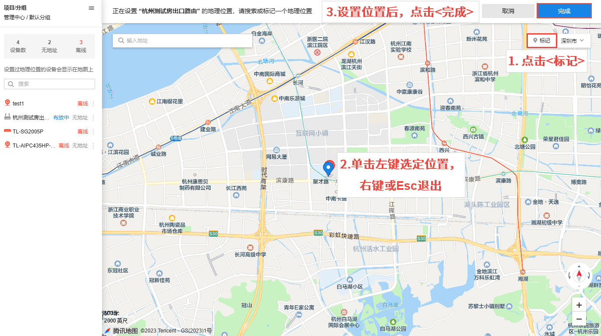
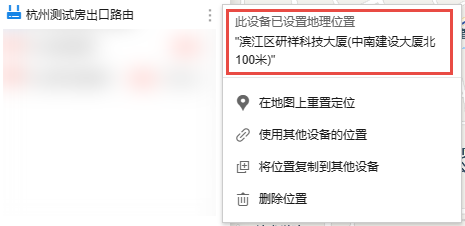
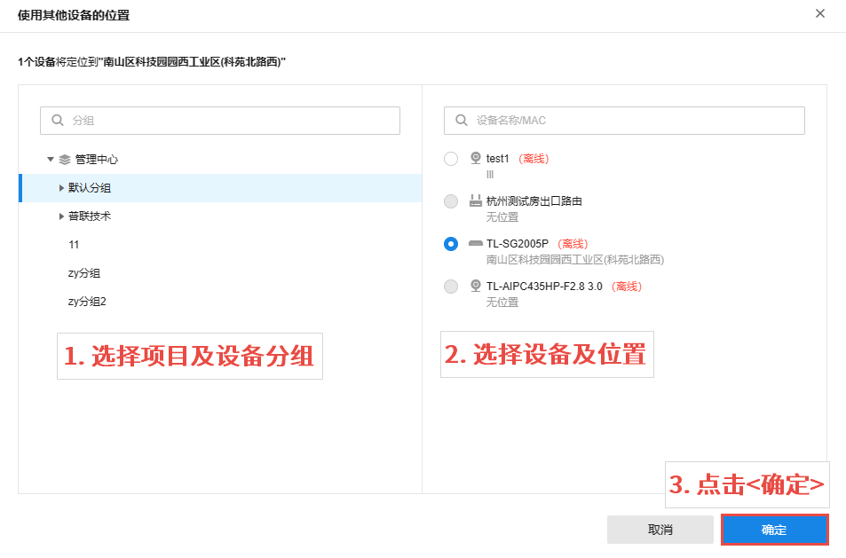

# 设置设备位置

#### 在地图上定位

  1. 在页面左侧，选择需要设置地理位置的设备，点击对应，选择“在地图上定位”。

  2. 点击<标记>，在地图上单击左键为设备选定位置，设置好位置后，点击<完成>使配置生效。

  3. 设置完成后，在页面左侧点击设备对应，可查看并管理设备已设置的地理位置。

#### 使用其他设备的位置

  1. 在页面左侧，选择需要设置地理位置的设备，点击对应，选择“使用其他设备的位置”。

  2. 在左侧选择项目及设备分组，在右侧选择需要复制的设备地址，设置完成后，点击<确定>。

