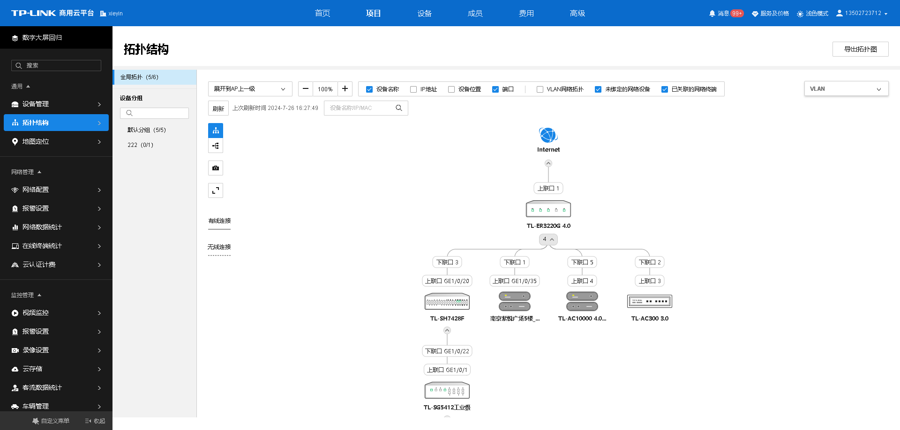
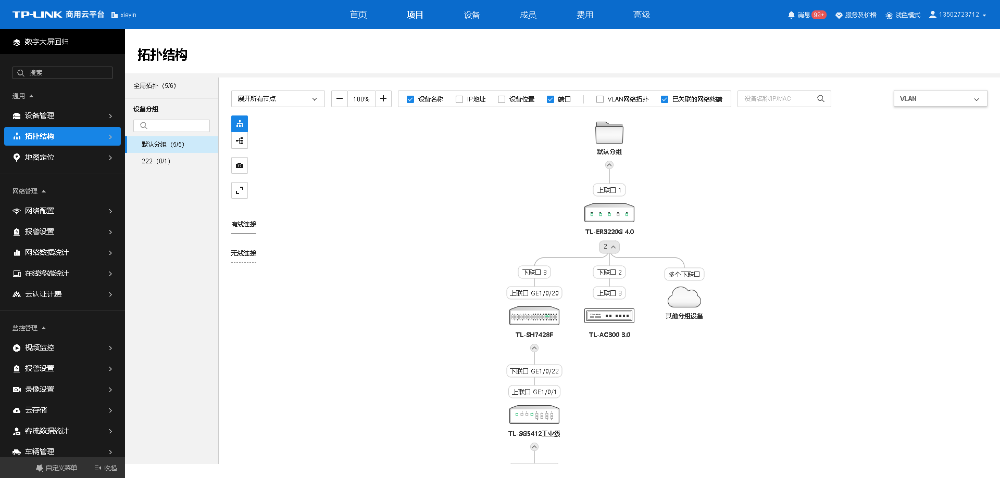

# 拓扑结构

TP-LINK 商用云平台结合网络系统，对设备进行整合，支持探查邻居关系并生成整个网络的拓扑结构。拓扑结构可视化，设备负载清晰明了，链路状态及时反馈，帮助用户快速排障。

进入页面的方法：项目 >> 通用 >> 拓扑结构

点击页面左上角可选择拓扑展开节点，可以根据需要展开一级/二级/三级/四级节点查看拓扑

图标| 功能  
---|---  
批量添加设备| 可将拓扑中暂未绑定的设备批量添加上云。  
导出拓扑图| 将全局拓扑导出为图片。  
展开所有节点| 根据网络状况，可选择展开各级节点。  
设备名称| 勾选后可在拓扑图中显示设备名称。  
IP 地址| 勾选后可在拓扑图中显示 IP 地址。  
设备位置| 勾选后可在拓扑图中显示设备位置。  
端口| 勾选后可在拓扑图中显示节点相互连接的设备端口号。  
VLAN 网络拓扑| 展示 VLAN 情况。  
未绑定的网络设备| 局域网中未上云的网络设备。  
已关联的网络终端| 局域网中接入的终端设备。  
刷新| 点击更新当前拓扑图，超过 7 天未主动刷新进入拓扑后自动刷新拓扑图。  
VLAN| 选择 VLAN 组进行高亮展示，并对 VLAN 进行备注。  
| 调整拓扑图显示方向为纵向/横向显示。  
| 放大/缩小显示拓扑图。  
| 截取当前窗口展示的拓扑图保存为图片。  
| 将拓扑图全屏显示。  
  
> 说明：
> 
> 成对的网桥或者易展设备上云后会显示在拓扑，如主子设备虚线连接，表示无线易展。
> 
> TP-LINK 网络设备会自动生成拓扑，第三方品牌网络设备不一定能在拓扑中体现。

选择拓扑左侧分组可以进入**分组拓扑** ，展示该分组下设备在拓扑中的连接关系。

分组拓扑以分组为根节点，展示拓扑中该分组下设备的连接关系，其他分组的设备不会在分组拓扑中展示。如链接关系中存在不可省略的其他分组设备，会以代替。
