# 添加设备

TP-LINK 商用云平台支持添加管理包括路由器、交换机、无线 AC/AP、网桥、网关、摄像机 IPC、录像机 NVR、充电桩、太阳能控制器、网络音响、停车抓拍机等TP-LINK 网络设备、安防设备及其他设备。

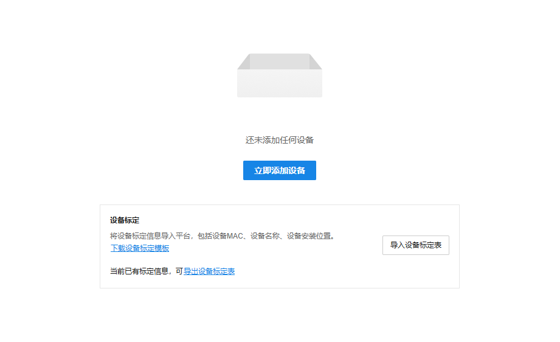

> 说明：
> 
> 请确认需要添加的设备都已接入互联网，再进行添加操作。

#### **设备ID添加**

通过设备ID的方式，可添加包括路由器、交换机、无线 AC/AP、网桥、网关、摄像机 IPC、录像机 NVR、充电桩、太阳能控制器、网络音响、停车抓拍机等TP-LINK设备。

设备 ID 可在设备机身上的产品规格标贴上查看。输入产品规格标贴上的 17 位设备 ID，设置设备名称及设备分组之后，点击<查找设备>，即可进行添加。

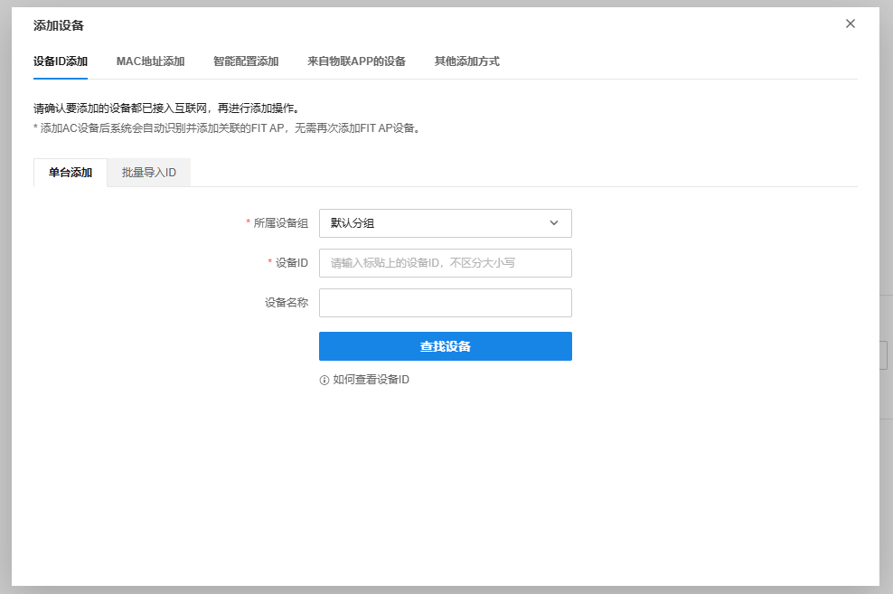

对于酒店、小区、工厂、园区等中大规模的项目场景，以及其他有较多设备需要使用商用云平台管理的情况，可以使用批量添加的方式统一将设备快速上云。

确保需要添加的设备已正常联网后，在“设备ID添加”页面内选择<批量导入ID>，并点击<下载模板>获取商用云平台提供的导入模板。在模板内填写设备的ID、用户名、密码等信息，点击<选择文件>，从本地选择填写完成的模板文件后，点击<开始导入>，即可进行设备的批量添加。

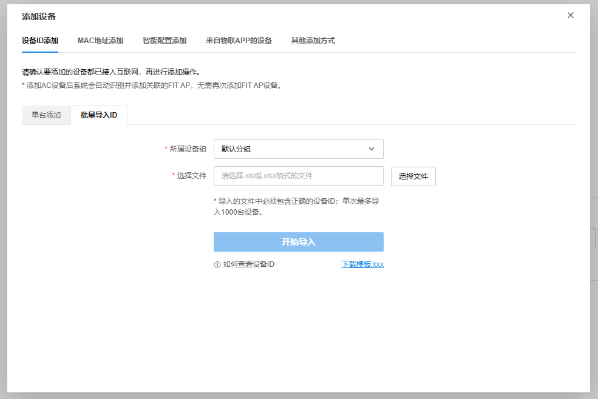

#### **MAC地址添加**

通过设备MAC地址方式，可添加包括路由器、交换机、网桥、网关、AC、FAT AP等TP-LINK网络设备。

设备MAC可在设备机身上的产品规格标贴上查看。输入设备的 MAC 地址、设备本地 Web 管理界面的用户名及密码，设置设备名称及设备分组之后，点击<添加>，即可进行添加。

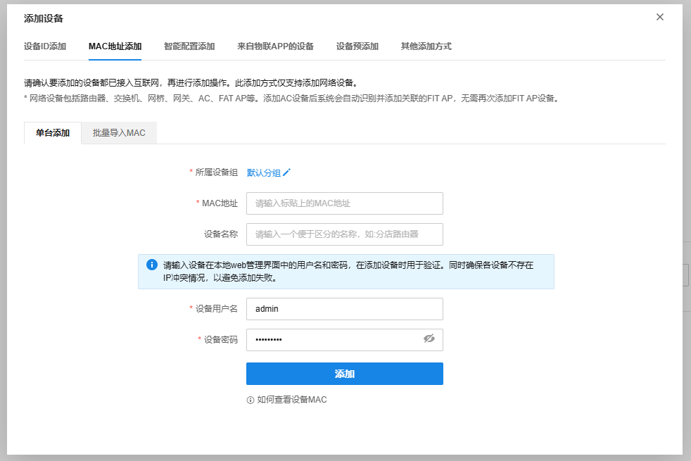

对于拥有较大规模网络设备拓扑的项目场景，以及其他有大批量网络设备需要使用商用云平台统一管理的情况，可以使用批量添加的方式将设备快速添加上云。

确保需要添加的设备已正常联网后，在“MAC地址添加”页面内选择<批量导入MAC>，并点击<下载模板>获取商用云平台提供的导入模板。在模板内填写设备的MAC地址、用户名、密码等信息，点击<选择文件>，从本地选择填写完成的模板文件后，点击<开始导入>，即可进行设备的批量添加。

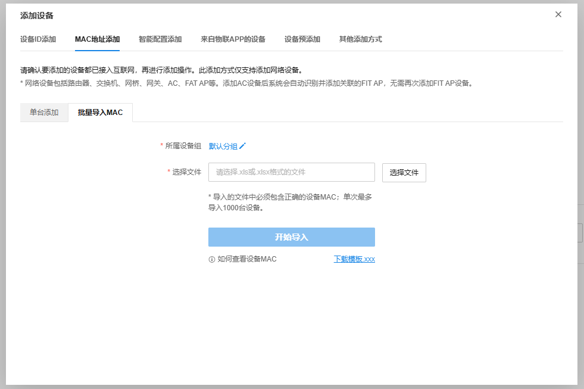

#### **智能配置添加**

商用云平台内已存在支持智能配置的设备时，可通过智能配置添加的方式，自动发现局域网中的全部设备，实现统一添加和集中管理。

在“智能配置添加”页面内，设置设备分组之后，点击<开始智能配置>，进入智能配置界面。

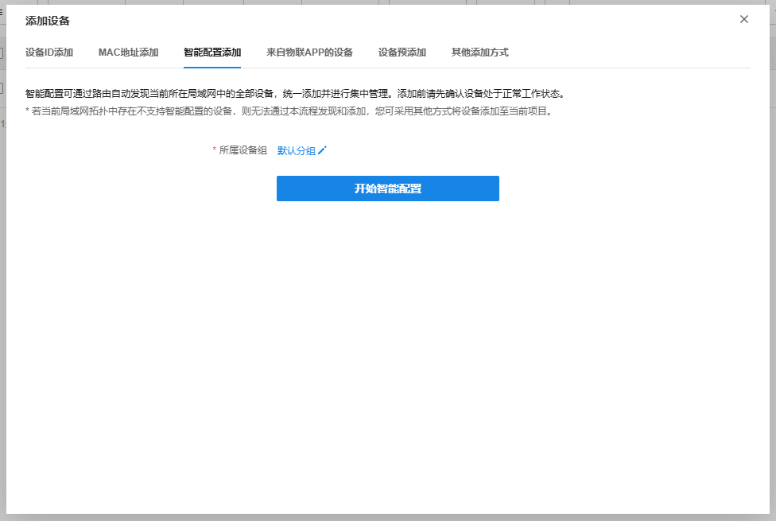

> 说明：
> 
> 如果当前局域网拓扑中不存在支持智能配置功能的设备，则无法通过智能配置集中发现和添加设备。此时建议通过设备ID、MAC 地址添加等方式来添加设备。

以下为智能配置添加的详细步骤：

1.发现全网拓扑

为方便设备管理，增加网络安全性，需为待添加的出厂状态的设备统一设置用户名和密码。设置用户名和密码之后，点击<确定>，即可开始自动发现。

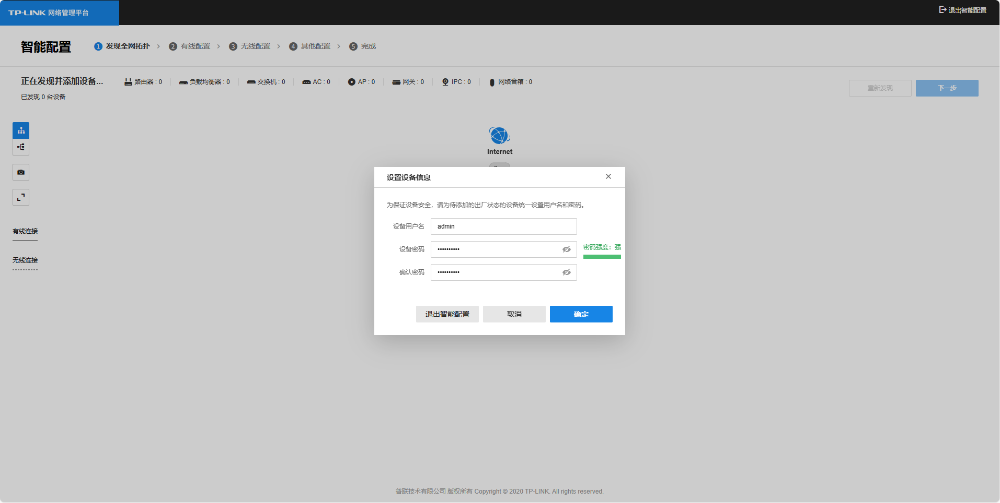

商用云平台发现局域网中支持智能配置功能的设备后，将在页面内生成拓扑图，并自动添加其中处于出厂状态的设备。

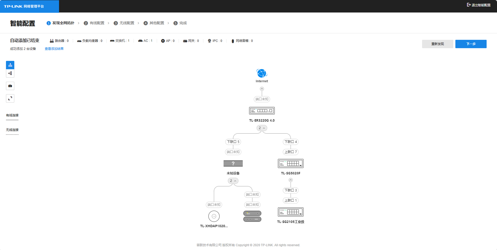

处于非出厂状态的设备（即已设置设备用户名与密码的设备）也会在此过程中被一并发现，但此类设备需要在添加结果页面内手动验证用户名和密码，才可添加到商云。

2.有线配置

可以在此步骤内划分不同类型的网段，然后将网段分配到交换机的端口。

划分网段：可添加 VLAN，每个 VLAN 对应一个网段。商用云平台提供了默认VLAN可供选择：默认 VLAN1 用于网络管理业务，VLAN2 用于员工网络无线业务，VLAN3 用于访客网络无线业务。

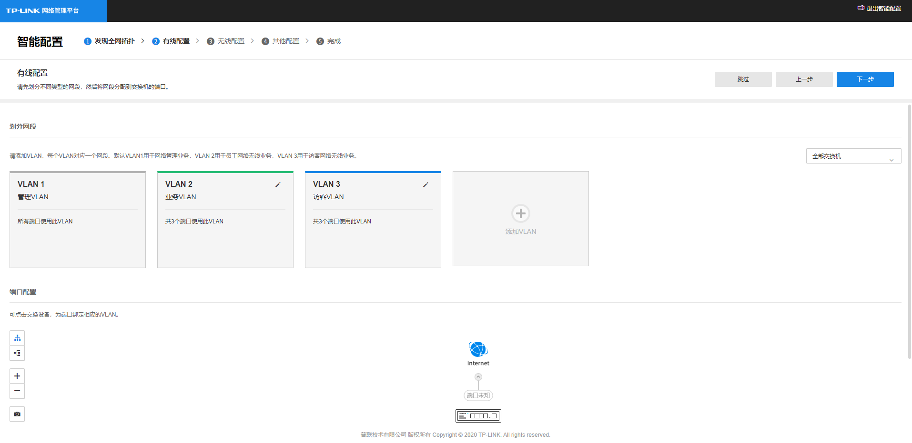

端口配置：可选择交换设备，并为端口绑定相应的 VLAN。

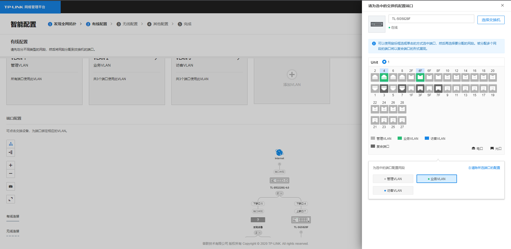

3.无线配置

可以在此步骤内设置 SSID 和认证方式，该配置针对具有无线覆盖功能的无线企业路由和无线接入点（AP）生效。

可选择新建 SSID 或选择已有的 SSID。详情请参考[SSID](<**um_5_1_1**>)。

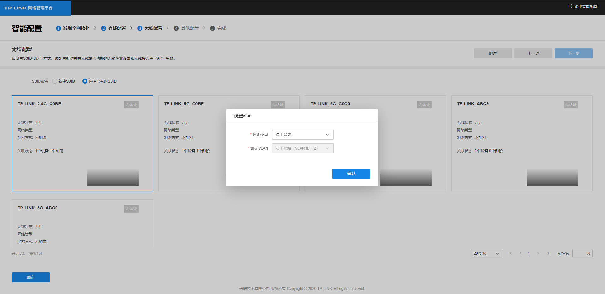

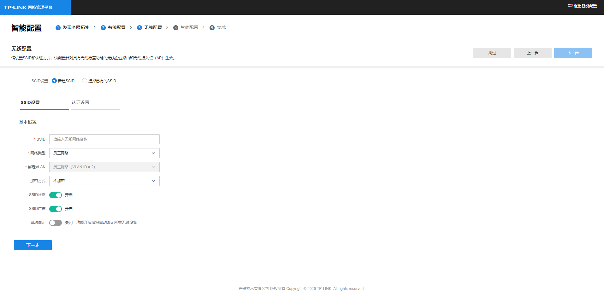

认证设置：可选择已有认证配置或新建认证配置，详情请参考[认证配置](<**um_5_1_3**>)。

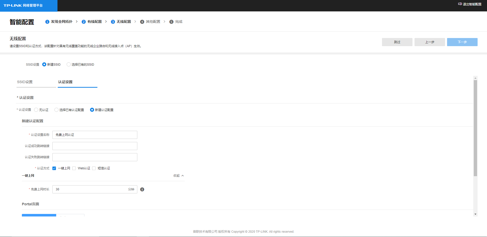

4.其他配置

商云云平台针对部分场景提供了个性化的网络设置项，配置更便捷：

通用：基本的有线无线配置。

宿舍：在基本的有线、无线配置基础上，增加交换机设置、AP 防护设置、无线设置。

酒店：在基本的有线、无线配置基础上，增加有线网络带宽控制、客人网络交换机设置、AP 防护设置、客人网络无线设置。

企业：在基本的有线、无线配置基础上，增加上网行为限制、交换机设置、AP 防护设置、访客网络设置。 

以企业设置项为例：

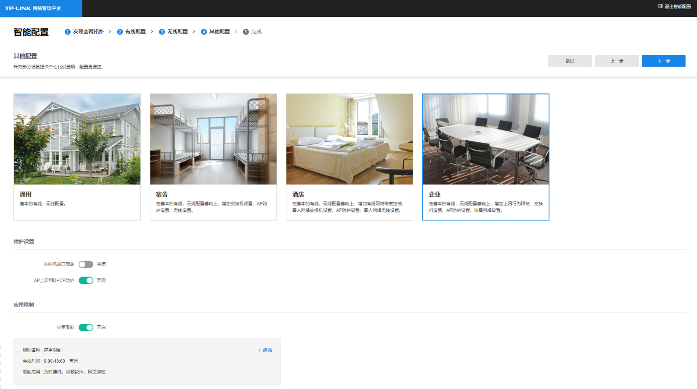

|   
---|---  
DHCP 防护| 指 AP 在接收到 DHCP 报文时检查其 IP 或 MAC，只允许绑定到该 AP 的 DHCP 服务器报文通过。该功能可以防止无线客户端从非法 DHCP 服务器获取 IP。  
交换机端口隔离| 通过限制某个端口到一组端口的数据转发，从而实现该端口与端口组之间的隔离。通过设置端口隔离，可以有效地限制特定端口之间的通信，并且不会影响与其他端口的正常通信，其功能类似于 VLAN，但比 VLAN 更便捷。  
应用限制| 设置规则名称及规则生效时间，勾选需要限制使用的应用，点击<保存>存储配置。  
  
5.完成

完成配置后，服务器会将配置下发到全部设备。点击<查看配置清单>，可查看设备的具体有线配置。

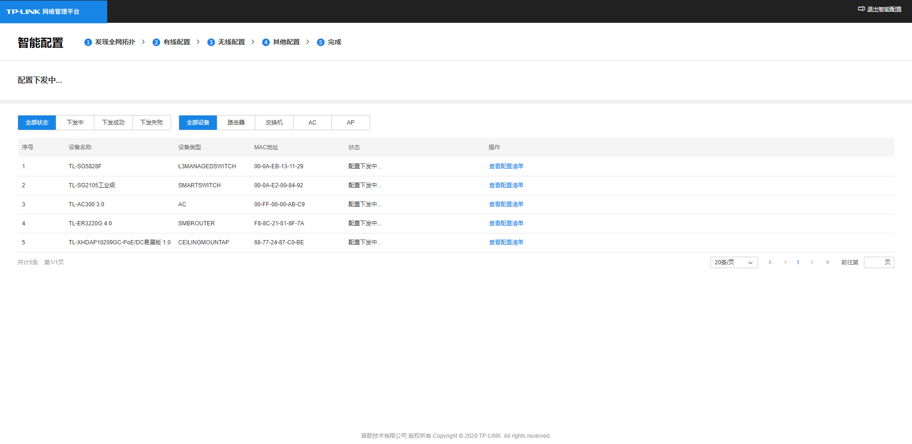

#### **来自物联APP的设备**

TP-LINK物联APP是管理TP-LINK智能物联产品的统一平台，可登录TP-LINK ID，并可添加和管理TP-LINK家用路由、安防监控、智能家居设备产品。

商用云平台支持将添加在物联APP的IPC设备（包括NVR通道）转移或分享至商云。

1.从物联APP转移设备

通过商用云平台提供的转移二维码或链接，可以将已添加到物联APP的IPC设备转移到商云。转移前，请确保待转移设备均处于在线状态。转移成功后，设备将与物联APP解绑。

在“来自物联APP的设备”页面内，选择“从物联APP转移设备”选项，选择设备需转移进入的设备分组后，点击<创建转移链接>，即可生成转移二维码和转移链接。

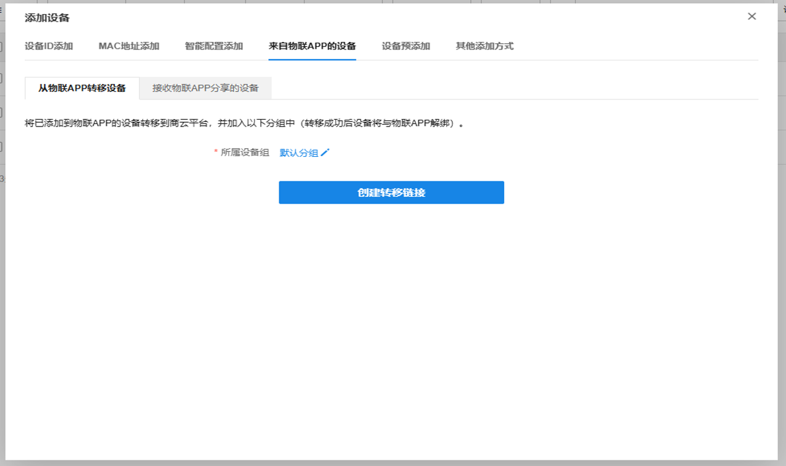

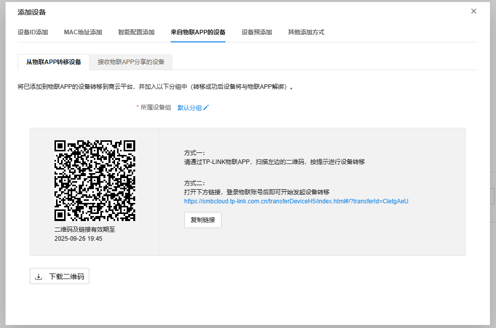

注意：

>   1. 页面内展示的二维码和链接仅对当前所选设备分组生效。如果在转移前更改了设备分组，请重新点击<创建转移链接>按钮，并使用新的二维码或链接进行设备转移操作。
>   2. 二维码和链接的有效时间为点击<创建转移链接>按钮时开始计算的24小时。
> 

使用物联APP扫描左侧的二维码，或者在浏览器中打开右侧的链接并登录物联账号，即可开始进行设备转移操作。以物联APP上的操作流程为例，在“选择设备”页面内，选择需要转移到商用云平台的IPC、NVR设备，并点击<下一步>。

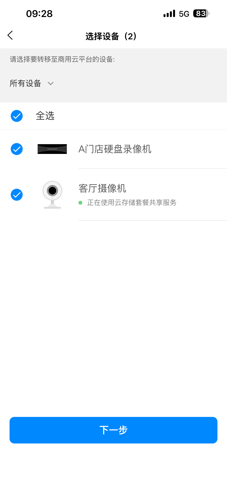

将设备转移到商用云平台，需要验证物联账号，并为这些设备重新设置新的设备密码。在完成身份验证和重设密码后，即可开始转移。转移过程中请勿离开转移设备页面，以免转移失败。

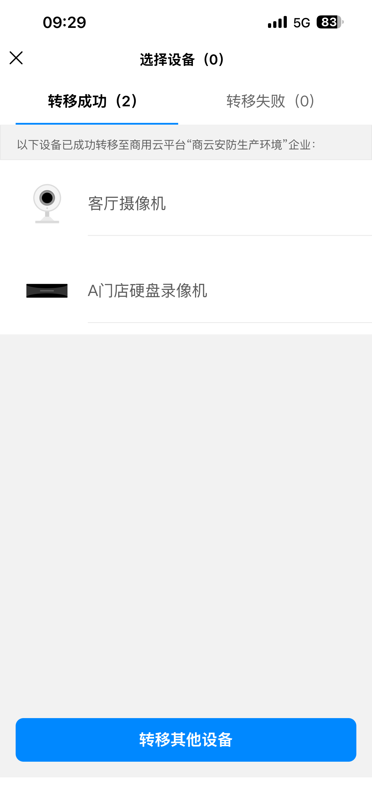

转移完成后，便可以在商用云平台的设备列表查看这些设备，并进行管理和配置。

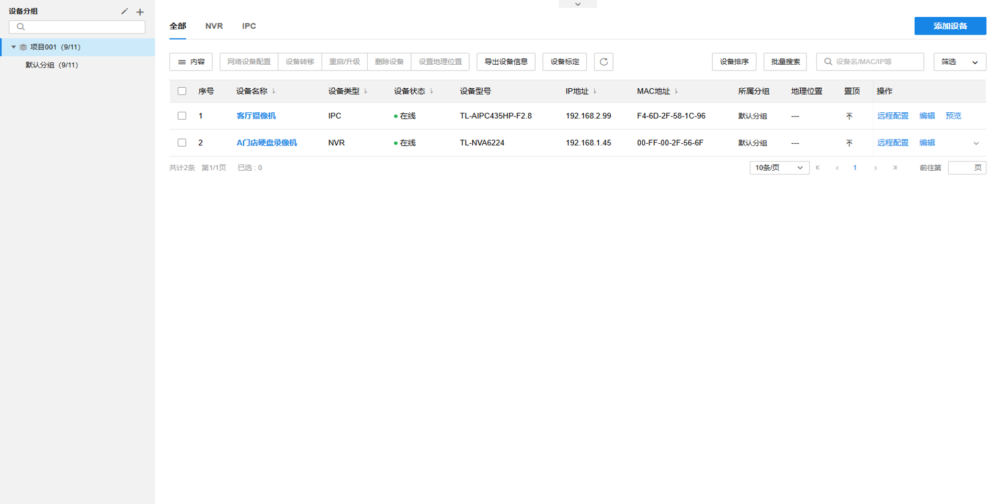

注意：

>   1. 若设备已开通云存储、AI云助手、高级视频共享等增值服务，转移后设备下的增值服务将会失效。建议在转移设备前先将服务剩余套餐及时转移给其他设备。
>   2. 如转移的设备中含有多通道设备，转移后设备下各通道添加的摄像机等硬件保持不变。
>   3. 设备及其下属通道的历史云录像、历史消息、微信绑定记录等不会随着设备转移，仍保留在原账号下，按原有规则清理。
>   4. 如设备处于托管或分享状态，转移后将自动取消托管或分享。
> 

2.接收物联APP分享的设备

通过商用云平台提供的转移二维码或链接，可以将已添加到物联APP的IPC设备分享到所选设备分组中。分享完成后，设备仍会绑定在物联APP，而商用云平台也可以获得这些设备的视频预览、录像回放、语音对讲、云台控制权限。另外，与转移设备不同，处于离线状态的设备也可分享到商用云平台。

在“来自物联APP的设备”页面内，选择“接收物联APP分享的设备”选项，选择设备需进入的设备分组后，点击<创建分享链接>，即可生成分享二维码和分享链接。

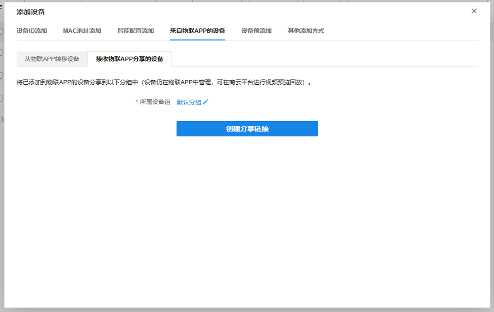

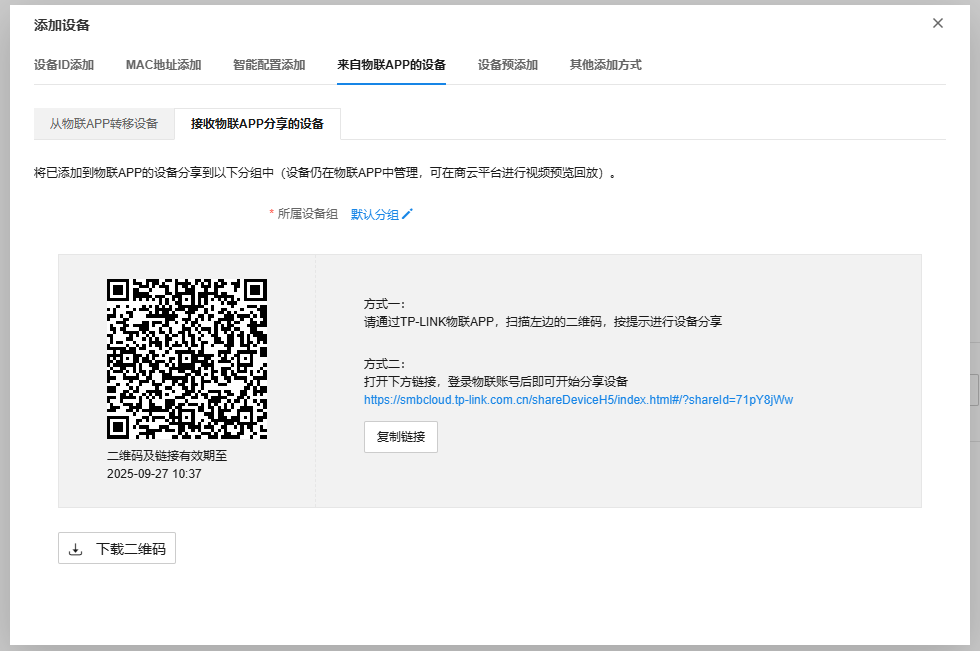

注意：

>   1. 页面内展示的二维码和链接仅对当前所选设备分组生效。如果在分享前更改了设备分组，请重新点击<创建分享链接>按钮，并使用新的二维码或链接进行分享操作。
>   2. 二维码和链接的有效时间为点击<创建分享链接>按钮时开始计算的24小时。
> 

使用物联APP扫描左侧的二维码，或者在浏览器中打开右侧的链接并登录物联账号，即可开始进行设备分享操作。以物联APP上的操作流程为例，在“选择设备”页面内，选择需要转移到商用云平台的IPC设备（包括NVR下的通道IPC），并点击<下一步>。

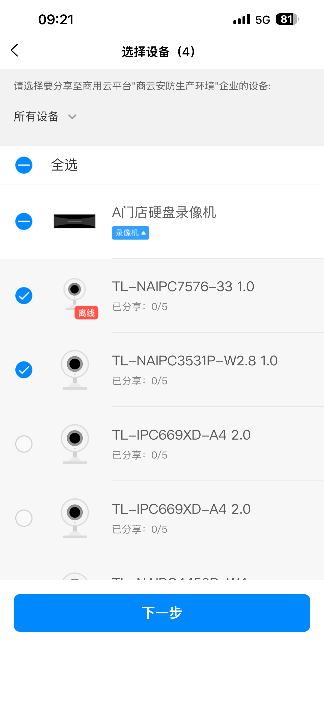

针对已选的IPC设备，选择需要分享给商用云平台的权限，之后点击<下一步>，开始分享。

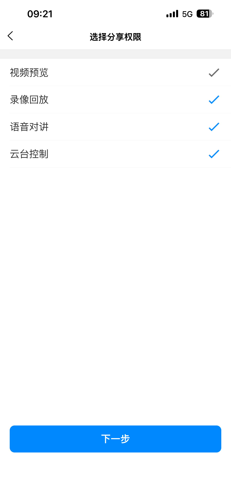

分享过程中请勿离开转移设备页面，以免转移失败。

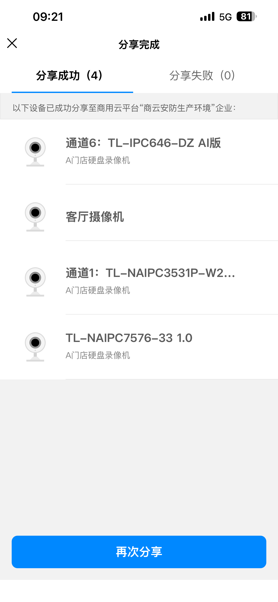

分享完成后，便可以在商用云平台的设备列表查看这些设备。这些分享自物联APP的设备会被收纳在“物联分享IPC”标签下，可进行视频预览、录像回放、语音对讲、云台控制等操作。

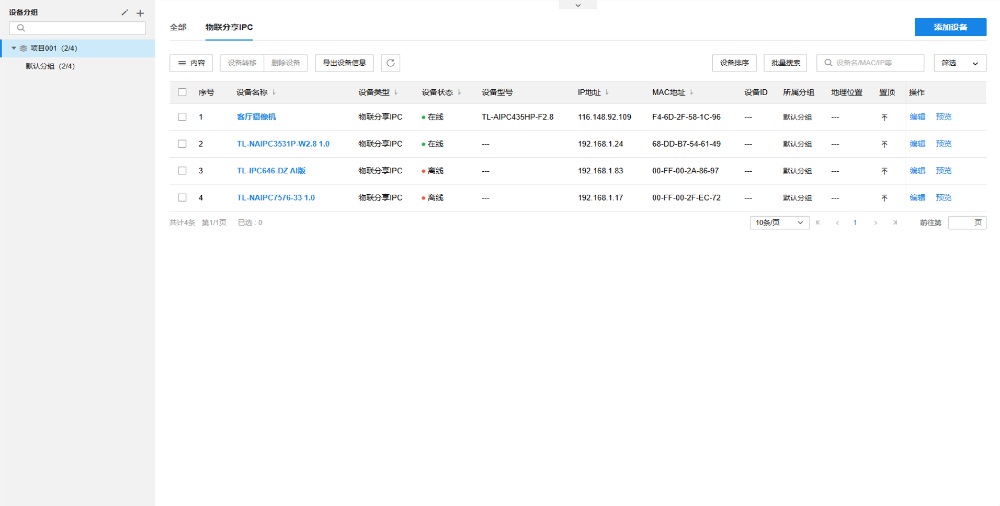

#### **设备预添加**

商用云平台支持通过设备ID或设备SN码添加暂未上线的出厂状态设备。此方式仅支持有设备ID或设备SN码的设备，设备类型不限。

在“设备预添加”页面内，点击<下载模板>获取商用云平台提供的模板文件，在模板内填入设备ID或设备SN码的至少一项，并补充设备名称、安装位置、设备用户名、设备密码等信息。其中设备名称与安装位置按需填入，用户名仅网络设备为必填，密码为所有设备必填。

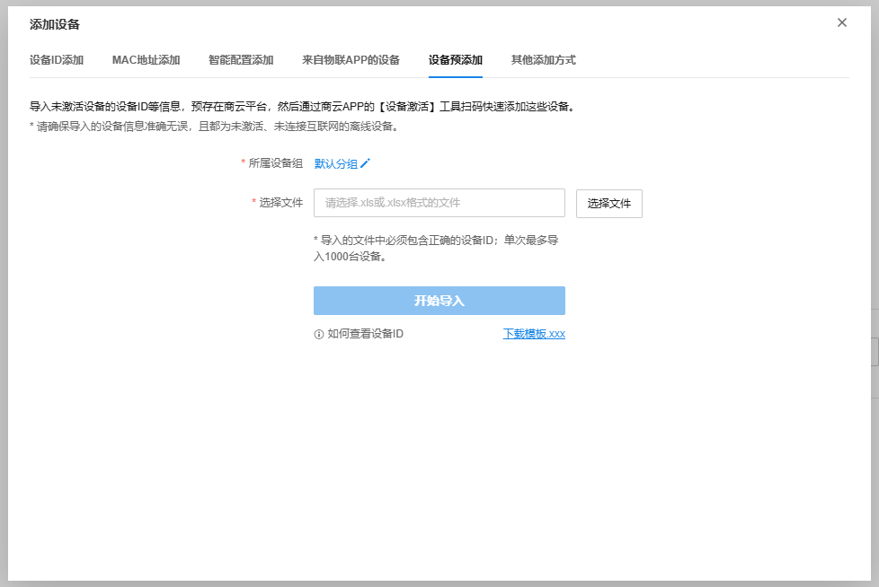

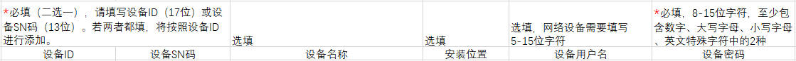

回到“设备预添加”页面，设置设备需添加进入的设备分组，上传填好设备信息的模板表格后，之后点击<开始导入>，即可开始设备预添加。表格内填写的信息将在后续设备激活时自动下发给设备。

预添加后设备会收纳在设备列表的“预添加设备”标签内。此时设备仍未实际绑定到项目，需要在设备预添加后的7日内，利用“商云APP-工具-设备激活”匹配项目的鉴权二维码并激活设备，设备被APP激活后将自动绑定到预添加的项目。

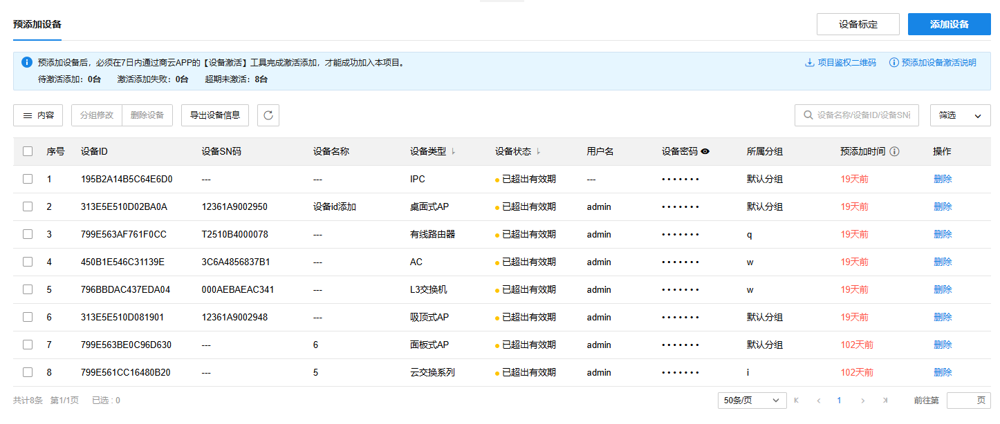

若设备被成功激活并绑定，该设备条目将自动从“预添加设备”列表中移除，并可直接在设备列表的对应分组下查看和管理。若设备激活后绑定失败、或未在有效期内被激活，您仍可以在“预添加设备”列表中看到设备条目并查看具体的失败原因。

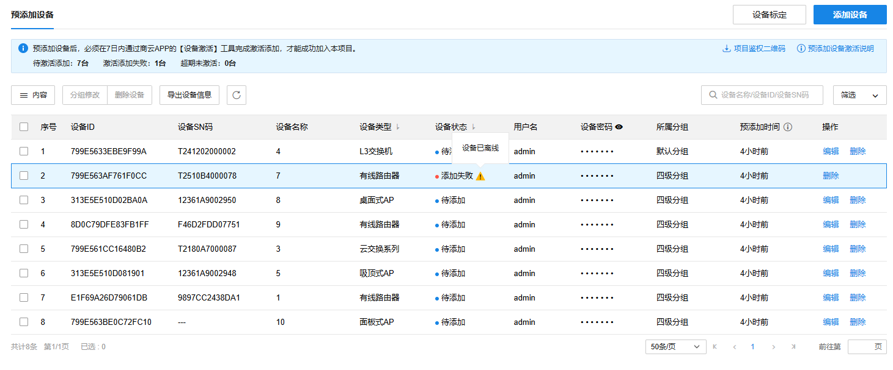

#### 其他添加方式

除了在商用云平台网页端进行添加设备之外，您也可以通过商云的其他客户端来进行添加操作。您可以使用TP-LINK商云APP扫描设备标贴上的二维码来快速添加设备；也可以使用TP-LINK商云客户端，自动发现并批量添加与电脑处于同一局域网下的监控设备。

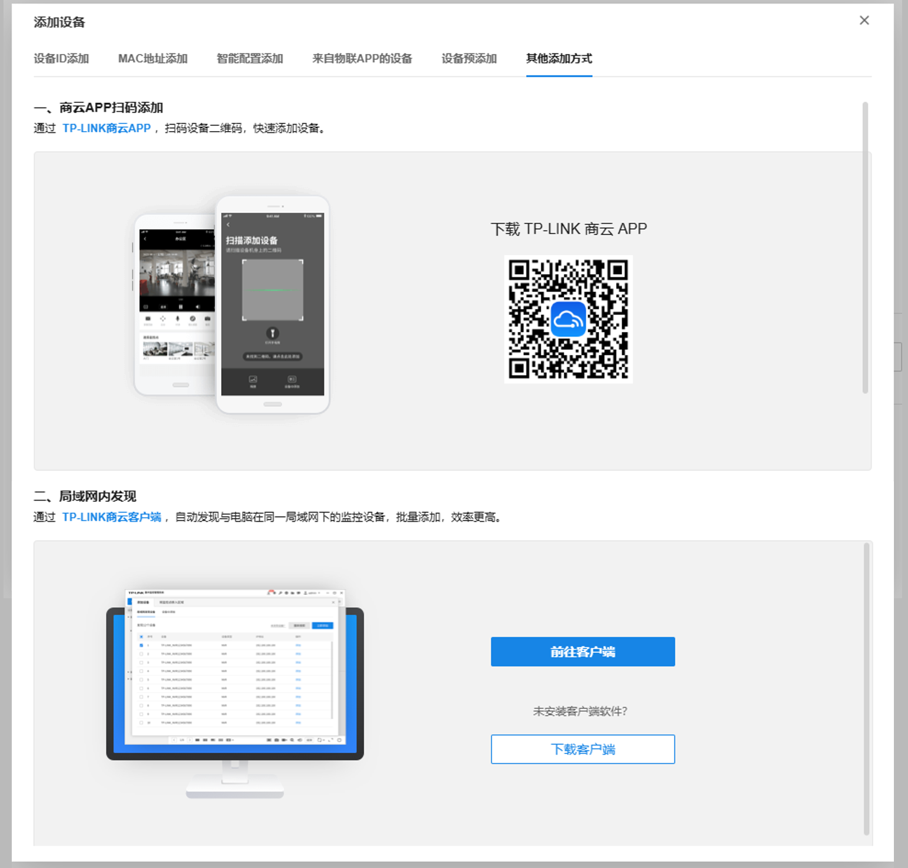
