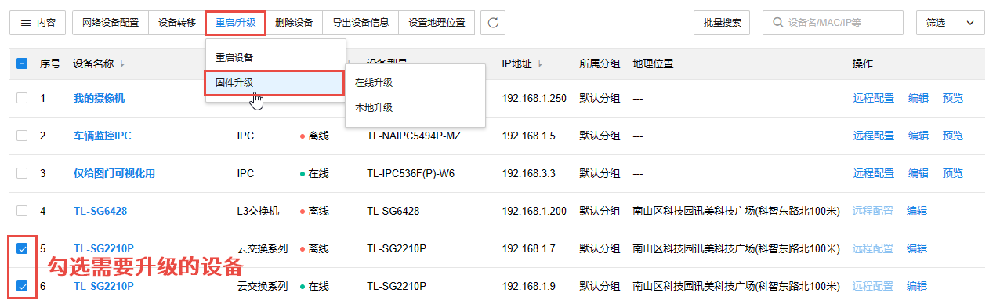
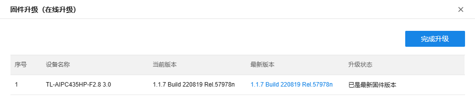
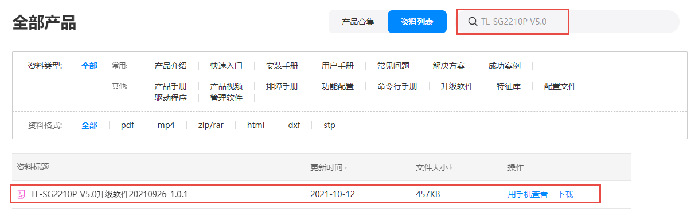
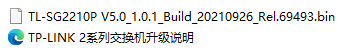
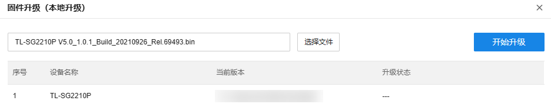
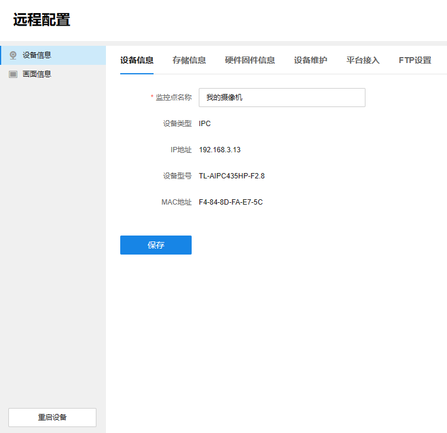
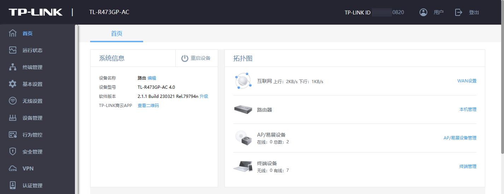
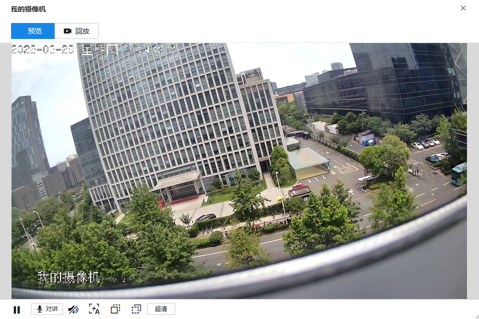
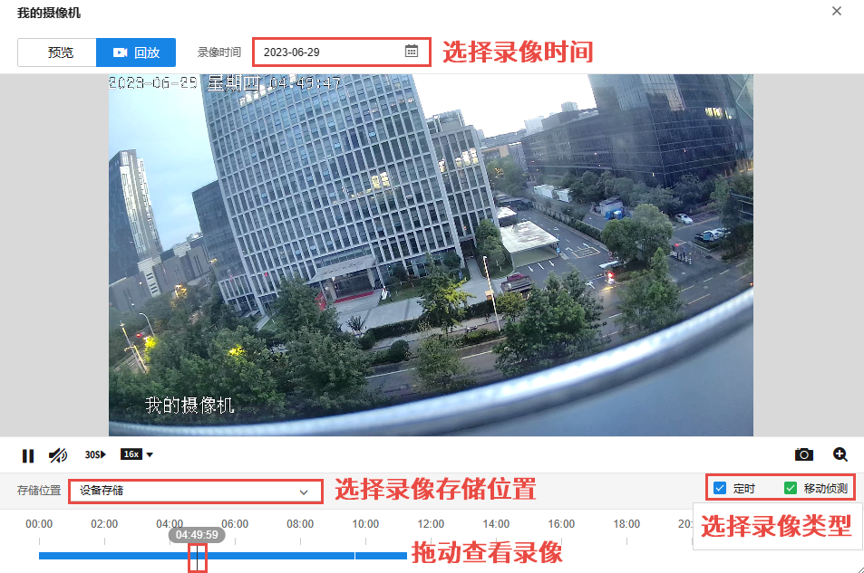

# 管理设备

本小节将详细介绍设备固件升级、远程配置、预览与回放等常用操作。

#### 固件升级

进入页面：项目 >> 通用 >> 设备管理，或进入“设备”页面，在页面左侧选择项目及设备分组，勾选多个设备，点击<重启/升级>，可对设备进行批量重启或固件升级，支持在线升级或本地升级。

> 注意：
> 
> 升级过程中，设备会自动加载并升级、重启。切勿在升级过程中断电，否则可能造成设备损坏。

##### 在线升级

配置方法：

  1. 勾选需要进行固件升级的设备，点击<重启/升级>，点击<固件升级>，选择<在线升级>。
  2. 平台将自动检测是否有可更新的固件，可根据提示进行升级。

##### 本地升级

  * 配置方法：

  1. 使用本地升级时，需要先确认设备的具体型号、硬件版本及当前固件版本。进入[TP-LINK 资料中心](<https://resource.tp-link.com.cn/>)，搜索“设备型号+空格+硬件版本”，如“TL-SG2210P V5.0”，点击<下载>获取升级固件。

  2. 将下载到电脑本地的升级固件解压，查看升级说明及升级固件。

  3. 进入商云设备管理界面，勾选需要进行固件升级的设备，点击<重启/升级>，点击<固件升级>，选择<本地升级>。
  4. 点击<选择文件>，选择格式为.bin 的解压文件，点击<开始升级>。

> 说明：
> 
> 在设备管理界面点击<编辑>查看设备信息，可查看设备型号及硬件版本。
> 
> “20210926”代表 2021 年 09 月 26 日的升级固件，通常固件的日期越新，说明固件版本越新。

#### 远程配置

##### 安防设备

点击安防设备对应<远程配置>按钮，可在商云平台对设备进行远程配置，具体配置可前往[TP-LINK 官网资料中心](<https://resource.tp-link.com.cn/?source=index>)，搜索设备型号，查看对应机型的用户手册。

##### 网络设备

点击网络设备对应<远程配置>按钮，将跳转前往设备的 Web 管理界面，具体配置可前往[TP-LINK 官网资料中心](<https://resource.tp-link.com.cn/?source=index>)，搜索设备型号，查看对应机型的用户手册。

#### 预览及回放

在设备列表中，点击安防设备对应<预览>按键，可实时预览并回放画面。

##### 预览

图标| 功能  
---|---  
| 暂停播放  
| 继续播放  
| 开启实时语音对讲  
| 自动对焦  
| 聚焦前景  
| 聚焦背景  
| 当前画面清晰度为超清，点击切换画面清晰度为流畅。  
| 当前画面清晰度为流畅，点击切换画面清晰度为超清。  
  
##### 回放

图标| 功能  
---|---  
| 暂停播放  
| 继续播放  
| 点击调节画面音量  
| 静音  
| 快进 30s  
| 倍速播放录像，支持 1/16、1/8、1/4、1/2、1、2、4、8、16 倍速播放。  
| 截图  
| 电子放大
