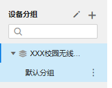
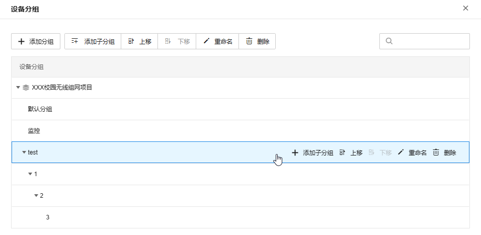

# 设备分组

TP-LINK 商用云平台支持将项目设备根据需要分为多个设备分组，最多可设置 4 级分组。

界面图标说明：

|   
---|---  
| 点击进入设备分组管理页面。  
| 点击在当前项目中添加设备分组。  
| 点击添加子分组或重命名当前分组。  
| 可根据名称对该项目设备分组进行搜索。  
  
  * 设备分组管理页面：

|   
---|---  
添加分组| 在当前项目中添加设备分组。  
添加子分组| 为选中设备分组添加子分组。  
重命名| 自定义设备分组名称。  
删除| 删除选中设备分组。  
上移/下移| 可自定义设备分组排序。
