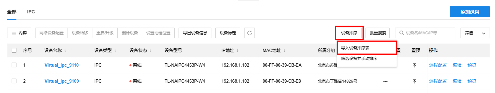
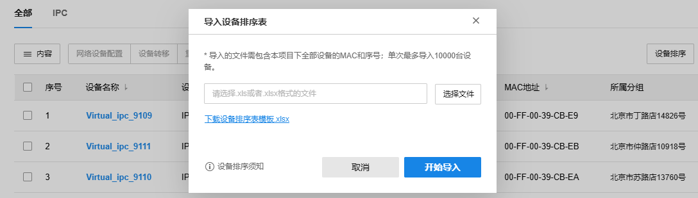
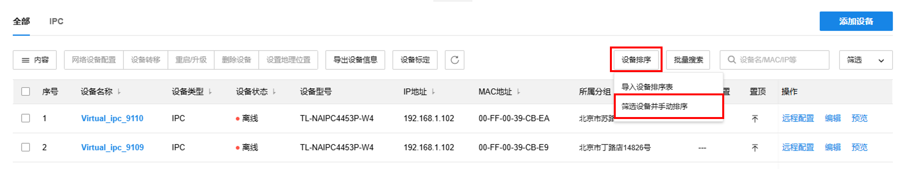
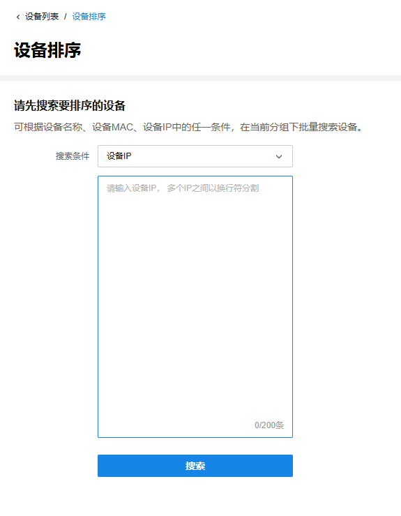
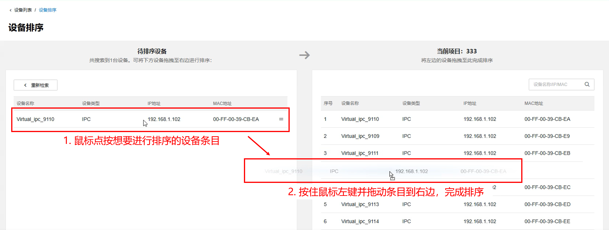

# 设备排序

本小节将详细介绍导入设备排序表和手动排序设备的操作。

进入页面：项目工作台>>设备管理>>设备列表，点击设备列表上方功能区内的<设备排序>，可通过导入设备排序表的方式批量调整设备排序，也可选择手动拖拽的方式来排序设备。

#### **导入设备排序表**

  1. 点击<设备排序>，选择<导入设备排序表>。

  2. 点击<下载设备排序表模板>下载标准模板。填写设备的序号和MAC地址后，将模板导入回商云，点击<开始导入>，商云将按照模板中指定的顺序调整设备列表的排序。

> 注意：
> 
> 通过导入设备排序表进行排序，导入后排序结果将不可撤销。为避免排序失败或排序错误，请注意以下事项：
> 
> 请导入.xls或.xlsx格式的文件。
> 
> 请确保导入的排序表中包含当前项目下的所有设备。表中未包含的设备将会自动排到设备列表的最后。
> 
> 请确保表中设备序号为从1开始的连续正整数。如果存在序号重复、缺失、非纯数字等情况，将导致排序失败或排序错误。
> 
> 请确保表中设备MAC信息无误。如果存在MAC地址缺失、重复、格式错误等情况，将导致排序失败或排序错误。

#### **筛选设备并手动排序**

  1. 点击<设备排序>，选择<筛选设备并手动排序>。

  2. 根据设备名称、设备MAC、设备IP中的任一条件，批量搜索当前项目下的设备。

  3. 长按鼠标左键，将搜索到的设备拖拽到右侧的设备列表中，即可调整设备排序。

> 说明：
> 
> 通过拖拽方式进行排序，每次拖拽的结果都会实时保存。如果对此次拖拽排序的结果不满意，可以撤销并重新拖拽排序。
