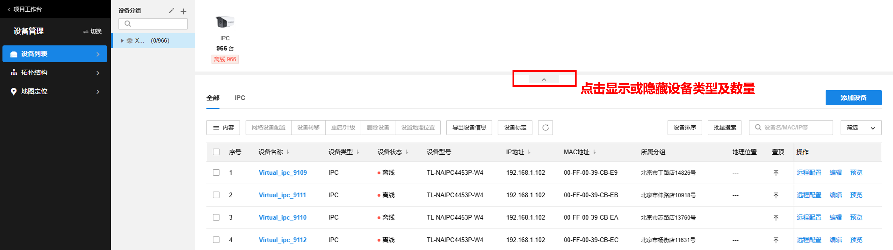

# 设备管理概述

**进入页面的方法：项目** **> >** **通用** **> >** **设备管理** >>**设备列表**

设备列表功能介绍：

|   
---|---  
内容| 可选择设备类型、设备状态、设备型号、IP 地址、MAC 地址等内容是否显示在设备列表中。  
网络设备配置| 可固化交换机设备 IP 地址或设置 AP 设备 LED 状态。 固化 IP 地址：固化后，交换机所有接口的 IP 地址模式将改为静态 IP。 设置 LED 状态：该设置仅对 AP 设备生效，可开启或关闭 LED 状态。  
设备转移| 将选中设备转移到其他分组或其他项目。  
重启/升级| 重启选中设备或对选中设备进行固件升级。  
删除设备| 点击从该分组中删除选中设备。  
导出设备信息| 点击导出设备信息到本地 PC。  
设置地理位置| 可选择通过在地图上定位、开启实时定位（支持 GPS 定位功能的设备）、使用其他设备的位置添加设备地理位置，或删除现有位置。  
设备标定| 可通过设备标定表导入设备标定信息，实现设备 MAC 地址和安装位置一一对应。支持导入、导出下载设备标定列表，下载设备标定模板。  
| 点击同步设备信息。  
编辑| 可查看并管理设备参数。  
远程配置| TP-LINK 商用云平台支持设备远程配置，用户可批量对设备查看、配置、升级，支持数十种参数的远程配置，无需繁琐的本地维护过程。不同机型具体配置可能有所差别，配置方法请前往查看对应机型用户手册。  
设备排序| 可通过导入表格或手动拖拽的方式调整设备条目的先后顺序。  
批量搜索| 可根据设备名称、设备 MAC、设备 IP 中的任一条件，在当前分组下批量搜索设备。  
| 可根据设备名、MAC 地址或 IP 地址等信息对列表内设备进行搜索。  
筛选| 可根据设备状态、LED 状态、起止 IP 地址和是否有新软件版本对列表中设备进行筛选。  
预览| 对于接入商云平台的 IPC 设备，可实时预览及回放。
