# SD-VPN

SD-VPN 基于商用网络云平台，一键完成整网 IPSec VPN 配置，使业务部署简便灵活，实现高效可视化运维的同时，充分保障信息安全，满足个人/企业/运营商的广域互联需求。可以解决传统互联网链路中 VPN 部署复杂、运维门槛高、网络风险高等诸多问题。可以应用于大中小型企业网络。

设备连接商云后可以在商云 SD-VPN 首页配置 VPN 功能，快速实现站点和站点之间的互通，同时增加了站点和站点之间访问控制策略配置，当隧道建立成功后，任何站点之间默认可以互相访问，可以通过设置访问控制策略和选路策略控制隧道上站点和站点之间的访问权限和路径。

#### 开启 SD-VPN

  1. 开启云管理功能，将所有站点的路由器设备添加到商云平台。
  2. 确认已经将所有站点的设备添加到同一个 TP-LINK ID 下，在功能链接模块点击 SD-VPN 进入 SD-VPN 功能首页。

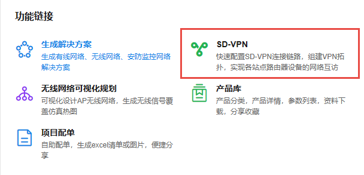

  3. 点击<开启 SD-VPN>，创建 SD-VPN 项目名称（可自定义名称），点击<创建>。

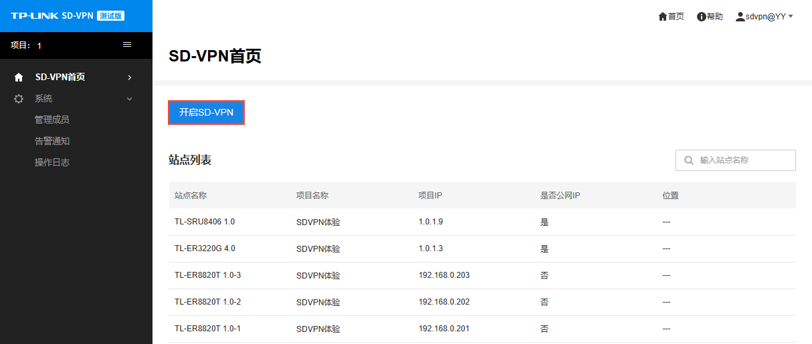

  4. 点击左侧功能栏可切换当前 SD-VPN 项目，并添加新项目。

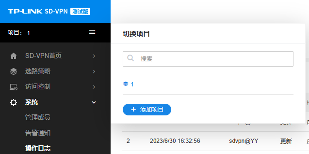

> 注意：
> 
> 设备绑定商云之后需要确保各个站点设备端启用了路由模式的 IPSec VPN 功能。（此功能默认开启）
> 
> 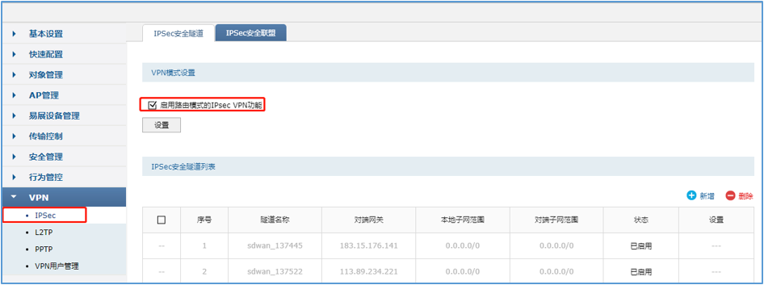

#### SD-VPN 首页

  1. 当创建了 SD-VPN 项目后，TP-LINK 商用云平台会自动将当前 TP-LINK ID 下所有支持 SD-VPN 功能的设备展示出来。
  2. 勾选设备并选择中心站点进行 SD-VPN 隧道搭建，设置完成后点击<完成>。

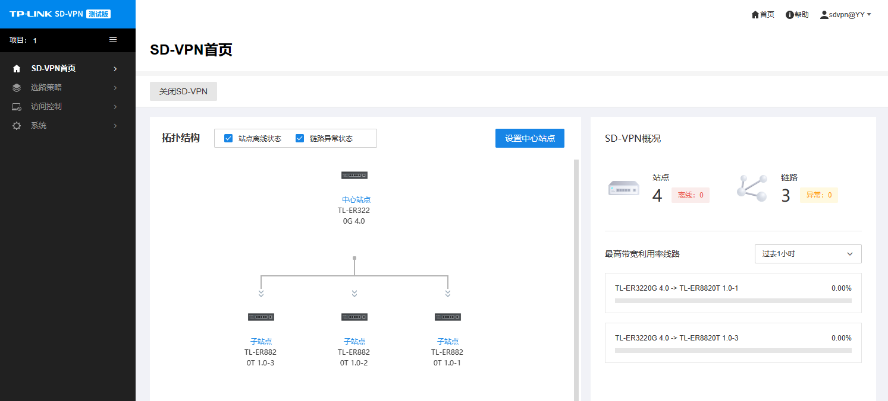

  3. 隧道自动搭建好后，各个站点之间默认即可互通：

#### 选路策略

SD-VPN 隧道搭建好后，在有多个中心站点的情况下，可以配置各分站点的主用链路和备用链路，实现整个 VPN 网络的负载均衡和链路备份。

  1. 在商云平台 SD-VPN 功能中进入选路策略页面，点击右侧<新建自定义选路策略>。

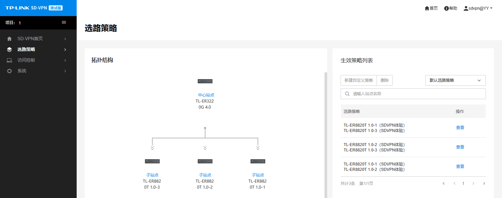

  2. 点击<选择站点>选择分站点：

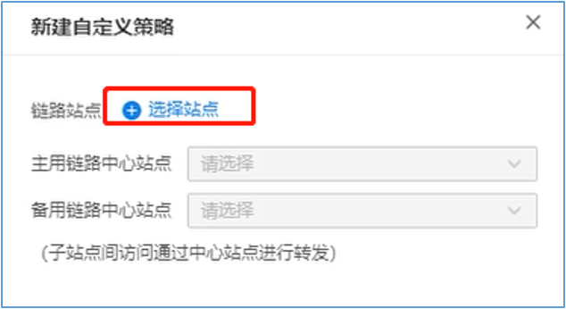

选择完成后，点击<保存>。

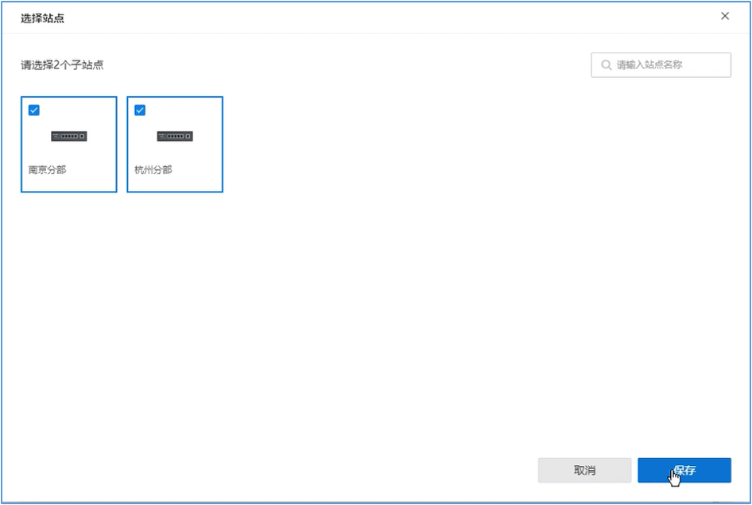

  3. 选择分站点用于通讯的主备中心站点：

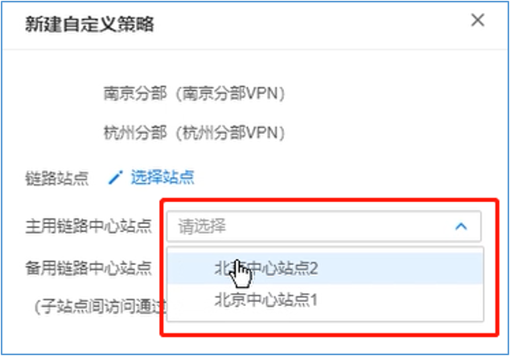

至此，主备站点设置完成，可以实现中心站点的备份，多分站点的情况下还可以实现中心站点的负载均衡。

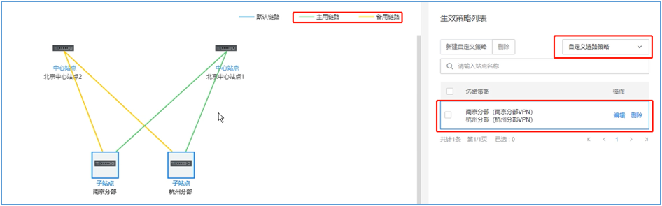

#### 访问控制

SD-VPN 隧道搭建完成后，各站点默认可以互访，如果需要控制某些站点部分或全部网段不能互访，可以在访问控制页面设置控制条目。

  1. 在访问控制栏选择需要控制访问的站点，点击<禁止访问>。

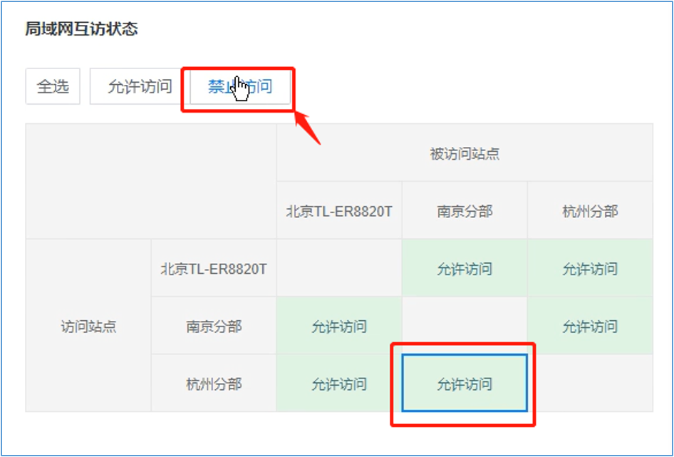

设置完成后杭州分部不能访问南京分部。

  2. 还可以点击设置例外网段，禁止站点之间的部分网段互访：

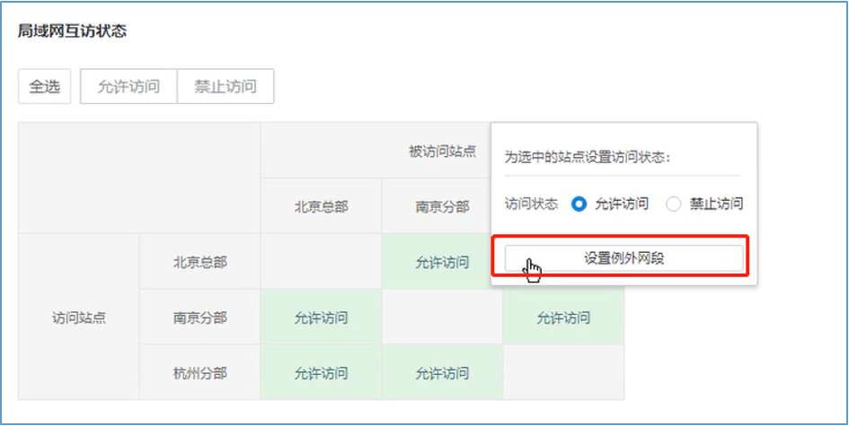

选择各站点之间部分不能访问的网段：

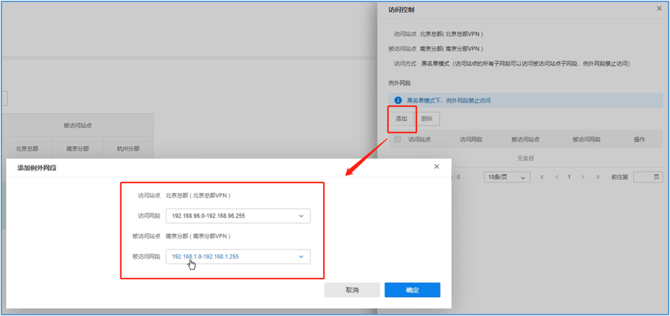

  3. 点击<确定>将配置下发完成后，即可实现站点之间部分网段不能互通，部分网段可以互通。

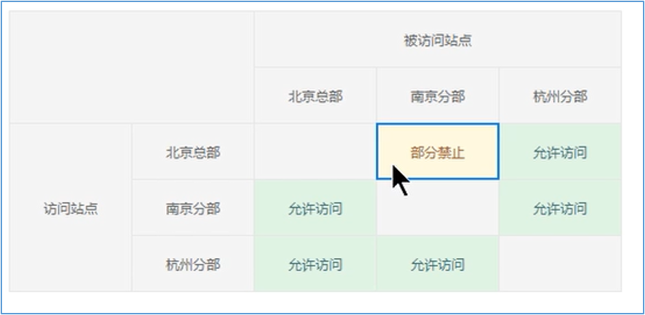

#### 管理成员

进入 SD-VPN 功能页面：系统 >> 管理成员，可查看并管理当前 SD-VPN 项目的管理成员。

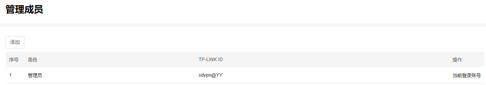

点击页面左上角<添加>，可为当前 SD-VPN 项目添加成员，成员角色分为管理员及操作员。

选择成员角色，输入需要添加的 TP-LINK ID（支持通过手机号/邮箱地址/子账号添加），点击<确定>完成添加。

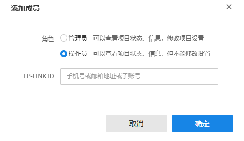

#### 告警通知

进入 SD-VPN 功能页面：系统 >> 告警通知，可查看当前 SD-VPN 项目的告警信息。

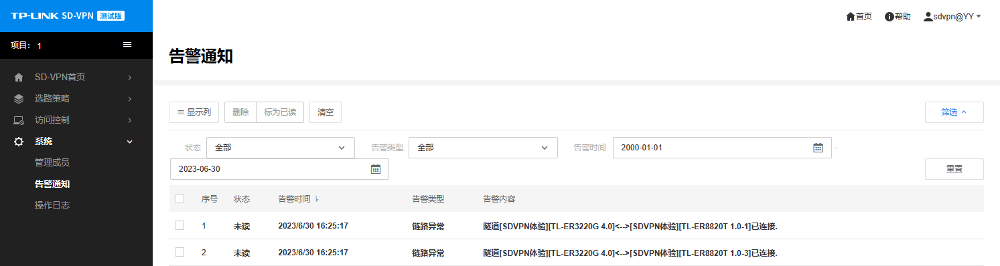

#### 操作日志

进入 SD-VPN 功能页面：系统 >> 操作日志，可查看当前 SD-VPN 项目的操作日志。

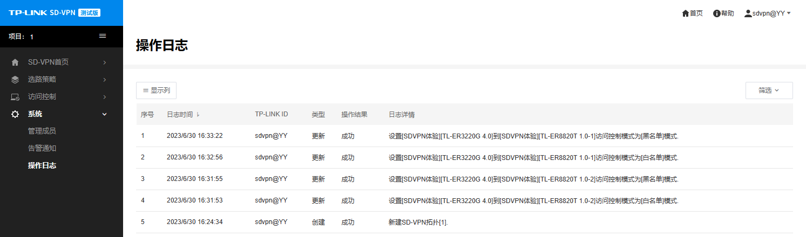
