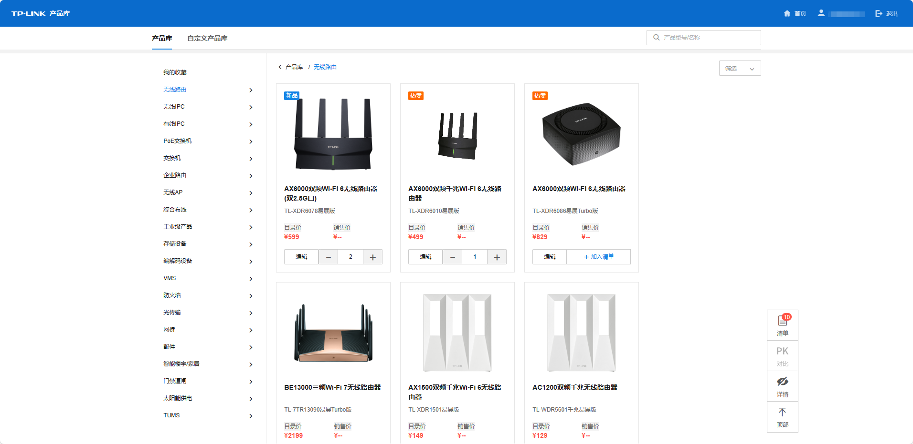

# 产品库

可查看产品分类、产品详情、参数列表，支持资料下载、分享收藏。

  1. 点击产品，可查看产品详情，支持下载产品资料。
  2. 点击产品右上角星号，可将产品加入<我的收藏>。
  3. 点击<编辑>，可编辑产品的销售价。
  4. 点击<加入清单>，可将产品加入清单进行配单。点击加号或减号，可调整加入清单中产品的数量。
  5. 点击右下角<清单>，可对预加入清单的产品进行编辑，点击<创建新配单>可生成配单表。

