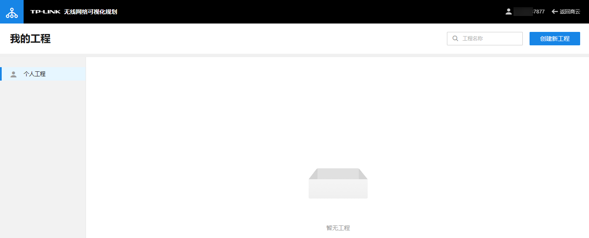
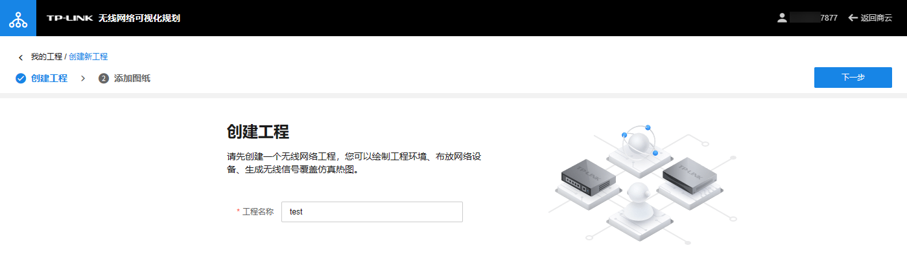
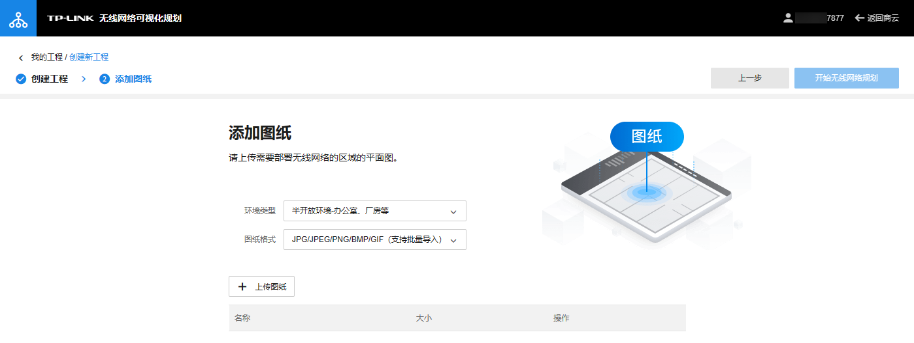
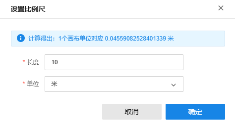
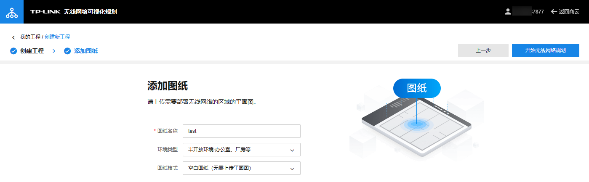
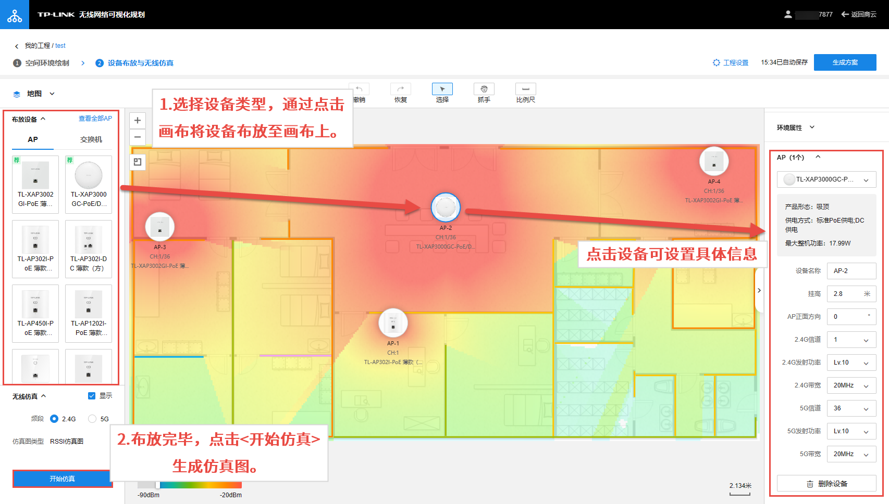
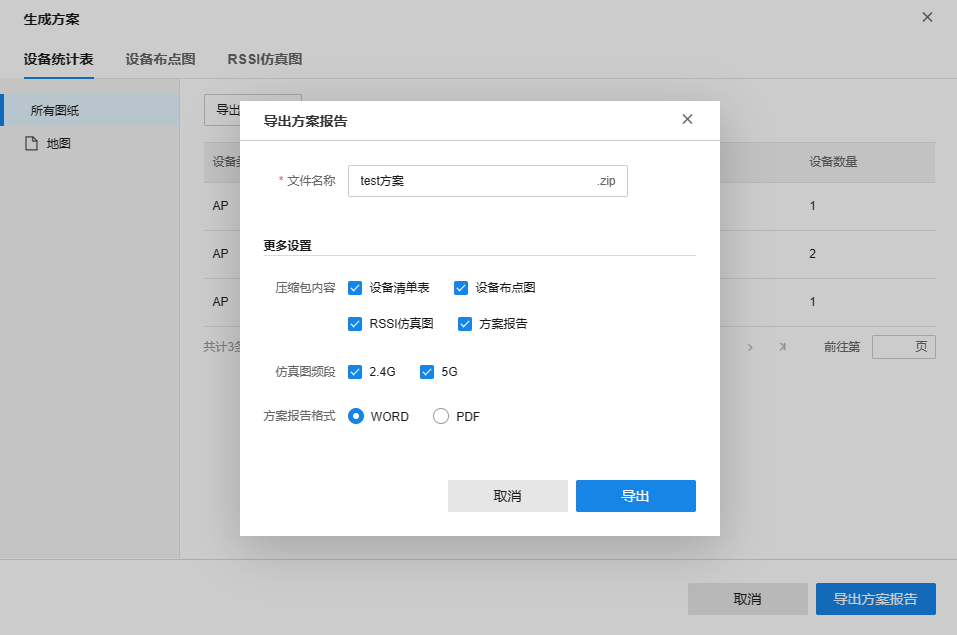

# 无线网络可视化规划

可视化设计 AP 无线网络，生成无线信号覆盖仿真热图。

  1. 在 TP-LINK 商用云平台首页点击<无线网络可视化规划>进入页面，点击<创建新工程>。

输入工程名称，点击<下一步>。

  2. 添加图纸：

选择环境类型及图纸格式，点击<上传图纸>上传需要部署无线网络的区域的平面图。

  3. 请在绘图区域设置比例尺。

选择障碍物的形状、类型后，开始绘制障碍物。设置完成后，点击页面右上角<开始无线网络规划>。

  4. 空间环境绘制：

第一步：选择设备类型，通过点击画布将设备布放至画布上。

第二步：布放完毕，点击<开始仿真>生成仿真图。

  5. 点击右上角<生成方案>，可查看当前设备统计表、设备布点图及 ESSI 仿真图。点击<导出方案报告>，设置文件名称、压缩包内容、仿真图频段及方案报告格式，点击<导出>即可。

