# 生成解决方案

可生成有线网络、无线网络、安防监控网络的解决方案。

  1. 选择组网类型，支持有线、无线组网，安防监控组网，以及有线、无线、安防监控一体化组网三种组网类型，请根据实际组网情况进行选择，此处以有线、无线、安防监控一体化组网为例进行说明。

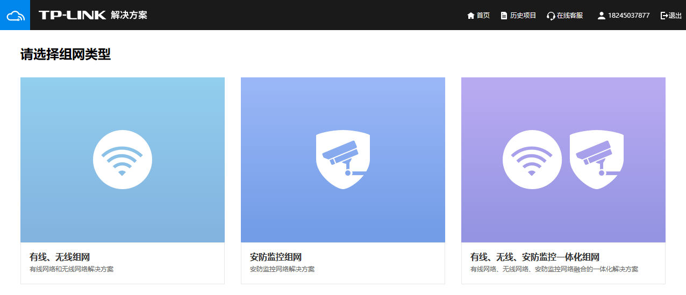

  2. 选择组网类型后，输入项目名称，选择应用场景。

TP-LINK 商用云平台支持酒店、餐厅、企业、工厂、宿舍、校园、医院、KTV、别墅、室外等应用场景。根据实际情况选择完成后，点击<开始规划网络>。

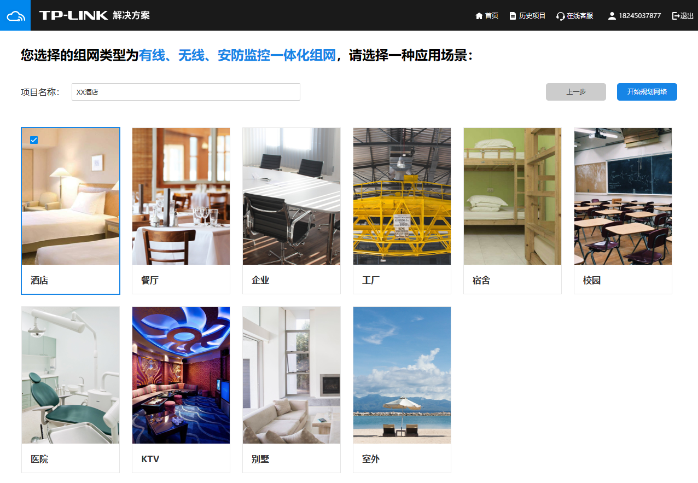

  3. 选择无线覆盖区域：无线网络覆盖方案需要根据不同区域的结构、面积和人数分别设计，根据实际情况选择需要无线覆盖的区域。设置完成后，点击<下一步>。

点击 查看详细信息。

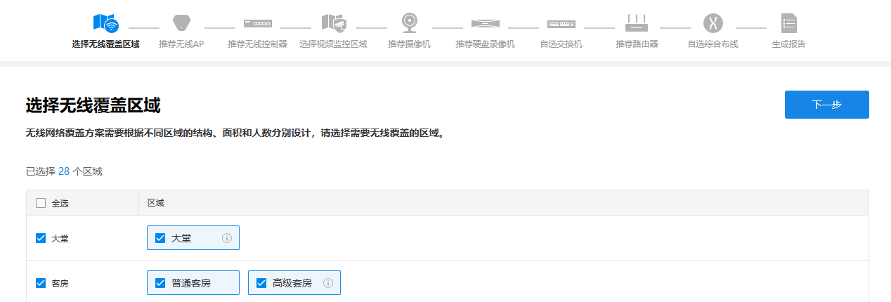

  4. 推荐无线 AP：请输入或选择各个区域的无线 AP 选型参数、条件，比如：需要无线覆盖区域的面积、无线上网人数、AP 安装方式、组网偏好等。点击<给我推荐>，系统将自动为您推荐合适的无线 AP 并计算所需要的无线 AP 数量。

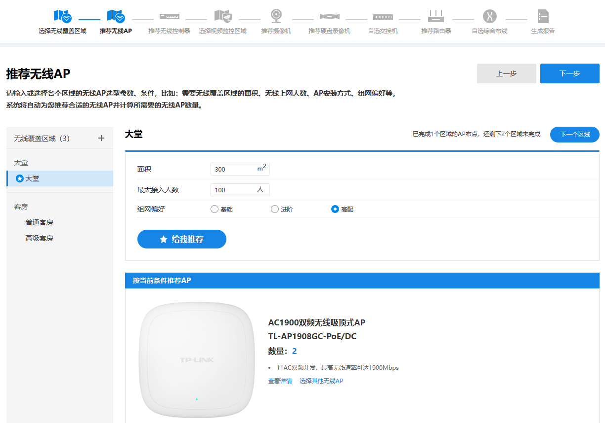

  5. 推荐无线控制器：

请输入无线控制器选型参数，包括网络最大接入人数、安装方式、管理功能等，点击<给我推荐>，系统将自动推荐合适额产品。其中管理无线 AP 数量可以根据后续 AP 扩容等因素进行手动调整。设置完成后，点击<下一步>。

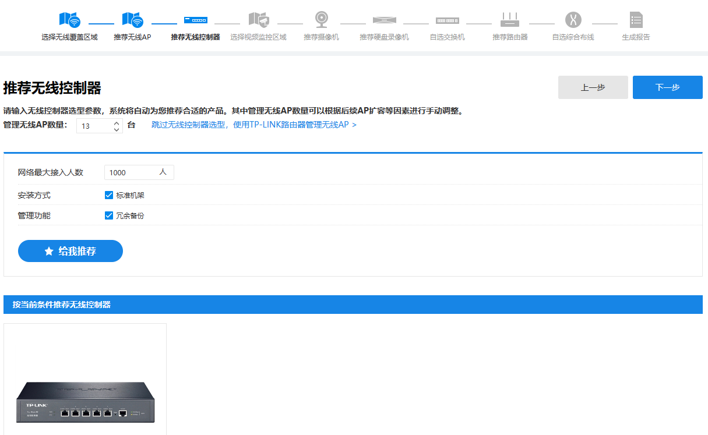

  6. 选择视频监控区域：

视频监控方案需要针对不同区域的特点分别设计，请选择需要视频监控的区域。

点击查看详细信息。

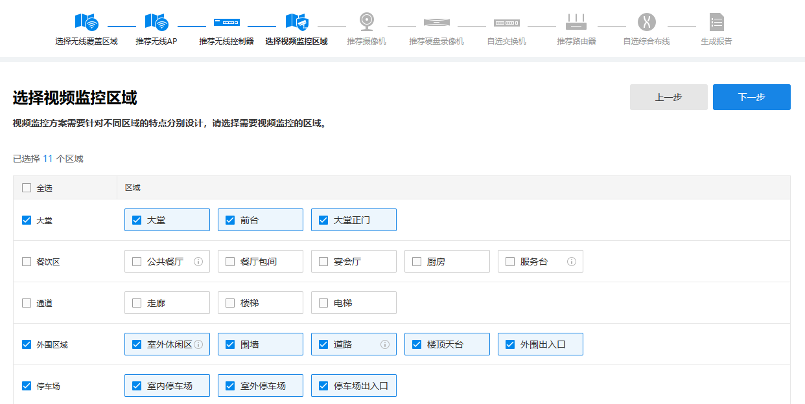

  7. 推荐摄像机：

请选择摄像机选型参数，比如：编码方式、供电方式、像素、产品形态、特殊需求（如语音、夜视）等。点击<给我推荐>，系统将自动为您推荐合适的产品。

设置完成后，点击<下一步>。

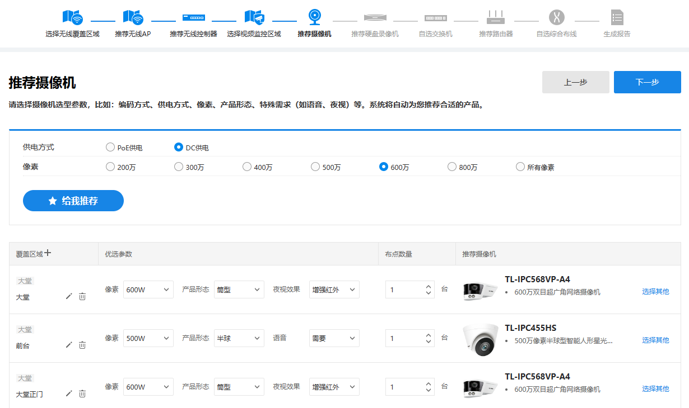

  8. 推荐硬盘录像机：

请输入硬盘录像机录像存储时长及摄像机数量，点击<给我推荐>，系统将自动为您推荐合适的产品。其中管理摄像机数量可以根据后续摄像机扩容等因素进行手动调整。

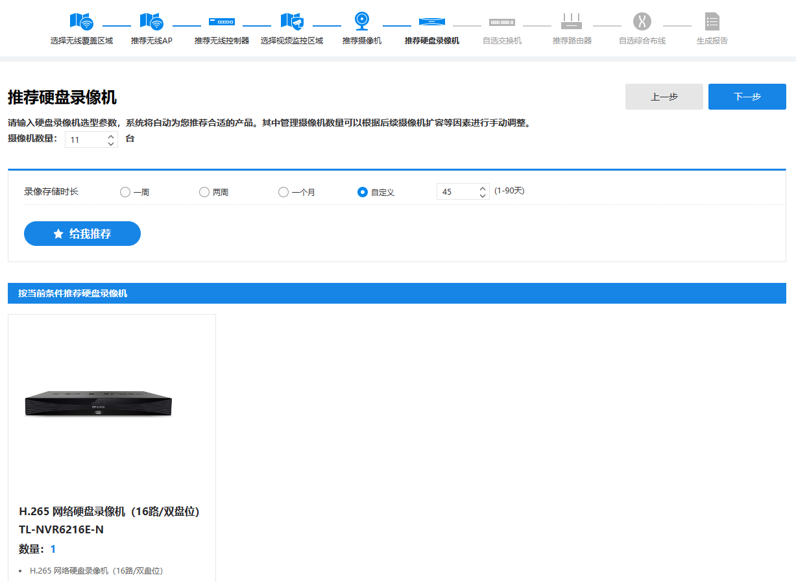

  9. 自选交换机：

请分别选择核心交换机和汇聚/接入交换机，可根据交换机的端口数、类型、管理功能等，自行选择合适的产品和数量。

可根据当前应用场景中所需设备类型及数量进行选择，选择完成后，点击<下一步>。

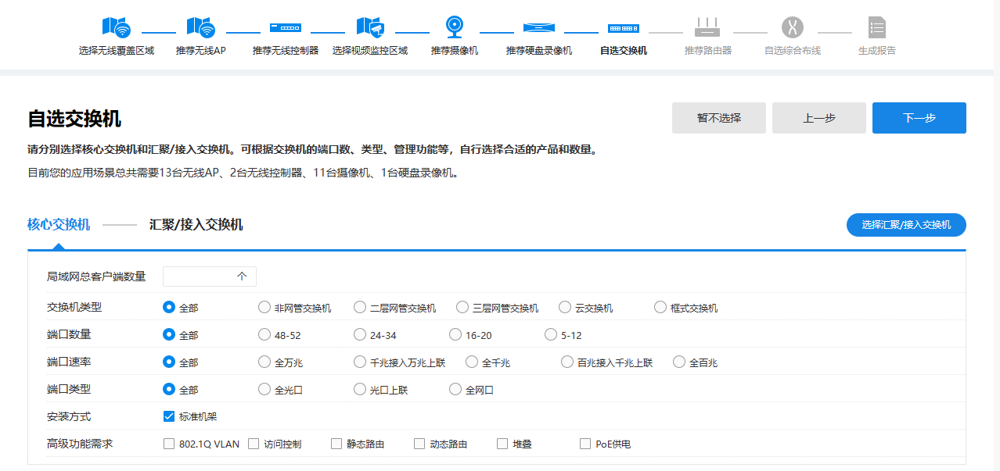

  10. 推荐路由器：

选择并输入路由器选型参数，包括预计最大接入用户数量、预计接入宽带数量、预计接入总带宽、路由器类型、安装方式及高级功能需求。点击<给我推荐>，系统将自动为您推荐合适的产品。

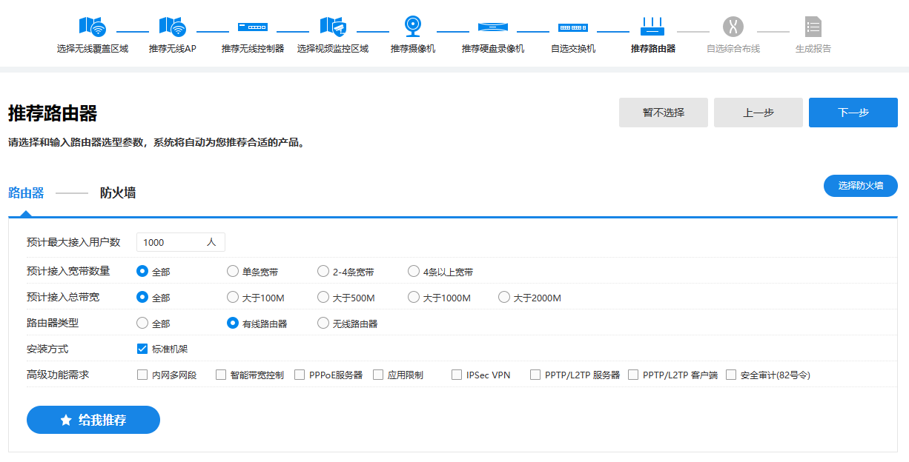

点击<防火墙>或<选择防火墙>，可选择是否需要防火墙产品。点击<给我推荐>，系统将自动为您推荐合适的防火墙产品。

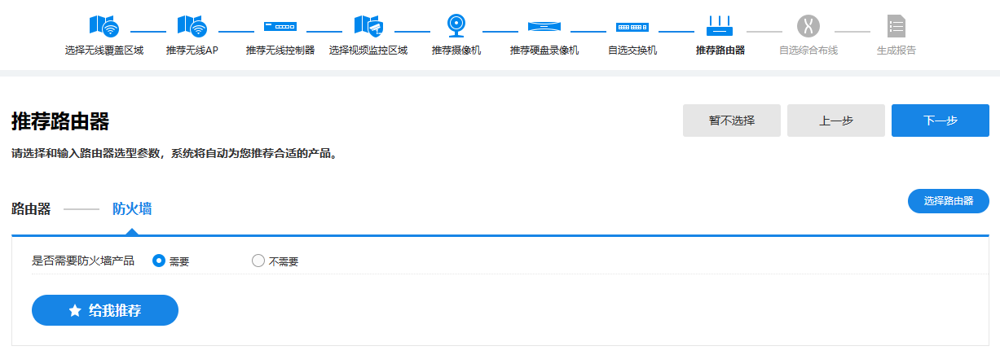

  11. 自选综合布线：

请根据您的网络需求选择合适的综合布线产品。

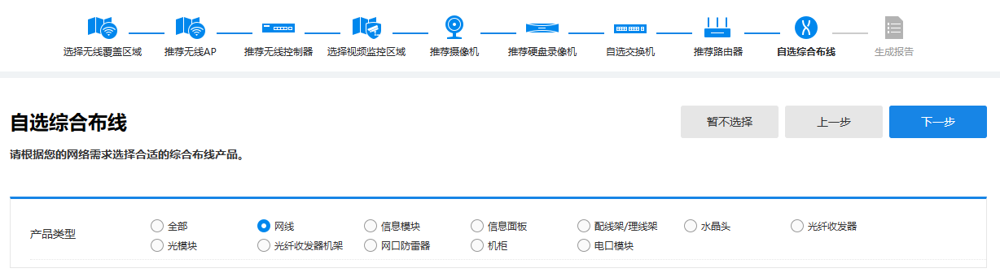

  12. 生成报告：

完成组网解决方案设计后，将自动生成拓扑结构图与设备清单。点击<下载到电脑>/<下载到手机>，可下载当前解决方案。

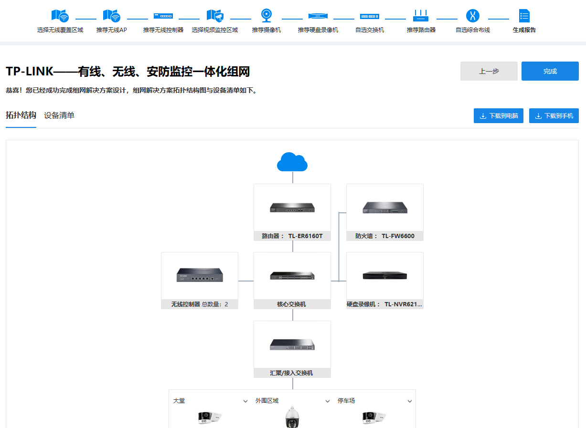

  13. 查看历史项目：

点击页面右上角的<历史项目>，可查看当前帐号所有组网解决方案项目。

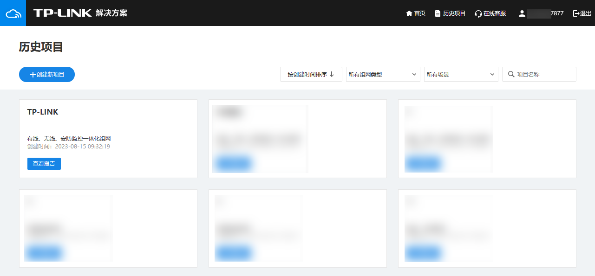
