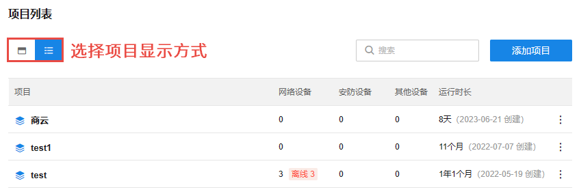
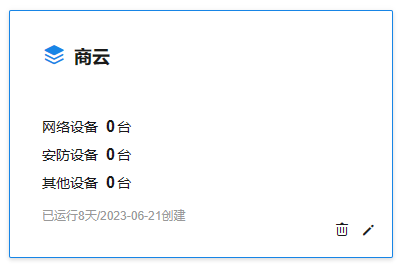

# 项目列表

在 TP-LINK 商用云平台首页的项目管理模块，可查看并管理已创建的项目，包括设备类型、设备数量、设备离线状况、创建时间和项目运行时长。

点击项目名称，将跳转进入对应的“项目”页面。

|   
---|---  
| 卡片视图  
| 列表视图  
搜索| 可根据项目名称对列表内项目进行搜索  
添加项目| 输入项目名，点击<确定>即可添加新项目。  
| 编辑项目名称  
| 删除项目
