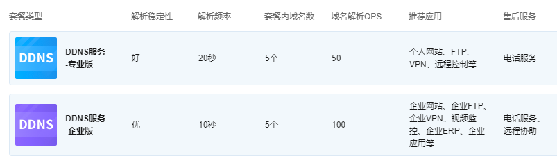
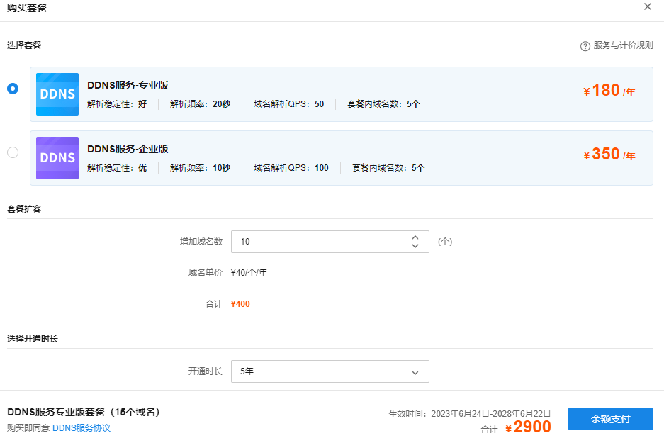
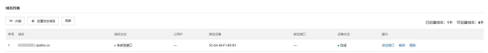
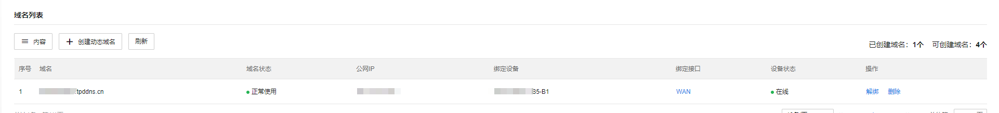
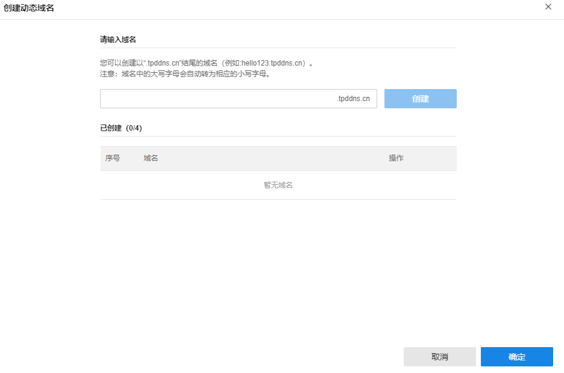

# DDNS

TP-LINK DDNS 服务有免费版，专业版和企业版三种不同服务类型，基于不同的服务类型解析速率和解析稳定性有些不同。

|   
---|---  
套餐类型| 不同类型的套餐属性。  
解析稳定性| 解析稳定性：企业版>专业版>免费版。  
解析频率| 域名对应的 IP 变化后能刷新出新 IP 的时间间隔。  
套餐内域名数| 套餐内支持的域名个数。  
域名解析 QPS| 每秒内响应域名查询请求的数量。  
  
**进入页面的方法：高级** **> >** **DDNS**

  * 购买高级套餐

点击<购买高级套餐>，根据需求购买套餐年限和需要的域名的个数，使用余额支付，如余额不足需先在费用页面进行充值：

  * **域名列表**

该列表展示 DDNS 域名绑定的设备信息状态，也可在此页面新增域名和修改绑定信息：

|   
---|---  
域名| TP-LINK ID 账号下的域名列表。  
域名状态| 显示域名的设备绑定状态。  
公网 IP| 域名对应的公网 IP。  
绑定设备| 域名绑定的设备 MAC 地址。  
绑定接口| 指明域名绑定设备的接口。  
设备状态| 域名绑定的设备的上云状态。  
  
同时也可在此页面创建新的动态域名，点击确定后保存新创建的域名：

