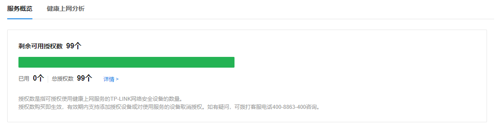
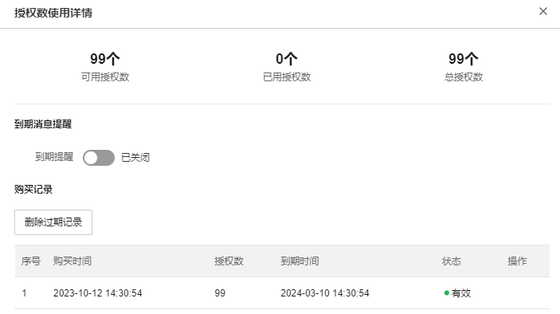
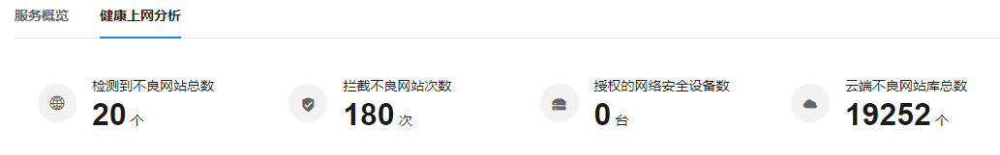
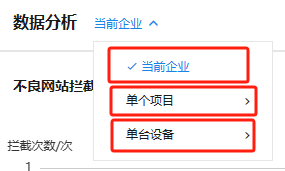

# 健康上网

#### 服务概览

**进入页面的方法：高级 >> 云安全 >> 健康上网 >> 服务概览**

TP-LINK 云安全-健康上网提供对用户上网行为的监测服务，依托云端持续更新的网站数据库，实时检测并阻止用户的不良上网行为，如访问色情网站。同时，支持对用户上网行为进行多维度的统计与分析，为网络安全管理提供有力支持。您可授权已接入商云平台的网络安全设备使用本服务。

  * 剩余可用授权数

指健康上网服务授权，此处显示剩余可用的/已使用的授权数量。

> 注意：
> 
> 授权数是指可授权使用健康上网服务的 TP-LINK 网络安全设备的数量。
> 
> 授权数购买即生效，有效期内支持添加授权设备或对使用服务的设备取消授权。

点击<详情>，查看授权详细信息：

  1. 授权使用详情：显示当前可用授权数、已用授权数、总授权数
  2. 到期消息提醒：默认开启，且默认当授权剩余有效期小于 30 天时，系统发送服务通知（仅支持 1-30 之间的整数）
  3. 购买记录：显示购买授权的记录，点击<删除过期记录>将删除所有已过期的购买记录

  * 授权设备

|   
---|---  
删除已失效设备| 将会把已失效的设备从列表中删除  
筛选| 支持按设备名或设备 MAC 搜索对应的网络安全设备，且筛选框支持快速筛选设备（支持按所属项目筛选，以及设备状态筛选）。  
设备| 该网络安全设备的名称  
MAC 地址| 该网络安全设备的 MAC 地址  
所属项目| 该网络安全设备所属的项目  
服务状态| 该设备对应的云服务状态  
授权时间| 该网络安全设备得到授权的时间  
操作| 包括重新/取消授权、删除等操作  
  
添加授权设备：点击<添加授权设备>，选择项目及设备，点击<确定>即可。

#### 健康上网分析

**进入页面的方法：高级 >> 云安全 >> 健康上网 >> 健康上网分析**

  * 健康上网情况总览

在此页面可以统计当前在线的网络安全设备与攻防情况，帮助用户快速预览当前网络安全态势。

|   
---|---  
检测到不良网站总数| 显示检测到的不良网站总数（单位：个）  
拦截不良网站次数| 显示拦截的不良网站次数（单位：次）  
授权的网络安全设备数| 显示“健康上网”功能授权的设备数量（单位：台）  
云端不良网站库总数| 当开通了“健康上网”模块的授权时，显示当前云端记录的不良网站数量（单位：个）  
  
  * 数据分析

页面支持三种统计对象：当前企业、单个项目、单台设备。

|   
---|---  
当前企业| 显示该企业所有项目的所有安全设备的健康上网分析数据  
单个项目| 显示该项目的所有安全设备的健康上网分析数据  
单台设备| 统计该设备记录到的安全事件情况  
  
  1. 不良网站拦截情况

图表显示对应时间段统计的不良网站拦截数量（单位：次），蓝色时间轴为具体的时间段标识；右上角的按钮可以调整指定显示的时间段（当前支持显示 12 小时、24 小时、7 天、30 天）

  2. 用户健康度情况

图表显示对应时间段统计的访问过不良网站的用户健康度情况，黑色时间轴为具体的时间段标识；右上角的按钮可以调整指定显示的时间段（当前支持显示 12 小时、24 小时、7 天、30 天）

  3. 不良网站检测情况

图表显示对应时间段统计的不良网站检测数量（单位：个），橙色时间轴为具体的时间段标识；右上角的按钮可以调整指定显示的时间段（当前支持显示 12 小时、24 小时、7 天、30 天）

  4. 近 24 小时服务动态

显示最近 24 小时内的健康上网服务产生的记录。
