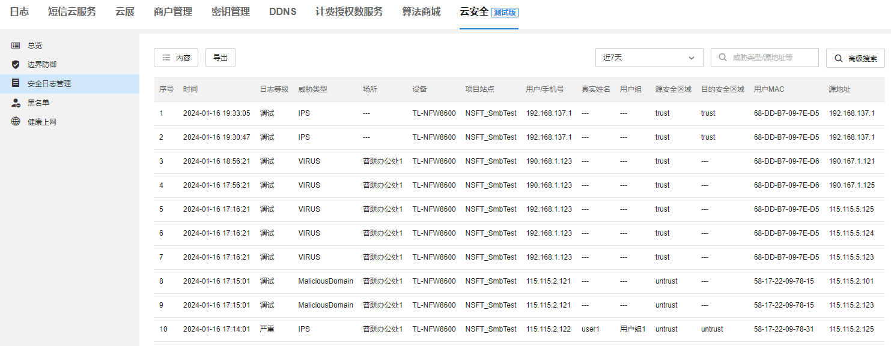

# 安全日志管理

**进入页面的方法：高级 >> 云安全 >> 安全日志管理**

|   
---|---  
内容| 可选择日志列表中需要显示的内容  
导出| 将当前安全日志导出到本地管理电脑  
高级搜索| 可根据日志内容对当前安全日志进行搜索  
时间| 安全日志发生的事件  
日志等级| 安全日志的严重等级  
威胁类型| 安全日志对应的威胁类型  
场所| 安全日志所属的场所  
设备| 安全日志所属的设备  
项目站点| 安全日志所属的项目站点  
用户/手机号| 安全日志所属的用户信息  
真实姓名| 安全日志所属的用户信息  
用户组| 安全日志所属的用户信息  
源安全区域| 安全日志对应的源安全区域  
目的安全区域| 安全日志对应的目的安全区域  
用户 MAC| 安全日志对应的用户 MAC 地址  
源地址| 安全日志对应的源地址  
目的地址| 安全日志对应的目的地址  
源端口| 安全日志对应的源端口  
目的端口| 安全日志对应的目的端口  
协议| 安全日志对应的协议类型  
应用| 安全日志对应的应用类型  
动作| 系统对安全日志所属流量的阻断动作  
安全策略| 安全日志所属的安全策略名称  
威胁名称| 安全日志对应的详细威胁名称  
威胁 ID| 安全日志对应的威胁 ID  
操作| 查看安全日志的详情内容
