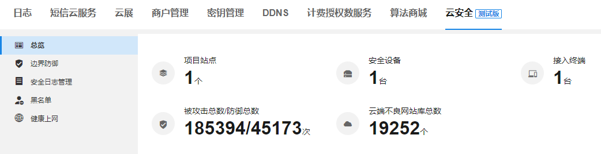
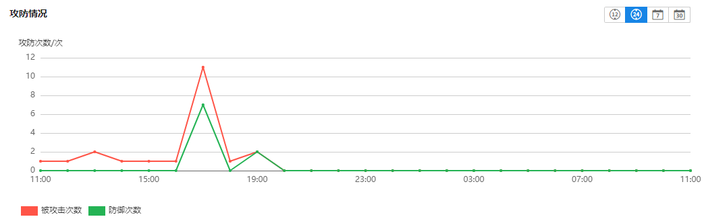
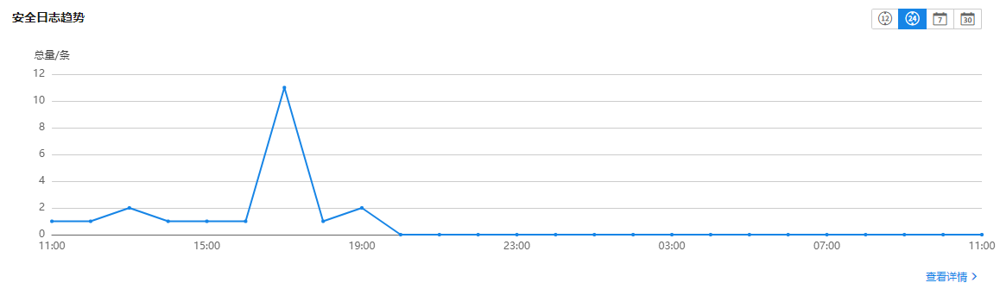
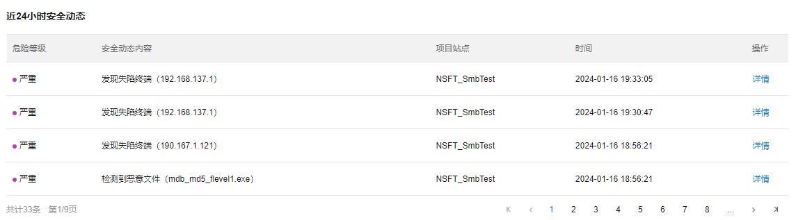

# 总览

**进入页面的方法：高级 >> 云安全 >> 总览**

  * 网络安全情况总览

在此页面可以统计当前在线的网络安全设备与攻防情况，帮助用户快速预览当前网络安全态势。

项目站点| 整网项目的数量（单位：个）  
---|---  
安全设备| 显示当前网络中的安全设备数量（单位：台）  
接入终端| 显示当前接入的上网终端数量（单位：台）  
被攻击总数/防御总数| 显示当前被攻击与进行防御的次数（单位：次）  
云端不良网站库总数| 当开通了“健康上网”模块的授权时，显示当前云端记录的不良网站数量（单位：个）  
  
#### 安全分析

**进入页面的方法：高级 >> 云安全 >> 总览 >>安全分析**

在此页面可以进一步查看网络安全事件，比如攻防情况（分别显示被攻击次数、防御次数），频率最高的 5 种威胁类型、频率最高的 5 种失陷类型、分时段安全日志数量、近 24 小时安全动态。

  * 统计对象选择

安全分析页支持两种统计对象：单个项目、单台设备

|   
---|---  
单个项目| 统计该项目中所有网络安全设备记录到的安全事件情况  
单台设备| 统计该设备记录到的安全事件情况  
  
  * 攻防情况

可统计一定时间段内的受攻击与防御次数（单位：次），红色表示被攻击次数，绿色表示防御次数；绿色时间轴表示安全事件发生的具体时间，右上角可以对显示的时间段调整（当前支持显示 12 小时、24 小时、7 天、30 天）

  * 威胁类型 TOP5

饼图显示指定时间段内出现频率最高的 5 种威胁类型，右上角可以调整指定统计的时间段（当前支持显示 12 小时、24 小时、7 天、30 天）

  * 失陷类型 TOP5

饼图显示指定时间段内出现频率最高的 5 种失陷类型，右上角可以调整指定统计的时间段（当前支持显示 12 小时、24 小时、7 天、30 天）

  * 安全日志趋势

图表显示对应时间段产生的安全日志数量，蓝色时间轴为具体的时间段标识；右上角的按钮可以调整指定显示的时间段（当前支持显示 12 小时、24 小时、7 天、30 天）

点击<查看详情>，跳转到“安全日志管理”页面。

  * 近 24 小时安全动态

显示最近 24 小时内的安全事件记录

危险等级| 安全事件危险等级  
---|---  
安全动态内容| 安全事件详细内容  
项目站点| 该安全事件发生时所在的项目站点  
时间| 该安全事件发生的时间  
操作| 该安全动态对应的详情信息
