# 边界防御

TP-LINK 云安全-边界防御支持管理设备安全区域的信任属性，通过云端智能分析设备安全日志，识别、处理不同类型的安全威胁（外部攻击源、失陷终端和恶意文件），并对安全动态进行可视化分析展示，实现全局的网络防护。您可授权已接入商云平台的网络安全设备使用本服务。

#### 服务概览

**进入页面的方法：高级 >> 云安全 >> 边界防御 >>服务概览**

  * 剩余可用授权数

指边界防御服务授权，此处显示剩余可用的/已使用的授权数量

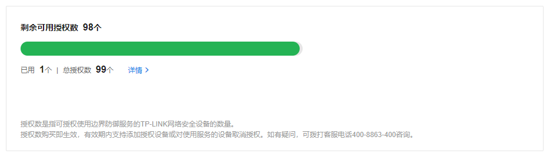

> 注意：
> 
> 授权数是指可授权使用边界防御服务的 TP-LINK 网络安全设备的数量。
> 
> 授权数购买即生效，有效期内支持添加授权设备或对使用服务的设备取消授权。

点击<详情>，查看授权详细信息：

  1. 授权使用详情：显示当前可用授权数、已用授权数、总授权数
  2. 到期消息提醒：默认开启，且默认当授权剩余有效期小于 30 天时，系统发送服务通知（仅支持 1-30 之间的整数）
  3. 购买记录：显示购买授权的记录，点击<删除过期记录>将删除所有已过期的购买记录

  * 授权设备

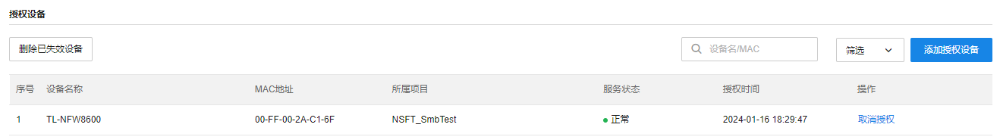

|   
---|---  
删除过期记录| 将会把已失效的设备从列表中删除  
筛选| 支持按设备名或设备 MAC 搜索对应的网络安全设备，且筛选框支持快速筛选设备（支持按所属项目筛选，以及设备状态筛选）。  
设备名称| 该网络安全设备的名称  
MAC 地址| 该网络安全设备的 MAC 地址  
所属项目| 该网络安全设备所属的项目  
服务状态| 该设备对应的云服务状态  
授权时间| 该网络安全设备得到授权的时间  
操作| 包括重新/取消授权、删除等操作  
  
添加授权设备：点击<添加授权设备>，选择项目及设备，点击<确定>即可。

#### 数据分析

**进入页面的方法：高级 >> 云安全 >> 边界防御 >> 数据分析**

  * 近 30 天防御数据统计

  1. 显示近 30 天的安全日志总量，点击右侧跳转到**安全日志管理** 页面。
  2. 危险攻击源

显示近 30 天的攻击源总数，点击右侧跳转到**危险攻击源** 页面。

  3. 失陷终端

显示近 30 天的失陷终端总数，点击右侧跳转到**失陷终端** 页面。

  4. 恶意文件

显示近 30 天的恶意文件总数，点击右侧跳转到**恶意文件** 页面。

  * 危险攻击源

显示指定时间段发现的攻击源数量。右上角可以指定统计的时间段（当前支持 12 小时、24 小时、7 天、30 天）；点击右下角<查看详情>跳转到**危险攻击源** 页面。

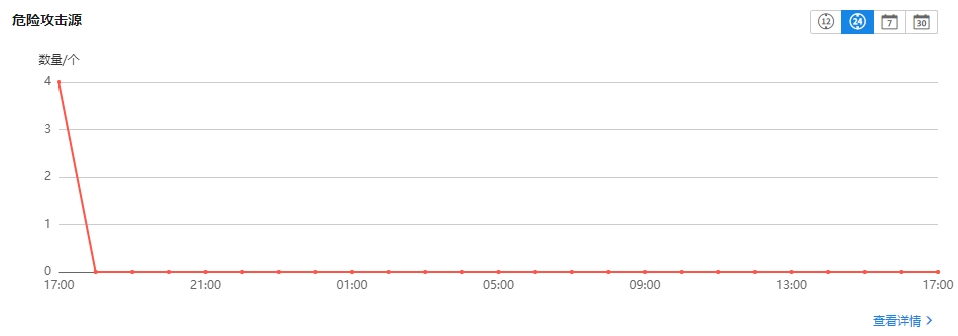

  * 失陷终端

显示指定时间段检测到的失陷终端数量。右上角可以指定统计的时间段（当前支持 12 小时、24 小时、7 天、30 天）；点击右下角<查看详情>跳转到**失陷终端** 页面。

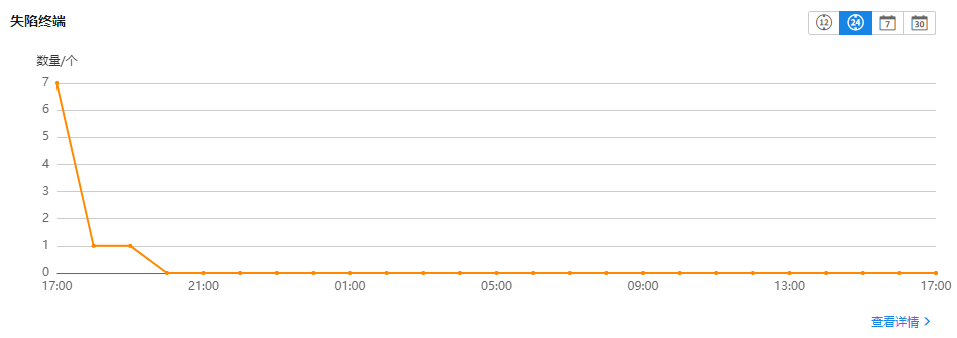

  * 恶意文件

显示指定时间段内发现的恶意文件数量。右上角可以指定统计的时间段（当前支持 12 小时、24 小时、7 天、30 天）；点击右下角<查看详情>跳转到**恶意文件** 页面。

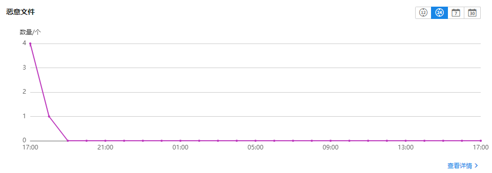

#### 危险攻击源

**进入页面的方法：高级 >> 云安全 >> 边界防御 >> 危险攻击源**

此页面可以查看危险攻击源的详细信息

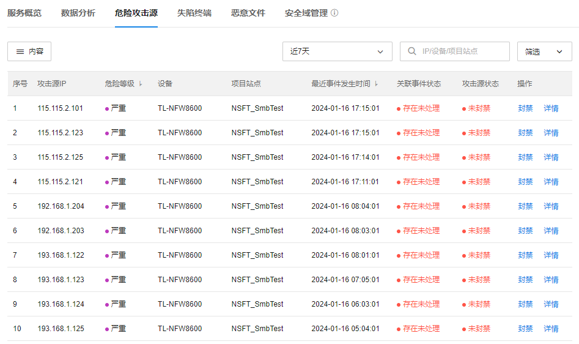

|   
---|---  
攻击源 IP| 攻击源的 IP 地址  
危险等级| 该事件对应的危险等级  
设备| 攻击源所属的设备  
项目站点| 攻击源所属的项目站点  
最近事件发生时间| 上一次事件发生的时间  
关联事件状态| 此事件的处理状态  
攻击源状态| 已封禁/未封禁  
封禁| 封禁后，设备将不再允许该 IP 的所有访问和被访问行为  
  
#### 失陷终端

**进入页面的方法：高级 >> 云安全 >> 边界防御 >> 失陷终端**

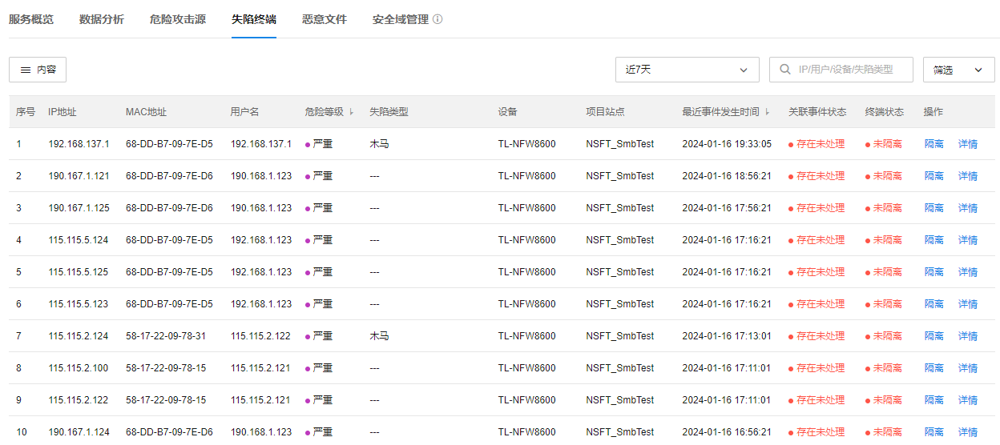

|   
---|---  
IP 地址| 失陷终端的 IP 地址  
MAC 地址| 失陷终端的 MAC 地址  
用户名| 失陷终端的所属用户名  
危险等级| 该事件对应的危险等级  
失陷类型| 终端失陷的类型  
设备| 失陷终端的所属设备  
项目站点| 失陷终端所属的项目站点  
最近事件发生时间| 上一次事件发生的时间  
关联事件状态| 此事件的处理状态  
终端状态| 已隔离/未隔离  
  
#### 恶意文件

**进入页面的方法：高级 >> 云安全 >> 边界防御 >> 恶意文件**

此页面可以查看恶意文件的详细信息

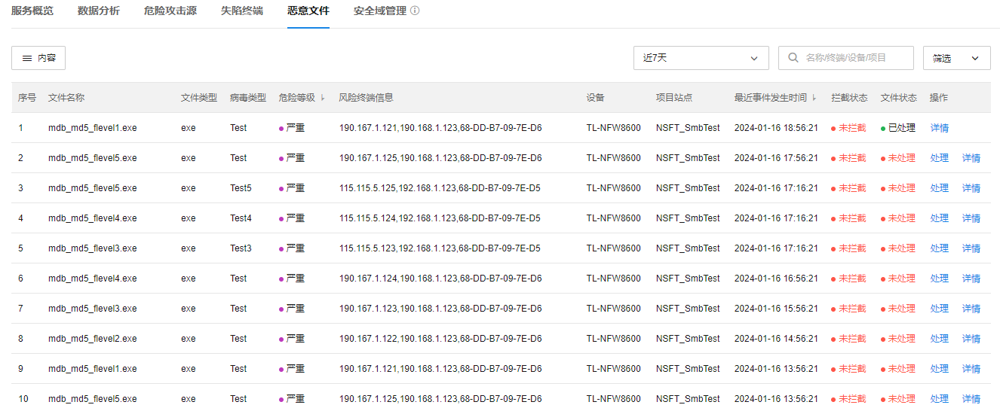

|   
---|---  
文件名称| 恶意⽂件的名称  
文件类型| 恶意⽂件的格式类型  
病毒类型| 恶意文件的病毒类型  
危险等级| 该事件对应的危险等级  
风险终端信息| 风险终端的身份信息  
设备| 事件所属的设备  
项目站点| 事件所属的项目站点  
最近事件发生时间| 上一次事件发生的时间  
拦截状态| 系统对该恶意文件的拦截状态  
文件状态| 管理人员对恶意文件的处理状态  
  
#### 安全域管理

**进入页面的方法：高级 >> 云安全 >> 边界防御 >> 恶意文件**

该页面用户可自行对安全域赋予信任属性，且结果对所有含该安全域的设备同时生效。

  * 信任域

用户信任的安全区域，通常用来定义用户的内部网络，是云安全检测分析失陷终端的重要依据。“trust”、“dmz”、“local”为系统默认的信任域

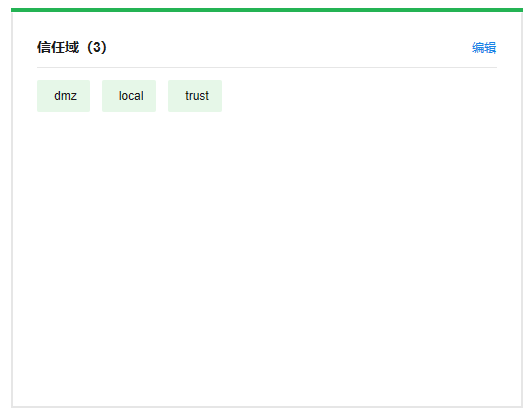

点击<编辑>后，可对“信任域”内的区域进行勾选，勾选需要设置为非信任域的区域，再点击<改为非信任域>，即可将这些区域设置为非信任域

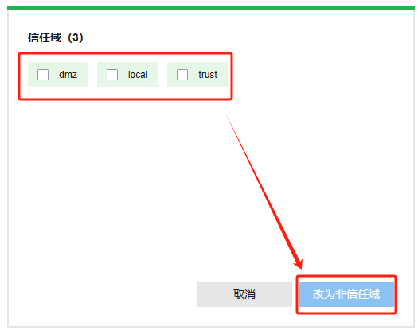

  * 非信任域

用户不信任的安全区域，通常用来定义 internet 等外部网络，是云安全检测分析外部攻击源的重要依据。“untrust”为系统默认的非信任域。

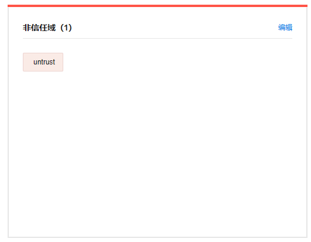

点击<编辑>后，可对“非信任域”内的区域进行勾选，勾选需要设置为信任域的区域，再点击<改为信任域>，即可将这些区域设置为信任域。

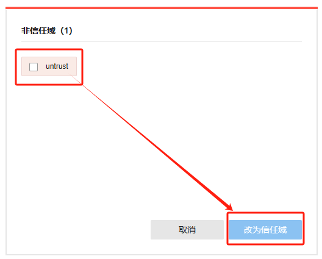

  * 未知域

当用户在设备本地【网络-安全区域】页面中新建自定义安全域，其信任属性默认为“未知”。

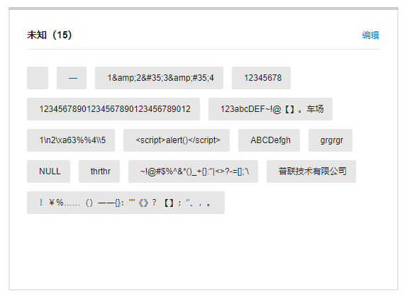

点击<编辑>，可修改未知域为信任域或非信任域。

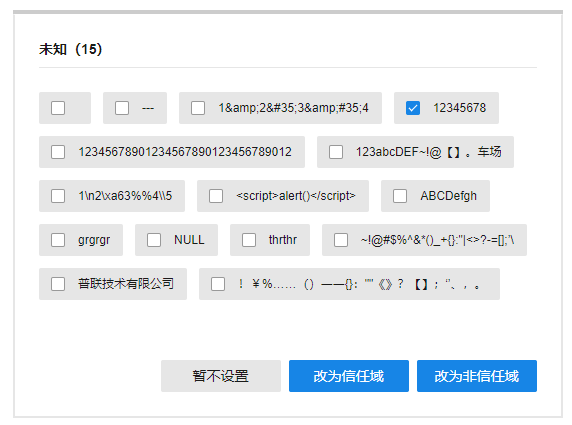

> 注意：
> 
> 需在此页面的“未知”标签池中设置自定义安全域的信任属性，否则云安全服务不会分析该未知属性安全域的流量。
> 
> 为保证云安全业务的正常运行，请勿让一个安全域同时用来定义内部网络和外部网络。
