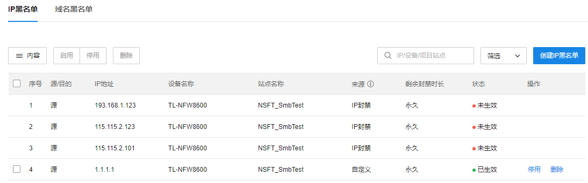
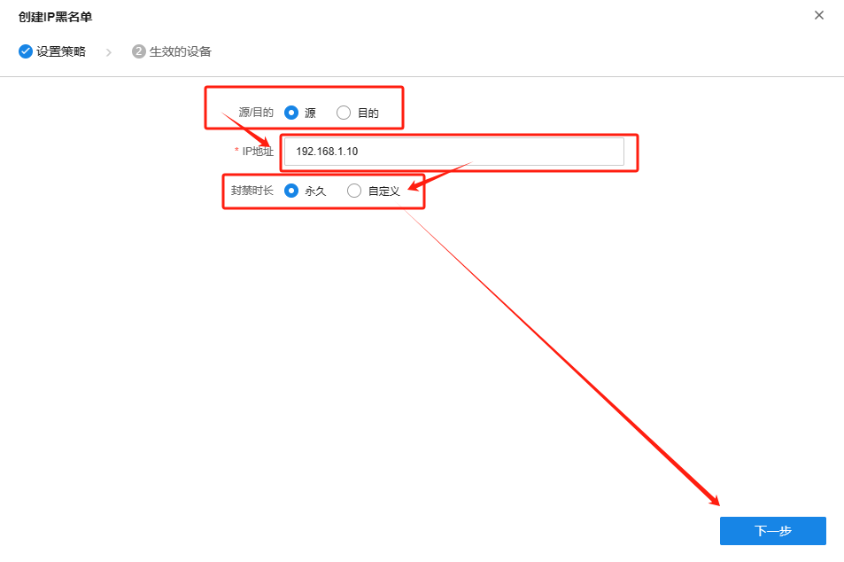
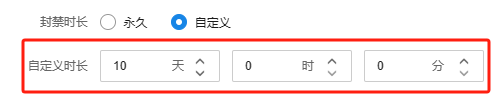
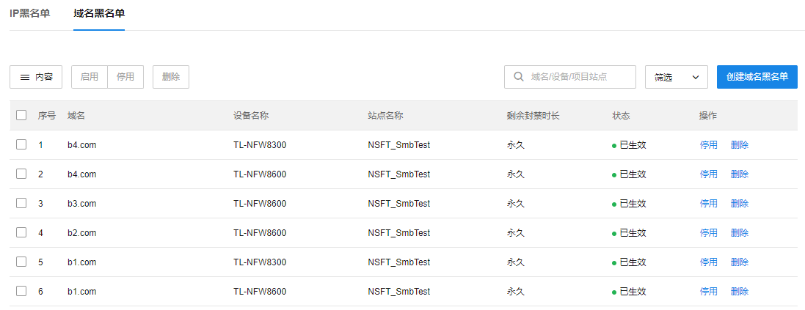
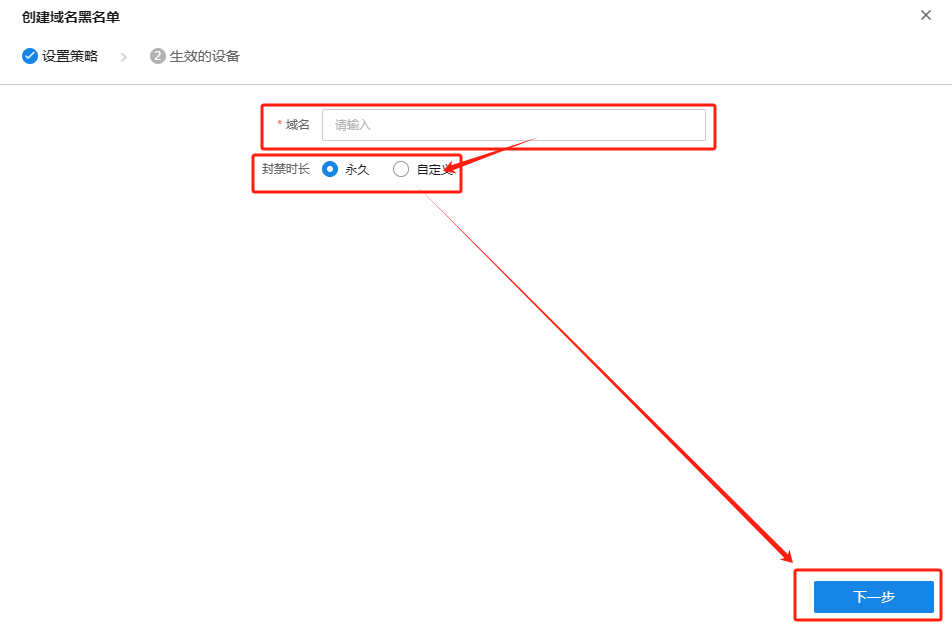

# 黑名单

#### IP 黑名单

**进入页面的方法：高级 >> 云安全 >> 黑名单 >> IP 黑名单**

此页用户可管理基于 IP 地址的黑名单

|   
---|---  
源/目的| 说明此黑名单规则是针对源 IP 地址还是目的 IP 地址  
IP 地址| 规则生效的对象 IP 地址  
设备名称| 此条 IP 地址黑名单规则生效的网络安全设备  
站点名称| 设备所属的站点名称  
来源| （1）自定义：来自自行创建的 IP 黑名单  
（2）IP 封禁：在【边界防御-危险攻击源]】中封禁 IP 则生成黑名单（解封或封禁时长到期时将自动删除）|   
（3）终端隔离：在【边界防御-失陷终端]】中隔离终端则生成黑名单（解封或封禁时长到期时将自动删除）|   
|   
剩余封禁时长| 该 IP 黑名单距离解封剩余的时间  
状态| 该黑名单条目的生效状态  
  
  * 启用/停用/删除黑名单

勾选需要操作的条目，点击<启用>/<停用>/<删除>，即可启用/禁用/删去黑名单规则。

  * 创建 IP 黑名单

用户可以自定义添加 IP 黑名单（当前支持单个添加）

  1. 点击页面右上角<创建 IP 黑名单>，选择对源 IP 地址或目的 IP 地址配置黑名单规则、键入 IP 地址、选择封禁时长，配置完成后，点击<下一步>。

封禁时长默认为永久，也支持用户自定义，如果选择自定义，则可以具体配置封禁时间，默认为 10 天。

  2. 选择黑名单规则生效的设备：左边可以快速选择项目组下的项目，右边可以选择对应项目下的具体设备，选择完成后，点击<确定>，即配置完成。

#### 域名黑名单

**进入页面的方法：高级 >> 云安全 >> 黑名单 >> 域名黑名单**

此页用户可管理基于域名的黑名单

|   
---|---  
域名| 匹配黑名单规则的域名  
设备名称| 此条黑名单规则生效的网络安全设备  
站点名称| 设备所属的站点名称  
剩余封禁时长| 该 IP 黑名单距离解封剩余的时间  
状态| 该黑名单条目的生效状态  
  
  * 启用/停用/删除黑名单

勾选需要操作的条目，点击<启用>/<停用>/<删除>，即可启用/禁用/删去黑名单规则。

  * 创建 IP 黑名单

用户可以自定义添加 IP 黑名单（当前支持单个添加）

  1. 点击页面右上角<创建域名黑名单>，键入域名，选择封禁时长，配置完成后，点击<下一步>。

封禁时长默认为永久，也支持用户自定义，如果选择自定义，则可以具体配置封禁时间，默认为 10 天。

  2. 选择黑名单规则生效的设备：左边可以快速选择项目组下的项目，右边可以选择对应项目下的具体设备，选择完成后，点击<确定>，即配置完成。

